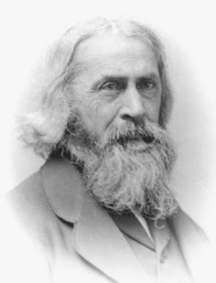
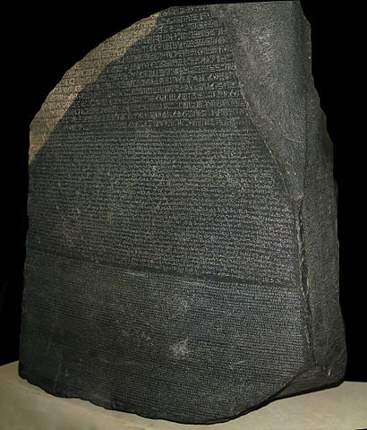

= My Glimpse Inside The Ivory Tower Of Mathematics
Tony Locke
:entails: &#x22A8;
:and: &#x2227;
:or: &#x2228;
:implies: &#x2192;
:not: &#x00AC;
:bicond: &#x2194;
:equiv: &#8801;
:toc:

[subs="replacements"]
++++

++++

:numbered:
== Introduction

I'm a mathematical barbarian, but a few days ago I broke into the ivory tower of
mathematics and learnt the basics of Sentential Logic. In order to help me
learn it, I wrote this tutorial. It helped me, and perhaps you'll find it useful
too.

=== Licence

This work is licensed under a
http://creativecommons.org/licenses/by-sa/4.0/[Creative Commons
Attribution-ShareAlike 4.0 International License].

=== Forum

If you have any comments on this book, please visit
https://groups.google.com/forum/\#!forum/glimpse-of-mathematics[https://groups.google.com/forum/#!forum/glimpse-of-mathematics].

The source code for the book is at
https://github.com/tlocke/maths[https://github.com/tlocke/maths].

=== Formats

This book is available in the following formats:

[horizontal]
Web:: http://maths.tlocke.org.uk/
EPUB:: http://maths.tlocke.org.uk/maths.epub

== Sentential Logic

[[img-russel]]
.http://commons.wikimedia.org/wiki/File:Russell_in_1924_01.jpg#mediaviewer/File:Russell_in_1924_01.jpg[Bertrand Russell in 1924] by Unknown - http://www.humanities.mcmaster.ca/~bertrand/later.html. Licensed under Public domain via http://commons.wikimedia.org/wiki/[Wikimedia Commons].

=== Statements

In sentential logic, we're only interested in sentences that are either true
or false. Such sentences are known as _statements_. Here are some sentences
together with explanations of whether they are statements or not:

[example]
How many miles to Crinnis?

This is a question, so not a statement.

[example]
Elephants have four legs.

Yay, an actual statement! It's a sentence that is either true or false.

[example]
Don't dilly-dally.

This isn't true or false, it sounds like someone admonishing somebody. Not a
statement.

[example]
The capital of France is Paris.

Yes, a statement.

[example]
He likes chocolate.

This sounds like a statement, but according to those logicians in the ivory
tower it doesn't count because it relies on knowing who '`he`' is.

[example]
Don't spoil the ship for a ha'peth of tar.

This is a proverb, not a statement.

I've got this nagging doubt in my mind. Most statements I can think of aren't
_totally_ ambiguous. Take the '`Elephants have four legs`' example. Maybe
there's a three legged elephant in existence, perhaps one in a zoo got
gangrene or something and had to have a leg amputated... Nevertheless, let's
suspend our disbelief and imagine all those perfect statements.

:numbered!:
==== Questions

. Which of the following are statements?
.. Who is John Galt?
.. He's over there.
.. Three divided by three is one.
.. Belgium is a European country.
.. Praise be!
.. Blue is a colour.

. Are the following statements true or false?
.. Four is greater than two.
.. Tennis is a colour.
.. A square has eight sides.
.. A cube has eight corners.
.. Birmingham is a city in England.
.. The word '`rotavator`' is a
      http://en.wiktionary.org/wiki/palindrome[palindrome].

==== Answers

. {empty}
.. Not a statement.
.. Not a statement.
.. A statement.
.. A statement.
.. Not a statement.
.. A statement.
. {empty}
.. True.
.. False.
.. False.
.. True.
.. True.
.. True.

:numbered:
=== Functions

It seems that the next thing the logicians do is string together simple
statements to make compound statements. So two simple statements might be:

[example]
Abelard likes coffee. +
Abelard likes cake.

And a compound statement formed from these two simple statements is:

[example]
Abelard likes coffee and Abelard likes cake.

This compound statement is true if both the simple statements are true,
otherwise it is false. Another compound statement we can make from our two
simple statements is:

[example]
Abelard likes coffee or Abelard likes cake.

This compound statment is false if both simple statements are false, otherwise
it's true. Those mathematicians from the Ivory Tower use the term _function_
for the '`and`' and '`or`' that join simple statements to make compound
statements.

:numbered!:
==== Questions

. Are the following compound statements true or false?
.. The film Erin Brokovich stars Julia Roberts and 16 is greater than 4.
.. London is the capital of France or Paris is the capital of France.
.. Some people have brown eyes and humans lay eggs.
.. Four multiplied by two is twenty or it has never rained in Wales.
.. Toothpaste is harder than diamond and less than 100 films have ever been
   made.

==== Answers

. {empty}
.. True.
.. True.
.. False.
.. False.
.. False.

:numbered:
=== Formulas

Rather than always writing simple statements out in full, those work-shy
logicians assign a label to them. They call the label an _atomic formula_, and
it can be any capital letter of the alphabet. So for the compound statement:

[example]
Abelard likes coffee and Abelard likes cake.

the two simple statements can have the atomic formulas P and Q:

[example]
P: Abelard likes coffee. +
Q: Abelard likes cake.

and the compound statement can be written as the _compound formula_:

[example]
P and Q

Now that we've said what P and Q stand for we can take this compound statement:

[example]
Abelard likes coffe or Abelard likes cake.

and write it using the atomic formulas to give the compound formula:

[example]
P or Q

:numbered!:
==== Questions

. Write the following compound statements as formulas:
.. The film Erin Brokovich stars Julia Roberts and 16 is greater than 4.
.. London is the capital of France or Paris is the capital of France.
.. Some people have brown eyes and humans lay eggs.
.. Four multiplied by two is twenty or it has never rained in Wales.
.. Toothpaste is harder than diamond and less than 100 films have ever been
   made.

==== Answers

. {empty}
.. P: The film Erin Brokovich stars Julia Roberts. +
   Q: 16 is greater than 4. +
   P and Q
.. A: London is the capital of France. +
   B: Paris is the capital of France. +
   A or B
.. P: Some people have brown eyes. +
   Q: Humans lay eggs. +
   P and Q
.. P: Four multiplied by two is twenty. +
   Q: It has never rained in Wales. +
   P or Q
.. P: Toothpaste is harder than diamond. +
   Q: Less than 100 films have ever been made. +
   P and Q

:numbered:
=== Function Notation

Here's an ambiguous compound statement:

[example]
London is the capital of the UK or London is the capital of France and Paris is
the captital of the UK.

substituting in '`true`' or '`false`' for the statements we get:

[example]
true or false and false

Which is false if we do the '`or`' first, and true if we do the '`and`' first.
So to express themselves unambiguously, logicians use _function notation_. In
function notation the formula:

[example]
A and B

is written as the formula:

[example]
and(A, B)

and the formula:

[example]
A or B

is written as the formula:

[example]
or(A, B)

so going back to our example:

[example]
true or false and false

if a logician wanted '`or`' to be done first they'd write the formula:

[example]
and(or(true, false), false)

and if they wanted the '`and`' to be done first they'd write the formula:

[example]
or(true, and(false, false))

:numbered!:
==== Questions

. Write the answers to the questions for <<_formulas>> using function
  notation.

==== Answers

. {empty}
.. and(P, Q)
.. or(A, B)
.. and(P, Q)
.. or(P, Q)
.. and(P, Q)

:numbered:
=== Interpretations

Say you've got a formula:

[example]
and(P, Q)

To logicians, an _interpretation_ is the assignment of true or false to P and Q.
So one interpretation is:

[example]
P is false +
Q is false

and another is:

[example]
P is true +
Q is false

so for a compound formula with two atomic formulas, there are four possible
interpretations:

|===
| P     | Q

| True  | True
| False | True
| True  | False
| False | False 
|===

and to make it easier to write they use T for true and F for false:

|===
| P | Q

| T | T
| F | T
| T | F
| F | F 
|===

:numbered!:
==== Questions

. For a compound formula with three atomic formulas, there are eight possible
  interpretations. Show those eight possible interpretation in a table.

==== Answers

. {empty}
+
|===
| P | Q | R

| T | T | T
| F | T | T
| T | F | T
| F | F | T
| T | T | F
| F | T | F
| T | F | F
| F | F | F
|===

:numbered:
=== Truth Tables

A truth table. A medieval device for extracting a confession? No, a
mathematical device for showing if a formula is true or false for every possible
<<_interpretations, interpretation>>. The truth table for and(P, Q) is:

|===
| P | Q | and(P, Q)

| T | T | T
| F | T | F
| T | F | F
| F | F | F
|===

so what we've done is written a row for each interpretation of P and Q, and then
in the final column put the value of and(P, Q). The truth table for
or(P, Q) is:

|===
| P | Q | or(P, Q)

| T | T | T
| F | T | T
| T | F | T
| F | F | F
|===

You can use a truth table to show that and(P, Q) means the same as and(Q, P):

|===
| P | Q | and(P, Q) | and(Q, P)

| T | T | T         | T
| F | T | F         | F
| T | F | F         | F
| F | F | F         | F
|===

For each interpretation, the last two columns are the same, and so and(P, Q)
means the same as and(Q, P).

:numbered!:
==== Questions

. Use a truth table to show that or(P, Q) means the same thing as or(Q, P).

==== Answers

. {empty}
+
|===
| P | Q | or(P, Q) | or(Q, P)

| T | T | T        | T
| F | T | T        | T
| T | F | T        | T
| F | F | F        | F
|===

For each row of the truth table, the last two columns are the same, and so
or(P, Q) means the same as or(Q, P).

:numbered:
=== Not

There's another function called _not_, which has the truth table:

|===
| P | not(P)

| T | F
| F | T
|===

Let us cast it loose amongst the other functions and employ the truth table
to see what results. Picking a formula at random, let's try:

[example]
or(not(P), Q)

which gives the truth table:

|===
| P | Q | not(P) | or(not(P), Q)

| T | T | F      | T
| F | T | T      | T
| T | F | F      | F
| F | F | T      | T
|===

Let us now extract a full confession from:

[example]
not(or(P, Q))

which gives the truth table:

|===
| P | Q | or(P, Q) | not(or(P, Q))

| T | T | T        | F
| F | T | T        | F
| T | F | T        | F
| F | F | F        | T
|===

One other thing, the first two functions we encountered ('`and`' and '`or`')
both acted on two formulas, and so they're known as _binary_ functions. The
'`not`' function acts on one formula and so is called a _unary_ function.

:numbered!:
==== Questions

. Give the truth tables for:
.. not(and(P, Q))
.. or(P, not(Q))
.. not(not(P))
.. not(or(or(P, Q), R))
.. not(and(or(P, Q), R))

==== Answers

. {empty}
.. {empty}
+
|===
| P | Q | not(P) | not(and(P, Q))

| T | T | F      | F
| F | T | T      | T
| T | F | F      | F
| F | F | T      | F
|===
+
.. {empty}
+
|===
| P | Q | not(Q) | or(P, not(Q))

| T | T | F      | T
| F | T | F      | T
| T | F | T      | T
| F | F | T      | F
|===
+
.. {empty}
|===
| P | not(P) | not(not(P))

| T | F      | T
| F | T      | F
|===
+
.. {empty}
|===
| P | Q | R | or(P, Q) | or(or(P, Q), R) | not(or(or(P, Q), R))

| T | T | T | T        | T               | F
| F | T | T | T        | T               | F
| T | F | T | T        | T               | F
| F | F | T | F        | T               | F
| T | T | F | T        | T               | F
| F | T | F | T        | T               | F
| T | F | F | T        | T               | F
| F | F | F | F        | F               | T
|===
+
.. {empty}
+
|===
| P | Q | R | or(P, Q) | and(or(P, Q), R) | not(and(or(P, Q), R))

| T | T | T | T        | T                | F
| F | T | T | T        | T                | F
| T | F | T | T        | T                | F
| F | F | T | F        | F                | T
| T | T | F | T        | F                | T
| F | T | F | T        | F                | T
| T | F | F | T        | F                | T
| F | F | F | F        | F                | T
|===

:numbered:
=== Satisfaction

'`Sir, I demand satisfaction!`'. Yeah, we're not in Poldark, they don't watch
that in their Ivory Tower. Why waste time on TV dramas when you could be doing
maths?

An interpretation _satisfies_ a formula if it is true under that interpretation.
An example you say? An example? Okay, okay, you started off humble and now
you're making demands. I just feel you need to take a moment to think about
your attitude to this whole thing.

Under the interpretation:

[example]
P is false +
Q is true

the formula:

[example]
and(not(P), Q)

evaluates to:

[example]
and(not(false), true) +
and(true, true) +
true

since it's true, we can say that this interpretation satisfies this formula.
'`Could you show me another example please?`', '`Certainly dear reader`'.
Under the interpretation:

[example]
A is true +
B is true +
C is true +

the formula:

[example]
or(or(B, A), not\(C))

evaluates to:

[example]
or(or(true, true), not(true)) +
or(true, false) +
true

and so this interpretation satisfies this formula.

:numbered!:
==== Questions

. For the following pairs of formulas and interpretations, show that the
  interpretation satisfies the formula:
.. or(P, Q) when P is true and Q is false.
.. or(not(P), not(Q)) when P is true and Q is false.
.. and(not(A), B) when A is false and B is true.

==== Answers

. {empty}
.. or(P, Q) +
   or(true, false) +
   true +
   so the interpretation satisfies the formula.
.. or(not(P), not(Q)) +
   or(not(true), not(false)) +
   or(false, true) +
   true
   so the interpretation satisfies the formula.
.. and(not(A), B) +
   and(not(false), true) +
   and(true, true) +
   true +
   so the interpretation satisfies the formula.

:numbered:
=== Falsification

This is the opposite of <<_satisfaction,satisfaction>>. An interpretation
_falsifies_ a formula if it is false under that interpretation. Under the
interpretation:

[example]
P is true +
Q is true

the formula:

[example]
and(not(P), Q)

evaluates to:

[example]
and(not(true), true) +
and(false, true) +
false

since it's false, we can say that this interpretation falsifies this formula.
Under the interpretation:

[example]
A is true +
B is true +
C is true +

the formula:

[example]
and(or(B, A), not\(C))

evaluates to:

[example]
and(or(true, true), not(true)) +
and(true, false) +
false

and so this interpretation satisfies this formula.

:numbered!:
==== Questions

. For the following pairs of formulas and interpretations, show that the
  interpretation falsifies the formula:
.. or(P, Q) when P is false and Q is false.
.. or(not(P), not(Q)) when P is true and Q is true.
.. and(not(A), B) when A is false and B is false.

==== Answers

. {empty}
.. or(P, Q) +
   or(false, false) +
   false +
   so the interpretation falsifies the formula.
.. or(not(P), not(Q)) +
   or(not(true), not(true)) +
   or(false, false) +
   false
   so the interpretation falsifies the formula.
.. and(not(A), B) +
   and(not(false), false) +
   and(true, false) +
   false +
   so the interpretation falsifies the formula.

:numbered:
=== Valid Formula

The formula:

[example]
or(P, not(P))

has the truth table:

|===
| P | not(P) | or(P, not(P))

| T | F      | T
| F | T      | T
|===

which shows that every possible interpretation satisfies the formula. In the
Tower such a formula is called a _valid formula_.
 

:numbered!:
==== Questions

. Using a truth table, show that the following formula is valid:
.. or(or(P, Q), not(P))

==== Answers

. {empty}
.. {empty}
+
|===
| P | Q | not(P) | or(P, Q) | or(or(P, Q), not(P))

| T | T | F      | T        | T
| F | T | T      | T        | T
| T | F | F      | T        | T
| F | F | T      | F        | T
|===
+
so the formula is valid.

:numbered:
=== Unsatisfiable Formula

The formula:

[example]
and(P, not(P))

has the truth table:

|===
| P | not(P) | or(P, not(P))

| T | F      | F
| F | T      | F
|===

which shows that every possible interpretation falsifies the formula. In the
Tower such a formula is called an _unsatisfiable formula_.

:numbered!:
==== Questions

. Using truth tables, show that the following formulas are unsatisfiable:
.. and(and(P, Q), not(and(P, Q)))
.. and(P, and(Q, not(P)))
.. and(and(not(P), not(Q)), not(and(not(P), not(Q))))
.. and(and(and(P, not(P)), Q), R)

==== Answers

. {empty}
.. {empty}
+
|===
| P | Q | and(P, Q) | not(and(P, Q)) | and(and(P, Q), not(and(P, Q)))

| T | T | T         | F              | F
| F | T | F         | T              | F
| T | F | F         | T              | F
| F | F | F         | T              | F
|===
+
so unsatisfiable.
.. {empty}
+
|===
| P | Q | not(P) | and(Q, not(P)) | and(P, and(Q, not(P)))

| T | T | F      | F              | F
| F | T | T      | T              | F
| T | F | F      | F              | F
| F | F | T      | F              | F
|===
+
so the formula is unsatisfiable.
.. {empty}
+
[cols="6*", options="header"]
|===
| P
| Q
| not(P)
| not(Q)
| and(not(P), not(Q))
| not(and(not(P), not(Q)))
| and(and(not(P), not(Q)), not(and(not(P), not(Q))))

| T | T | F | F | F | T | F
| F | T | T | F | F | T | F
| T | F | F | T | F | T | F
| F | F | T | T | T | F | F
|===
so the formula is unsatisfiable.
.. {empty}
+
[cols="7*", options="header"]
|===
| P
| Q
| R
| not(P)
| and(P, not(P))
| and(and(P, not(P)), Q)
| and(and(and(P, not(P)), Q), R)

| T | T | T | F | F | F | F
| F | T | T | T | F | F | F
| T | F | T | F | F | F | F
| F | F | T | T | F | F | F
| T | T | F | F | F | F | F
| F | T | F | T | F | F | F
| T | F | F | F | F | F | F
| F | F | F | T | F | F | F
|===
so unsatisfiable.

:numbered:
=== Implies

There's another binary function called _implies_ that has the truth table:

|===
| P | Q | implies(P, Q)

| T | T | T
| F | T | T
| T | F | F
| F | F | T
|===

Take the two simple statements:

[example]
Abelard is at the cafe. +
The cafe is open.

Joining the two with an implication could give the compound statement:

[example]
Abelard is at the cafe only if the cafe is open.

If Abelard really is at the cafe and the cafe really is open, then this
compound statement is true. If Abelard isn't at the cafe, then whether or not
the cafe is open, the compound statement is still true (another way of putting
it is to say that if Abelard is not at the cafe, then this is still consistent
with with the statement that '`Abelard is at the cafe only when the cafe is
open`'). The only time the compound statement is false is if Abelard is at the
cafe but the cafe is not open.

There are a few different ways that '`implies`' occurs in English. The
statement:

[example]
Abelard is at the cafe only if the cafe is open.

could be written in these alternative ways:

[example]
* If Abelard is at the cafe then the cafe is open.
* Abelard being at the cafe implies that the cafe is open.
* The cafe being open is a necessary condition for Abelard to be at the cafe.
* The cafe being open follows from Abelard being at the cafe.

The formula:

[example]
implies(and(P, not(Q)), Q)

Has the truth table:

|===
| P | Q | not(Q) | and(P, not(Q)) | implies(and(P, not(Q)), Q)

| T | T | F      | F              | T
| F | T | F      | F              | T
| T | F | T      | T              | F
| F | F | T      | F              | T
|===

Another example; the truth table for implies(Q, and(P, not(Q))) is:

|===
| P | Q | not(Q) | and(P, not(Q)) | implies(Q, and(P, not(Q)))

| T | T | F      | F              | F
| F | T | F      | F              | F
| T | F | T      | T              | T
| F | F | T      | F              | T
|===

:numbered!:
==== Questions

. Write the following English statements as logical formulas:
.. The washing is out only if it's a dry day.
.. If Keith is in Bath, then Keith is in England.
.. The sky being red at night implies that the shepherds are delighted.
. Create a truth table for each of the following formulas:
.. implies(not(P), Q)
.. implies(Q, not(Q))
.. or(implies(P, Q), P)
.. implies(not(and(P, Q)), or(not(P), not(Q)))
.. implies(and(P, implies(P, Q)), not(P))

==== Answers

. {empty}
.. P: The washing is out. +
   Q: It's a dry day. +
   implies(P, Q)
.. A: Keith is in Bath. +
   B: Keith is in England. +
   implies(A, B)
.. A: The sky is red at night. +
   B: The shepherds are delighted. +
   implies(A, B)
. {empty}
.. {empty}
+
|===
| P | Q | not(P) | implies(not(P), Q)

| T | T | F      | T
| F | T | T      | T
| T | F | F      | T
| F | F | T      | F
|===
+
.. {empty}
+
|===
| Q | not(Q) | implies(Q, not(Q))

| T | F      | F
| F | T      | T
|===
+
.. {empty}
+
|===
| P | Q | implies(P, Q) | or(implies(P, Q), P)

| T | T | T             | T
| F | T | T             | T
| T | F | F             | T
| F | F | T             | T
|===
+
.. {empty}
+
|===
| P
| Q
| and(P, Q)
| not(and(P, Q))
| not(P)
| not(Q)
| or(not(P), not(Q))
| implies(not(and(P, Q)), or(not(P), not(Q)))

| T | T | T | F | F | F | F | T
| F | T | F | T | T | F | T | T
| T | F | F | T | F | T | T | T
| F | F | F | T | T | T | T | T
|===
+
.. {empty}
+
|===
| P
| Q
| implies(P, Q)
| not(P)
| and(P, implies(P, Q))
| implies(and(P, implies(P, Q)), not(P))

| T | T | T | F | T | F
| F | T | F | T | F | T
| T | F | F | F | F | T
| F | F | F | T | F | T
|===

:numbered:
=== Equals

The _equals_ function is a binary function with the truth table:

|===
| P | Q | equals(P, Q)

| T | T | T
| F | T | F
| T | F | F
| F | F | T
|===

Translating from English to a formula, the sentence:

[example]
It's Christmas Day if and only if it's the 25th of December.

is written:

[example]
P: It's Christmas Day. +
Q: It's the 25th of December. +
equals(P, Q)

which of course is true. An example that is false is:

[example]
It's Christmas Day if and only if it's the 2nd of March.

which is written:

[example]
P: It's Christmas Day. +
Q: It's the 2nd of March. +
equals(P, Q)

:numbered!:
==== Questions

. Translate the following English sentences into formulas:
.. The bike's back brake comes on if, and only if, the left brake lever is
   applied.
.. The fridge light is on if, and only if, the fridge door is open.
. Give the truth table for each of the following formulas:
.. equals(A, and(B, C))
.. or(B, equals(A, B))
.. and(P, not(equals(P, or(Q, P))))
.. and(equals(Q, not(P)), equals(P, not(not(Q))))

==== Answers

. {empty}
.. The bike's back brake comes on if, and only if, the left brake lever is
   applied. +
   P: The bike's back brake comes on. +
   Q: The left brake lever is applied. +
   equals(P, Q)
.. The fridge light is on if, and only if, the fridge door is open. +
   P: The fridge light is on. +
   Q: The fridge door is open. +
   equals(P, Q)
. Give the truth table for each of the following formulas:
.. equals(A, and(B, C))
+
|===
| A | B | C | and(B, C) | equals(A, and(B, C)

| T | T | T | T         | T
| F | T | T | T         | F
| T | F | T | F         | F
| F | F | T | F         | T
| T | T | F | F         | F
| F | T | F | F         | T
| T | F | F | F         | F
| F | F | F | F         | T
|===
+
.. or(B, equals(A, B))
+
|===
| A | B | equals(A, B) | or(B, equals(A, B))

| T | T | T            | T
| F | T | F            | T
| T | F | F            | F
| F | F | T            | T
|===
+
.. and(P, not(equals(P, or(Q, P))))
+
|===
| P
| Q
| or(Q, P)
| equals(P, or(Q, P)
| not(equals(P, or(Q, P))
| and(P, not(equals(P, or(Q, P))))

| T | T | T | T | F | F
| F | T | T | F | T | F
| T | F | T | T | F | F
| F | F | F | T | F | F
|===
+
.. and(equals(Q, not(P)), equals(P, not(not(Q))))
+
|===
| P
| Q
| not(P)
| equals(Q, not(P))
| not(Q)
| not(not(Q))
| equals(P, not(not(Q)))
| and(equals(Q, not(P)), equals(P, not(not(Q))))

| T | T | F | F | F | T | T | F
| F | T | T | T | F | T | F | F
| T | F | F | T | T | F | F | F
| F | F | T | F | T | F | T | F
|===

:numbered:
=== Identity

If two formulas are an _identity_, then the formula formed by joining them with
the '`equals`' function will be valid. For example, if the pair of formulas:

[example]
implies(A, B) +
or(not(A), B)

are an identity, then:

[example]
equals(implies(A, B), or(not(A), B))

will be valid. Its truth table is:

|===
| A
| B
| implies(A, B)
| not(A)
| or(not(A)), B)
| equals(implies(A, B), or(not(A), B))

| T | T | T | F | T | T
| F | T | T | T | T | T
| T | F | F | F | F | T
| F | F | T | T | T | T
|===

and so indeed we can say that this pair of formulas is an identity. The symbol
for identity is {equiv}, and so we can write the identity as:

implies(A, B) {equiv} or(not(A), B)

The two formulas in an identity can be substituted for each other in other
formulas, without changing the meaning of those other formulas. The commonly
used identities have their own names. The identity that we've just found:

[example]
implies(A, B) {equiv} or(not(A), B)

is called _material implication_.

:numbered!:
==== Questions

. Use the material implication identity to rewrite the following formulas while
  preserving their meaning:
.. implies(A, B)
.. or(not(A), B)
.. implies(A, not(B))
.. or(A, B)

==== Answers

. Use the material implication identity to rewrite the following formulas while
  preserving their meaning:
.. implies(A, B) +
   or(not(A), B)
.. or(not(A), B) +
   implies(A, B)
.. implies(A, not(B)) +
   or(not(A), not(B))
.. or(A, B) +
   implies(not(A), B)

:numbered:
==== Material Equality

Hot on the heels of meeting the Material Implies identity, I encountered the
Material Equality identity:

[example]
equals(P, Q) {equiv} and(or(not(P), Q), or(P, not(Q)))

Actually I found loads of these identities in the Tower, some with names, some
without. I noted down the ones I thought were important, and the ones that had
a pattern to them and skipped over the rest. Is this the right approach?

:numbered!:
==== Questions

. Use the material equality identity to rewrite the following formulas while
  preserving their meaning:
.. equals(P, Q)
.. and(or(not(P), Q), or(P, not(Q)))
.. and(equals(P, Q), P)
.. or(and(or(P, Q), or(not(P), not(Q))), not(P))

==== Answers

. Use the material equality identity to rewrite the following formulas while
  preserving their meaning:
.. equals(P, Q) +
   and(or(not(P), Q), or(P, not(Q)))
.. and(or(not(P), Q), or(P, not(Q))) +
   equals(P, Q)
.. and(equals(P, Q), P) +
   and(and(or(not(P), Q), or(P, not(Q))), P)
.. or(and(or(P, Q), or(not(P), not(Q))), not(P)) +
   or(equals(P, Q), not(P))

:numbered:
=== Commutativity

A special type of identity that some binary functions have is _commutativity_.
The function '`and`' is commutative which means that:

[example]
and(A, B) {equiv} and(B, A)

This identity is called _conjunction commutativity_. Not all
binary functions are commutative though. For example the pair of formulas:

[example]
implies(A, B) +
implies(B, A)

is not and identity because:

[example]
equals(implies(A, B), implies(B, A))

is not a valid formula, and so '`implies`' is not commutative. Here's a table
showing all the binary functions, and whether they're commutative or not, and if
they are, giving the name of the associated identity.

|===
| Binary Function | Commutative? | Name Of Identity

| and             | Yes          | conjunction commutativity
| or              | Yes          | disjunction commutativity
| implies         | No           |
| equals          | Yes          | equality commutativity
|===

:numbered!:
==== Questions

. For each of the four binary functions use a truth table to show if they
  are or are not commutative.

==== Answers

. {empty}
.. '`and`' is commutative if equals(and(A, B), and(B, A)) is valid.
+
|===
| A | B | and(A, B) | and(B, A) | equals(and(A, B), and(B, A))

| T | T | T         | T         | T
| F | T | F         | F         | T
| T | F | F         | F         | T
| F | F | F         | F         | T
|===
+
so it is valid and so '`and`' is commutative.
.. '`or`' is commutative if equals(or(A, B), or(B, A)) is valid.
+
|===
| A | B | or(A, B) | or(B, A) | equals(or(A, B), or(B, A))

| T | T | T          | T      | T
| F | T | T          | T      | T
| T | F | T          | T      | T
| F | F | F          | F      | T
|===
+
so it is valid and so '`or`' is commutative.
.. '`implies`' is commutative if equals(implies(A, B), implies(B, A)) is 
   valid.
+
[cols="5*", options="header"]
|===
| A
| B
| implies(A, B)
| implies(B, A)
| equals(implies(A, B), equals(B, A))

| T | T | T | T | T
| F | T | T | F | F
| T | F | F | T | F
| F | F | T | T | T
|===
+
it is not valid and so '`implies`' is not commutative.
.. '`equals`' is commutative if equals(equals(A, B), equals(B, A)) is
   valid.
+
[cols="5*", options="header"]
|===
| A
| B
| equals(A, B)
| equals(B, A)
| equals(equals(A, B), equals(B, A))

| T | T | T | T | T
| F | T | F | F | T
| T | F | F | F | T
| F | F | T | T | T
|===
+
it is valid and so '`equals`' is commutative.

:numbered:
=== Associativity

Another type of identity that some binary functions have is _associativity_. The
'`and`' function is associative, which means:

[example]
and(P, and(Q, R)) {equiv} and(and(P, Q), R)

because the formula:

[example]
equals(and(P, and(Q, R)), and(and(P, Q), R))

is valid. So if you've got three formulas joined by '`and`', it doesn't
make any difference if the first two are joined first, or the last two.
This identity is called _conjunction associativity_. Here's a
table showing all the binary functions, and whether they're associative or
not, and if they are, giving the name of the identity:

|===
| Binary Function | Associative? | Name Of Identity

| and             | Yes          | Conjunction associativity
| or              | Yes          | Disjunction associativity
| implies         | No           |
| equals          | Yes          | Equality associativity
|===

:numbered!:
==== Questions

. For each of the four binary functions use a truth table to show if they
  are or are not associative (big truth tables ahoy!).

==== Answers

. For each of the four binary functions use a truth table to show if they
  are or are not associative (big truth tables ahoy!).
.. '`and`' is associative if equals(and(and(A, B), C), and(A, and(B, C))) is
   valid.
+
[cols="8*", options="header"]
|===
| A
| B
| C
| and(A, B)
| and(and(A, B), C)
| and(B, C)
| and(A, and(B, C))
| equals(and(and(A, B), C), and(A, and(B, C)))

| T | T | T | T | T | T | T | T
| F | T | T | F | F | T | F | T
| T | F | T | F | F | F | F | T
| F | F | T | F | F | F | F | T
| T | T | F | T | F | F | F | T
| F | T | F | F | F | F | F | T
| T | F | F | F | F | F | F | T
| F | F | F | F | F | F | F | T
|===
+
it is valid and so '`and`' is associative.
.. '`or`' is associative if equals(or(or(A, B), C), or(A, or(B, C))) is
   valid.
+
[cols="8*", options="header"]
|===
| A
| B
| C
| or(A, B)
| or(or(A, B), C)
| or(B, C)
| or(A, or(B, C))
| equals(or(or(A, B), C), or(A, or(B, C)))

| T | T | T | T | T | T | T | T
| F | T | T | T | T | T | T | T
| T | F | T | T | T | T | T | T
| F | F | T | F | T | T | T | T
| T | T | F | T | T | T | T | T
| F | T | F | T | T | T | T | T
| T | F | F | T | T | F | T | T
| F | F | F | F | F | F | F | T
|===
+
it is valid and so '`or`' is associative.
.. '`implies`' is associative if equals(implies(implies(A, B), C),
   implies(A, implies(B, C))) is valid.
+
[cols="8*", options="header"]
|===
| A
| B
| C
| implies(A, B)
| implies(implies(A, B), C)
| implies(B, C)
| implies(A, implies(B, C))
| equals(implies(implies(A, B), C), implies(A, implies(B, C)))

| T | T | T | T | T | T | T | T
| F | T | T | T | T | T | T | T
| T | F | T | F | T | T | T | T
| F | F | T | T | T | T | T | T
| T | T | F | T | F | F | F | T
| F | T | F | T | F | F | T | F
| T | F | F | F | T | T | T | T
| F | F | F | T | F | T | T | F
|===
+
it is not valid and so '`implies`' is not associative.
.. '`equals`' is associative if equals(equals(equals(A, B), C),
   equals(A, equals(B, C))) is valid.
+
[cols="8*", options="header"]
|===
| A
| B
| C
| equals(A, B)
| equals(equals(A, B), C)
| equals(B, C)
| equals(A, equals(B, C))
| equals(equals(equals(A, B), C), equals(A, equals(B, C)))

| T | T | T | T | T | T | T | T
| F | T | T | F | F | T | F | T
| T | F | T | F | F | F | F | T
| F | F | T | T | T | F | T | T
| T | T | F | T | F | F | F | T
| F | T | F | F | T | F | T | T
| T | F | F | F | T | T | T | T
| F | F | F | T | F | T | F | T
|===
+
it is valid and so '`equals`' is associative.

:numbered:
=== Distributivity

Another '`itivity`'. Here are the _distributivity_ identities:

|===
| Identity | Name

| and(A, and(B, C)) {equiv} and(and(A, B), and(A, C))
| Distribution of '`and`' over '`and`'

| and(A, or(B, C)) {equiv} or(and(A, B), and(A, C))
| Distribution of '`and`' over '`or`'

| or(A, and(B, C)) {equiv} and(or(A, B), or(A, C))
| Distribution of '`or`' over '`and`'

| or(A, or(B, C)) {equiv} or(or(A, B), or(A, C))
| Distribution of '`or`' over '`or`'

| implies(A, implies(B, C)) {equiv} implies(implies(A, B), implies(A, C))
| Distribution of '`implies`' over '`implies`'

| implies(A, equals(B, C)) {equiv} equals(implies(A, B), implies(A, C))
| Distribution of '`implies`' over '`equals`'

| or(A, equals(B, C)) {equiv} equals(or(A, B), or(A, C))
| Distribution of '`or`' over '`equals`'
|===

Here's the pattern as I see it. If there are two functions y and z, then if
y distributes over z then:

[example]
y(A, z(B, C)) {equiv} z(y(A, B), y(A, C))

:numbered!:
==== Questions

. For the following distributivity identities use a truth table to show that
  they really are identities.
.. '`and`' over '`and`'
.. '`implies`' over '`equals`'
.. '`or`' over '`equals`'

==== Answers

. For the following distributivity identities use a truth table to show that
  they really are identities.
.. If '`and`' is distributive over '`and`' then: +
   equals(and(P, and(Q, R)), and(and(P, Q), and(P, R))) is valid.
+
[cols="9*", options="header"]
|===
| P
| Q
| R
| and(Q, R)
| and(P, and(Q, R))
| and(P, Q)
| and(P, R)
| and(and(P, Q), and(P, R))
| equals(and(P, and(Q, R)), and(and(P, Q), and(P, R)))

| T | T | T | T | T | T | T | T | T
| F | T | T | T | F | F | F | F | T
| T | F | T | F | F | F | T | F | T
| F | F | T | F | F | F | F | F | T
| T | T | F | F | F | T | F | F | T
| F | T | F | F | F | F | F | F | T
| T | F | F | F | F | F | F | F | T
| F | F | F | F | F | F | F | F | T
|===
+
the formula is indeed valid, so '`and`' is distributive over '`and`'.
.. '`implies`' over '`equals`'
.. If '`implies`' is distributive over '`equals`' then: +
   equals(implies(P, equals(Q, R)), equals(implies(P, Q), implies(P, R))) +
   is valid.
+
[cols="9*", options="header"]
|===
| P
| Q
| R
| equals(Q, R)
| implies(P, equals(Q, R))
| implies(P, Q)
| implies(P, R)
| equals(implies(P, Q), implies(P, R))
| equals(implies(P, equals(Q, R)), equals(implies(P, Q), implies(P, R)))

| T | T | T | T | T | T | T | T | T
| F | T | T | T | T | T | T | T | T
| T | F | T | F | F | F | T | F | T
| F | F | T | F | T | T | T | T | T
| T | T | F | F | F | T | F | F | T
| F | T | F | F | T | T | T | T | T
| T | F | F | T | T | F | F | T | T
| F | F | F | T | T | T | T | T | T
|===
+
the formula is indeed valid, so '`implies`' is distributive over '`equals`'.
.. If '`or`' is distributive over '`equals`' then: +
   equals(or(P, equals(Q, R)), equals(or(P, Q), or(P, R))) +
   is valid.
+
[cols="9*", options="header"]
|===
| P
| Q
| R
| equals(Q, R)
| or(P, equals(Q, R))
| or(P, Q)
| or(P, R)
| equals(or(P, Q), or(P, R))
| equals(or(P, equals(Q, R)), equals(or(P, Q), or(P, R)))

| T | T | T | T | T | T | T | T | T
| F | T | T | T | T | T | T | T | T
| T | F | T | F | T | T | T | T | T
| F | F | T | F | F | F | T | F | T
| T | T | F | F | T | T | T | T | T
| F | T | F | F | F | T | F | F | T
| T | F | F | T | T | T | T | T | T
| F | F | F | T | T | F | F | T | T
|===
+
the formula is indeed valid, so '`or`' is distributive over '`equals`'.

:numbered:
=== Idempotence

[[img-benjaminpeirce]]
.http://commons.wikimedia.org/wiki/File:BenjaminPeirce5.jpg#/media/File:BenjaminPeirce5.jpg[Benjamin Peirce] by http://www.pragmaticism.net/faq.htm[www.pragmaticism.net]. Licensed under Public Domain via http://commons.wikimedia.org/wiki/[Wikimedia Commons].

'`Hey, Tony`', Benjamin Peirce said as he tapped me on the knee and leaned over
confidentially, '`there's another property of functions that I call
_idempotence_`'. The '`and`' function is idempotent because:

[example]
and(P, P) {equiv} P

and the '`or`' function is idempotent because:

[example]
or(P, P) {equiv} P

but '`implies`' is not idempotent. We can show that '`or`' is idempotent by
showing that:

[example]
equals(or(P, P), P)

is valid, as shown by truth table:

|===
| P | or(P, P) | equals(or(P, P), P)

| T | T        | T
| F | F        | T
|===

and '`implies`' is not idempotent because:

[example]
equals(implies(P, P), P)

is not valid, as shown by the truth table:

|===
| P | implies(P, P) | equals(implies(P, P), P)

| T | T             | T
| F | T             | F
|===

Here's a table showing whether each function is idempotent or not.

|===
| Function        | Idempotent? | Identity Name

| not             | Yes         | Idempotence of negation
| and             | Yes         | Idempotence of conjunction
| or              | Yes         | Idempotence of disjunction
| implies         | No          |
| equals          | No          |
|===

The unary function '`not`' is idempotent because:

[example]
not(not(P)) {equiv} P

:numbered!:
==== Questions

. For the following functions, use a truth table to show whether or not the
  function is idempotent.
.. equals
.. and
. Use the idempotence of negation identity to simplify the following
  formulas:
.. or(P, not(not(Q)))
.. not(not(or(P, Q)))
.. and(not(not(A)), not(not(B)))

==== Answers

. {empty}
.. '`equals`' is not idempotent because: +
   equals(equals(P, P), P) +
   is not valid, as shown by truth table:
+
|===
| P | equals(P, P) | equals(equals(P, P), P)

| T | T            | T
| F | T            | F
|===
.. '`and`' is idempotent because: +
   equals(and(P, P), P) +
   is valid, as shown by truth table:
+
|===
| P | and(P, P) | equals(and(P, P), P)

| T | T         | T
| F | F         | T
|===
+
. Use the idempotence of negation identity to simplify the following
  formulas:
.. or(P, not(not(Q))) +
   or(P, Q)
.. not(not(or(P, Q))) +
   or(P, Q)
.. and(not(not(A)), not(not(B))) +
   and(A, B)

:numbered:
=== De Morgan's Laws

I found in the Tower that Mathematicians are often good at music too. De Morgan
was a flautist. I've got no musical ability. De Morgan's Laws are a couple of
identities:

[example]
and(A, B) {equiv} not(or(not(A), not(B)))

and:

[example]
or(A, B) {equiv} not(and(not(A), not(B)))

Some say they're obvious. Do you find them obvious? I don't.

:numbered!:
==== Questions

. For De Morgan's laws, use a truth table to show that they are identities.

==== Answers

. For De Morgan's laws, use a truth table to show that they are identities.
.. If: +
   and(A, B) {equiv} not(or(not(A), not(B))) +
   then: +
   equals(and(A, B), not(or(not(A), not(B)))) +
   is valid. The truth table is:
+
[cols="8*", options="header"]
|===
| A
| B
| and(A, B)
| not(A)
| not(B)
| or(not(A), not(B))
| not(or(not(A), not(B)))
| equals(and(A, B), not(or(not(A), not(B))))

| T | T | T | F | F | F | T | T
| F | T | F | T | F | T | F | T
| T | F | F | F | T | T | F | T
| F | F | F | T | T | T | F | T
|===
+
which shows it is valid, and so the two formulas are equivalent.
.. If: +
   or(A, B) {equiv} not(and(not(A), not(B))) +
   then: +
   or(A, B) {bicond} not(and(not(A), not(B)) +
   is valid. The truth table for this formula is:
+
[cols="8*", options="header"]
|===
| A
| B
| or(A, B)
| not(A)
| not(B)
| and(not(A), not(B))
| not(and(not(A), not(B)))
| equals(or(A, B), not(and(not(A), not(B)))) +

| T | T | T | F | F | F | T | T
| F | T | T | T | F | F | T | T
| T | F | T | F | T | F | T | T
| F | F | F | T | T | T | F | T
|===
+
which shows it is valid, and so the pair of formulas we started with is an
identity.

:numbered:
=== Arguments

The word '`argument`' makes me think of a bitter shouting match. To a logician
it means something altogether more cerebral. A logical argument in English might
be:

[example]
Abelard ordered coffee or Abelard ordered cake. Abelard didn't order cake.
Therefore Abelard ordered coffee.

To convert this argument from English into logical symbols, we first of all
define the atomic formulas:

[example]
A: Abelard ordered coffee. +
B: Abelard ordered cake.

So the argument becomes:

[example]
If or(A, B) is true and not(B) is true, then A is true.

To express this argument more concisely we roll out the _double turnstile_ 
symbol {entails}, and write the argument as:

[example]
or(A, B), not(B) {entails} A

Where the comma-separated list of formulas on the left of the double-turnstile
are the premises, and the formula on the right is the conclusion. That's the
argument written down, but is it valid? In other words, if the premises are
true, is the conclusion true? To find out, we can say that if:

[example]
implies(and(or(A, B), not(B)), A)

is valid, then the argument is valid. If effect we've joined the premises
together with '`and`' and replaced the {entails} with an '`implies`' to get the
formula. Bring on the table of truth!

[cols="6*", options="header"]
|===

| A
| B
| or(A, B)
| not(B)
| and(or(A, B), not(B))
| implies(and(or(A, B), not(B)), A)

| T | T | T | F | F | T
| F | T | T | F | F | T
| T | F | T | T | T | T
| F | F | F | T | F | T
|===

The last column is always true, so the formula is valid, so the
argument is valid. Yay! Let's test another argument for validity:

[example]
If we run out of petrol we won't get to the wedding on time. If we lose our
way we won't get to the wedding on time. We've run out of petrol. We won't get
to the wedding on time.

In logic symbols the argument is:

[example]
A: Run out of petrol. +
B: Get to the wedding on time. +
C: Lose our way. +
implies(A, not(B)), implies(C, not(B)), A {entails} not(B)

The argument is valid if:

implies(and(and(implies(A, not(B)), implies(C, not(B))), A), not(B))

is valid. Doing a giant truth table:

[cols="9"]
|===
| 1 | 2 | 3 | 4 | 5 | 6 | 7 | 8 | 9

| A
| B
| C
| not(B)
| implies(A, col_4)
| implies(C, col_4)
| and(col_5, col_6)
| and(col_7, A)
| implies(col_8, col_4)

| T | T | T | F | F | F | F | F | T
| F | T | T | F | T | F | F | F | T
| T | F | T | T | T | F | F | F | T
| F | F | T | T | T | T | T | F | T
| T | T | F | F | F | T | F | F | T
| F | T | F | F | T | T | T | F | T
| T | F | F | T | T | T | T | T | T
| F | F | F | T | T | T | T | F | T
|===

Shows that the formula is valid and so the argument is indeed valid.

:numbered!:
==== Questions

. Construct logical arguments for the following arguments in English:
.. If it's a silent film then there's no sound. It's a silent film. Therefore
   there's no sound.
.. Scheherazade bought black paint or Scheherazade bought grey paint.
   Scheherazade did not buy grey paint. Therefore Scheherazade bought black
   paint.
.. It is not the case that Ben won a tennis match and Toby won a tennis match.
   Toby won a tennis match. Therefore Ben did not win a tennis match.
.. Bill orders 6x or Bill orders Tribute. If Bill orders 6x or Tribute then the
   pub is open. Bill does not order Tribute. Therefore the pub is open and Bill
   orders 6x.
.. The light switch is on or the light switch is off. The light switch is not on
   and off. This light switch is not on. Therefore the light switch is off.
. For the arguments given in question 1, show whether they are valid or not.

==== Answers

. {empty}
.. P: It's a silent film. +
   Q: There's no sound. +
   implies(P, Q), P {entails} Q
.. A: Scheherazade bought black paint. +
   B: Scheherazade bought grey paint. +
   or(A, B), not(B) {entails} A
.. P: Ben won a tennis match. +
   Q: Toby won a tennis match. +
   not(and(P, Q)), Q {entails} not(P)
.. P: Bill orders 6x. +
   Q: Bill orders Tribute. +
   R: The pub is open. +
   or(P, Q), implies(or(P, Q), R), not(Q) {entails} and(R, P)
.. P: The light switch is on. +
   Q: The light switch is off. +
   or(P, Q), not(and(P, Q)), not(P) {entails} Q
. {empty}
.. If the argument implies(P, Q), P {entails} Q is valid, then the formula
   and(implies(P, Q), implies(P, Q)) is valid. The following truth table
   shows the formula is valid, so the argument is indeed valid.
+
|===
| 1 | 2 | 3             | 4             | 5

| P | Q | implies(P, Q) | and(col_3, P) | implies(col_4, Q)

| T | T | T             | T             | T
| F | T | T             | F             | T
| T | F | F             | F             | T
| F | F | T             | F             | T
|===
+
.. If the argument or(A, B), not(B) {entails} A is valid, then the formula
   implies(and(or(A, B), not(B)), A) is valid. The following truth table
   shows the formula is valid, so the argument is indeed valid.
+
|===
| 1 | 2 | 3        | 4      | 5                 | 6

| A | B | or(A, B) | not(B) | and(col_3, col_4) | implies(col_5, A)

| T | T | T        | F      | F                 | T
| F | T | T        | F      | F                 | T
| T | F | T        | T      | T                 | T
| F | F | F        | T      | F                 | T
|===
+
.. If the argument or(P, Q), Q {entails} not(P) is valid, then the formula
   implies(and(or(P, Q), Q), not(P)) is valid. The following truth table
   shows the formula is not valid, so the argument is not valid.
+
|===
| 1 | 2 | 3        | 4      | 5             | 6

| P | Q | or(P, Q) | not(P) | and(col_3, Q) | implies(col_5, col_4)

| T | T | T        | F      | T             | F
| F | T | T        | T      | T             | T
| T | F | T        | F      | F             | T
| F | F | F        | T      | F             | T
|===
+
.. If the argument or(P, Q), implies(or(P, Q), R), not(Q) {entails} and(R, P) is
   valid, then the formula implies(and(and(or(P, Q), implies(or(P, Q), R)),
   not(Q)) {implies} and(R, P)) is valid. The following truth table
   shows the formula is valid, so the argument is valid.
+
[cols="10*", options="header"]
|===
| 1
| 2
| 3
| 4
| 5
| 6
| 7
| 8
| 9
| 10

| P
| Q
| R
| or(P, Q)
| implies(col_4, R)
| and(R, P)
| not(Q)
| and(col_4, col_5)
| and(col_8, col_7)
| implies(col_9, col_6)

| T | T | T | T | T | T | F | T | F | T
| F | T | T | F | T | F | F | F | F | T
| T | F | T | F | F | T | T | F | F | T
| F | F | T | F | T | F | T | F | F | T
| T | T | F | T | F | F | F | F | F | T
| F | T | F | F | T | F | F | F | F | T
| T | F | F | F | T | F | T | F | F | T
| F | F | F | F | T | F | T | F | F | T
|===
+
.. If the argument or(P, Q), not(and(P, Q)), not(P) {entails} Q is valid, then
   the formula implies(and(and(or(P, Q), not(and(P, Q))), not(P)), Q) is valid.
   The following truth table shows the formula is valid, so the argument is
   valid.
+
[cols="9*", options="header"]
|===
| 1
| 2
| 3
| 4
| 5
| 6
| 7
| 8
| 9

| P
| Q
| or(P, Q)
| and(P, Q)
| not(col_4)
| not(P)
| and(col_3, col_5)
| and(col_7, col_6)
| implies(col_8, Q)

| T | T | T | T | F | F | F | F | T
| F | T | T | F | T | T | T | T | T
| T | F | T | F | T | F | T | F | T
| F | F | F | F | T | T | F | F | T
|===

:numbered:
=== Conjunctive Normal Form (CNF)

When I got to this point in the Ivory Tower, John Alan Robinson took me by the
scruff of the neck and said, '`Look, you've just got to learn this, don't ask
why`'. '`Okay, I replied meekly`'.

A _literal_ is an atomic formula or the '`not`' of an atomic formula. Eg:

[example]
P +
not(P)

A _clause_ is a number of literals joined by the '`or`' function. Eg:

[example]
or(not(P), Q) +
P +
or(or(P, Q), not\(R))

A formula in CNF is a number of clauses joined by the '`and`' function. Eg:

and(and(or(not(P), Q), P), or(or(P, Q), not\(R)))

Anyway, John Alan Robinson went on to tell me the most remarkable thing, _any_
formula can be written in CNF. You simply (!) use the following identities
(which we've previously encountered), applying them in the given order:

[cols="3"]
|===
.2+| Step 1: Implications
| Material Implication
| implies(P, Q) {equiv} or(not(P), Q)

| Material Equivalence
| equals(P, Q) {equiv} and(or(not(P), Q), or(P, not(Q)))

.2+| Step 2: Negations
| Idempotence of '`not`'
| not(not(P)) {equiv} P

| De Morgan's Laws
| and(A, B) {equiv} not(or(not(A), not(B))) +
  or(A, B) {equiv} not(and(not(A), not(B)))

.4+| Step 3: Distributivity
| '`and`' over '`and`'
| and(A, and(B, C)) {equiv} and(and(A, B), and(A, C))

| '`and`' over '`or`'
| and(A, or(B, C)) {equiv} or(and(A, B), and(A, C))

| '`or`' over '`and`'
| or(A, and(B, C)) {equiv} and(or(A, B), or(A, C))

| '`or`' over '`or`'
| or(A, or(B, C)) {equiv} or(or(A, B), or(A, C))

.2+| Step 4: Associativity
| '`and`'
| and(A, and(B, C)) {equiv} and(and(A, B), C)

| '`or`'
| or(A, or(B, C)) {equiv} or(or(A, B), C)
|===

Here's are a couple of examples that I was shown. We start out with an example
formula in the normal logical notation:

[example]
implies(and(A, not(B)), implies(C, B))

Applying step 1, Material Implication, we get:

[example]
implies(and(A, not(B)), or(not\(C), B))

applying Material Implication again gives us:

[example]
or(not(and(A, not(B))), or(not\(C), B))

so now we've got rid of the '`implies`' functions. Now let's plough on with
step 2, Negations, where the application of De Morgan's Laws, gives:

[example]
or(or(not(A), not(not(B))), or(not\(C), B))

Idempotence of '`not`' alert!

[example]
or(or(not(A), B), or(not\(C), B))

We're so nearly in CNF, but not quite. Since '`or`' is associative:

[example]
or(or(or(not(A), B), not\(C)), B)

Hah! We're now in CNF. Okay, in the second example we've got to convert:

[example]
or(equals(A, B), not\(C))

into CNF. Starting with step 1, Implications:

[example]
or(and(or(not(A), B), or(A, not(B))), not\(C))

there aren't any negations to do, so skipping on to step 3, distributivity:

[example]
and(or(not\(C), or(not(A), B)), or(not\(C), or(A, not(B))))

using the associativity of {or}:

[example]
and(or(or(not\(C), not(A)), B), or(or(not\(C), A), not(B)))

we've got it in CNF.

:numbered!:
==== Questions

. Write the following formulas in CNF notation:
.. or(A, implies(not(B), A))
.. implies(implies(A, B), C)
.. or(P, equals(Q, not(P)))
.. or(and(A, B), and(A, C))
.. and(and(A, B), and(A, C))

==== Answers

. {empty}
.. or(A, implies(not(B), A)) +
   or(A, or(not(not(B)), A)) [Material Implication] +
   or(A, or(B, A)) [Idempotence of '`not`'] +
   or(or(A, B), A) [Associativity of '`or`']
.. implies(implies(A, B), C) +
   implies(or(not(A), B), C) [Material Implication] +
   or(not(or(not(A), B)), C) [Material Implication] +
   or(and(not(not(A), not(B)), C) [De Morgan's Laws] +
   or(and(A, not(B)), C) [Idempotence of '`not`'] +
   and(or(C, A), or(C, not(B))) [Distribute '`or`' over '`and`']
.. or(P, equals(Q, not(P))) +
   or(P, and(or(not(Q), not(P)), or(Q, not(not(P))))) [Material Equality] +
   or(P, and(or(not(Q), not(P)), or(Q, P))) [Idempotence of '`not`'] +
   and(or(P, or(not(Q), not(P))), or(P, or(Q, P))) [Distribute '`or`' over
   '`and`']
.. or(and(A, B), and(A, C)) +
   and(or(and(A, B), A), or(and(A, B), C)) [Distribute '`or`' over '`and`'] +
   and(and(or(A, A), or(B, A)), and(or(A, C), or(B, C))) [Distribute '`or`' over
   '`and`'] +
   and(and(and(or(A, A), or(B, A)), or(A, C)), or(B, C)) ['`and`' is
   associative]
.. and(and(A, B), and(A, C)) +
   and(and(and(A, B), A), C) ['`and`' is associative]

:numbered:
=== CNF Set Notation

As we've seen, the '`or`' function is commutative and associative. Dr Robinson
told me that this means that for any CNF clause it doesn't matter how you
arrange the brackets and literals, each arrangement will be equivalent. Let's
try that out:

[example]
or(A, B) +
or(B, A)

well yes, that's easy because since '`or`' is commutative:

[example]
or(A, B) {equiv} or(B, A)

Here are all the different ways of arranging three literals:

[example]
or(or(A, B), C) +
or(or(A, C), B) +
or(or(B, A), C) +
or(or(B, C), A) +
or(or(C, A), B) +
or(or(C, B), A) +
or(A, or(B, C)) +
or(A, or(C, B)) +
or(B, or(A, C)) +
or(B, or(C, A)) +
or(C, or(A, B)) +
or(C, or(B, A))

I'll try and transform the second clause to be the same as the first:

[example]
or(or(A, C), B) +
or(A, or(C, B)) [associativity] +
or(A, or(B, C)) [commutativity] +
or(or(A, B), C) [associativity] +

and transforming the third clause to be the same as the first:

[example]
or(or(B, A), C) +
or(or(A, B), C) [commutativity]

Okay, so a collection of literals in any order is enough to specify a clause.
'`But wait`', cries Robinson, '`there's more! Since AND is commutative and
associative, all ways of arranging the clauses and brackets of a CNF formula
are equivalent`'. Well let's try that out with two clauses A and B:

[example]
and(A, B) +
and(B, A)

since '`and`' is commutative:

[example]
and(A, B) {equiv} and(B, A)

Here are all the different ways of arranging three clauses:

[example]
and(and(A, B), C) +
and(and(A, C), B) +
and(and(B, A), C) +
and(and(B, C), A) +
and(and(C, A), B) +
and(and(C, B), A) +
and(A, and(B, C)) +
and(A, and(C, B)) +
and(B, and(A, C)) +
and(B, and(C, A)) +
and(C, and(A, B)) +
and(C, and(B, A))

I'll try and transform the second formula to be the same as the first:

[example]
and(and(A, C), B) +
and(A, and(C, B)) [associativity] +
and(A, and(B, C)) [commutativity] +
and(and(A, B), C) [associativity] +

and then transform the third formula to be the same as the first:

[example]
and(and(B, A), C) +
and(and(A, B), C) [commutativity]

With that under my belt, Robinson exclaimed, '`Idempotence! We can ignore any
repeated literals in a CNF clause or repeated clauses in a CNF formula`'.
Robinson was used to quicker minds than mine, so I asked him to elaborate. If
we've got a clause:

[example]
or(A, A)

then since '`or`' is idempotent we can replace it with:

[example]
A

and with a more complicated example:

[example]
or(or(A, B), A)

since we know that we can put the brackets and literals anywhere we can write:

[example]
or(or(A, A), B) +
or(A, B) [idempotence]

Likewise, if we've got a CNF formula:

[example]
and(A, A)

them since '`and`' is idempotent we can replace it with:

[example]
A

and with a more complicated example:

[example]
and(and(A, B), A)

since we know that we can put the brackets and literals anywhere we can write:

[example]
and(and(A, A), B) +
and(A, B) [idempotence]

'`Do keep up Locke! I now want to introduce the idea of a _set_, which is a
collection of items which is unordered and no item is repeated. A
CNF clause can be written as a set of literals, and a CNF formual can be written
as a set of clauses`'. 

Here are some example clauses in the left hand column, and the clauses in set
notation in the right hand column:

|===
| CNF Clause           | Set Notation

| or(not(P), Q)        | {not(P), Q}
| P                    | \{P}
| or(or(P, Q), not\(R)) | {P, Q, not\(R)}
|===

So an example formula:

and(and(or(not(P), Q), P), or(or(P, Q), not\(R)))

is written in CNF set notation as:

{{not(P), Q}, \{P}, {P, Q, not\(R)}}

Yes, I like this CNF set notation. Much clearer and easier to write. How do you
find it? Here's another example:

[example]
or(or(not(A), B), not\(C))

which written in set notation is:

[example]
{{not(A), B, not\(C)}}

Okay, in the second example we've got to convert:

[example]
and(or(or(not\(C), not(A)), B), or(or(not\(C), A), not(B)))

into set notation which gives:

[example]
{{not\(C), not(A), B}, {not\(C), A, not(B)}}

So to go from CNF to CNF set notation:

. Remove repeated literals in clauses ('`or`' associativity, commutativity and
  idempotence)
. Remove repeated clauses in the formula ('`and`' associativity, commutativity
   and idempotence)
. Rewrite clauses as a comma separated list of literals surrounded by braces.
. Rewrite formula as comma separated list of clauses surrounded by braces.

:numbered!:
==== Questions

. Write the answers to the CNF section in CNF set notation:

==== Answers

. {empty}
.. and(or(C, A), or(C, not(B))) +
   {{C, A}, {C, not(B)}}
.. and(or(P, or(not(Q), not(P))), or(P, or(Q, P))) +
   and(or(P, or(not(Q), not(P))), or(P, Q)) ['`or`' associativity,
   commutativity and idempotence] +
   {{P, not(Q), not(P)}, {P, Q}} [set notation]
.. and(and(and(or(A, A), or(B, A)), or(A, C)), or(B, C)) +
   {\{A}, {B, A}, {A, C}, {B, C}} [set notation]
.. and(and(and(A, B), A), C) +
   and(and(B, A), C) ['`and`' associativity, commutativity and idempotence] +
   {\{B}, \{A}, \{C}} [Set notation]

:numbered:
=== Propositional Resolution

The logicians have discovered / invented other ways of showing if an argument is
valid or not. One of these methods is _Propositional Resolution_. 

Writing out truth tables gets tedious, especially as the number of rows grows
exponentially with the number of atomic formulas. The logicians have discovered

:numbered:
=== Mendelson's Axiomatic System

Writing out truth tables gets tedious, especially as the number of rows grows
exponentially with the number of atomic formulas. The logicians have discovered
/ invented other ways of showing if an argument is valid or not. One of these
methods is _Mendelson's Axiomatic System_. They tell me it may not be easier
than truth tables but enables them to introduce Big Ideas. I can't help but
feel that's somewhat patronising. These so-called Big Ideas better be worth it.
Mendelson's System only works if an argument is expressed using only the
functions {not} and {implies}. You have to rewrite the argument using the
following rules of replacement:

* (P {or} Q) {equiv} ({not}P {implies} Q)
* (P {and} Q) {equiv} {not}(P {implies} {not}Q)
* (P {bicond} Q) {equiv} {not}((P {implies} Q) {implies} {not}(Q {implies} P))

So for example we looked at this argument previously:

[example]
(A {or} B), {not}B {entails} A

Using the above rules of replacement we can rewrite it as:

[example]
({not}A {implies} B), {not}B {entails} A

about theseSo, I'll press on

and I find this attitude
somewhat patronising. It involves rewriting the assumptions in a progressively simpler and simpler form until you
end up with the conclusion. The simplifying substitutions are valid arguments
that are known as _rules of inference_. One rule of inference is:

[example]
(A {or} B), {not}B {entails} A

Writing out truth tables gets tedious, especially as the number of rows grows
exponentially with the number of atomic formulas. The logicians have discovered
/ invented an easier way of showing if an argument is valid or not. It involves rewriting the assumptions in a progressively simpler and simpler form until you
end up with the conclusion. The simplifying substitutions are valid arguments
that are known as _rules of inference_. One rule of inference is:

:numbered:
=== Rules Of Inference

Writing out truth tables gets tedious, especially as the number of rows grows
exponentially with the number of atomic formulas. The logicians have discovered
/ invented an easier way of showing if an argument is valid or not. It involves rewriting the assumptions in a progressively simpler and simpler form until you
end up with the conclusion. The simplifying substitutions are valid arguments
that are known as _rules of inference_. One rule of inference is:

[example]
P, P {implies} Q {entails} Q

You can see this is a valid argument because the formula:

[example]
\((P {and} (P {implies} Q)) {implies} Q)

has the truth table:

[cols="5"]
|===
| P
| Q
| (P {implies} Q)
| (P {and} (P {implies} Q))
| \((P {and} (P {implies} Q)) {implies} Q)

| T | T | T | T | T
| F | T | T | F | T
| T | F | F | F | T
| F | F | T | F | T
|===

which shows that the formula is valid and so the argument is valid.
This rule of inference has the typically recondite name of..._modus ponens_!!!

Another rule of inference is:

[example]
A {and} B {entails} B

and another:

[example]
A {and} B {entails} A

These two rules are called _{and} reduction_. And so, armed with these rules,
lets find out if the following argument is valid:

[example]
A {and} B {implies} A, B {entails} A

The steps to show this is valid are:

. A {and} B {implies} A (assumption)
. B {implies} A (1. and {and} reduction)
. B (assumption)
. A (2. and 3. and modus ponens)

Case solved! Another one:

[example]
Q, (R {and} P) {and} (R {and} Q) {implies} P {entails} P

. (R {and} P) {and} (R {and} Q) {implies} P (assumption)
. R {and} (R {and} Q) {implies} P (1. and {and} reduction)
. R {and} Q {implies} P (2. and {and} reduction)
. Q {implies} P (3. and {and} reduction)
. Q (assumption)
. P (4. and 5. and modus ponens)

Here's a list of rules of inference:

|===
| Name                   | Rule

| Modus ponens           | (A {implies} B), A {entails} B
| Modus tollens          | (A {implies} B), {not}B {entails} {not}A
| {implies} introduction | A {entails} (B {implies} A)
| {or} introduction      | A {entails} (A {or} B)
| {or} elimination       | (A {implies} C), (B {implies} C), (A {or} B) {entails} C
| {bicond} introduction  | (A {implies} B), (B {implies} A) {entails} (A {bicond} B)
| {bicond} elimination   | (A {bicond} B) {entails} (A {implies} B)
| {and} introduction     | A, B {entails} (A {and} B)
| {and} elimination      | (A {and} B) {entails} A
| {not} elimination      | Assume {not}A, derive B and {not}B {entails} A
| transitive             | A {implies} B, B {implies} C {entails} A {implies} C
|===

:numbered!:
==== Questions

. Show that the rules of inference are valid by using a truth table.
. For all the arguments in the questions for <<_arguments>>, show that they are
  valid by using rules of inference.

==== Answers

. {empty}
.. The following truth table shows that A {and} (A {implies} B) {implies} B is
   valid, and so the rule of inference is valid.
|===
| 1 | 2 | 3             | 4             | 5
| A | B | A {implies} B | A {and} col_3 | col_4 implies B

| T | T | T             | T             | T
| F | T | T             | F             | T
| T | F | F             | F             | T
| F | F | T             | F             | T
|===
[start=2]
.. The following truth table shows that A {and} B {implies} (A {implies} B) is
   valid, and so the rule of inference is valid.
|===
| 1 | 2 | 3         | 4             | 5
| A | B | A {and} B | A {implies} B | col_3 {implies} col_4

| T | T | T         | T             | T
| F | T | F         | T             | T
| T | F | F         | F             | T
| F | F | F         | T             | T
|===
[start=3]
.. The following truth table shows that (A {implies} B) {and} {not}B {implies}
   {not}A is valid, and so the rule of inference is valid.
|===
| 1 | 2 | 3             | 4      | 5      | 6                 | 7
| A | B | A {implies} B | {not}B | {not}A | col_3 {and} col_4 | col_6 {implies} col_5

| T | T | T             | F      | F      | F                 | T
| F | T | T             | F      | T      | F                 | T
| T | F | F             | T      | F      | F                 | T
| F | F | T             | T      | T      | T                 | T
|===
[start=4]
.. The following truth table shows that {not}{not}A {implies} A is valid, and so
   the rule of inference is valid.
|===
| A | {not}A | {not}{not}A | {not}{not}A {implies} A

| T | F      | T           | T
| F | T      | F           | T
|===
[start=5]
.. The following truth table shows that A {and} B {implies} A is valid, and so
   the rule of inference is valid.
|===
| A | B | A {and} B | A {and} B {implies} A

| T | T | T         | T
| F | T | F         | T
| T | F | F         | T
| F | F | F         | T
|===
[start=6]
.. The following truth table shows that A {and} B {implies} A {and} B is
   obviously valid, and so the rule of inference is valid.
[start=7]
.. The following truth table shows that (A {implies} C) {and} (B {implies} C)
   {and} (A {or} B) {implies} C is valid, and so the rule of inference is
   valid.
|===
| 1 | 2 | 3 | 4             | 5             | 6        | 7                 | 8                 | 9
| A | B | C | A {implies} C | B {implies} C | A {or} B | col_4 {and} col_5 | col_7 {and} col_6 | col_8 {implies} C

| T | T | T | T             | T             | T        | T                 | T                 | T
| F | T | T | T             | T             | T        | T                 | T                 | T
| T | F | T | T             | T             | T        | T                 | T                 | T
| F | F | T | T             | T             | F        | T                 | F                 | T
| T | T | F | F             | F             | T        | F                 | F                 | T
| F | T | F | T             | F             | T        | F                 | F                 | T
| T | F | F | F             | T             | T        | F                 | F                 | T
| F | F | F | T             | T             | F        | T                 | F                 | T
|===
[start=8]
.. The following truth table shows that A {implies} A {or} B is valid, and so
   the rule of inference is valid.
|===
| A | B | A {or} B | A {implies} A {or} B

| T | T | T        | T
| F | T | T        | T
| T | F | T        | T
| F | F | F        | T
|===
[start=9]
.. The following truth table shows that (A {or} B) {and} {not}B {implies} A is
   valid, and so the rule of inference is valid.
|===
| 1 | 2 | 3        | 4      | 5                 | 6
| A | B | A {or} B | {not}B | col_3 {and} col_4 | col_5 {implies} A

| T | T | T        | F      | F                 | T
| F | T | T        | F      | F                 | T
| T | F | T        | T      | T                 | T
| F | F | F        | T      | F                 | T
|===
[start=10]
.. The following truth table shows that (A {implies} B) {and} (B {implies} C)
   {implies} (A {implies} C) is valid, and so the rule of inference is
   valid.
|===
| 1 | 2 | 3 | 4             | 5             | 6             | 7                 | 8                 | 9
| A | B | C | A {implies} B | B {implies} C | A {implies} C | col_4 {and} col_5 | col_7 {implies} col_6

| T | T | T | T             | T             | T             | T                 | T
| F | T | T | T             | T             | T             | T                 | T
| T | F | T | F             | T             | T             | F                 | T
| F | F | T | T             | T             | T             | T                 | T
| T | T | F | T             | F             | F             | F                 | T
| F | T | F | T             | F             | T             | F                 | T
| T | F | F | F             | T             | F             | F                 | T
| F | F | F | T             | T             | T             | T                 | T
|===
. {empty}
.. P: It's a silent film. +
   Q: There's no sound. +
   P {implies} Q, P {entails} Q +
   1. P {implies} Q (assumption)
   2. P (assumption)
   3. Q (1. and 2. and modus ponens)
.. A: Scheherazade bought black paint. +
   B: Scheherazade bought grey paint. +
   A {or} B, {not}B {entails} A
   1. A {or} B (assumption)
   2. {not}B (assumption)
   3. A (1. and 2. and {or} syllogism)
.. P: Ben won a tennis match. +
   Q: Toby won a tennis match. +
   {not}(P {and} Q), Q {entails} {not}P
   1. P (assume as part of {not} elimination)
   2. Q (assumption) 
   3. P {and} Q (1. and 2. and {and} introduction)
   4. {not}(P {and} Q) (assumption)
   5. {not}P (3. and 4. and {not} elimination)
.. P: Bill orders 6x. +
   Q: Bill orders Tribute. +
   R: The pub is open. +
   P {or} Q, P {or} Q {implies} R, {not}Q {entails} R {and} P
   1. {not}P (assume for {not} elimination)
   2. {not}Q (assumption)
   3. {not}P {and} {not}Q (1. and 2. {and} introduction)
   4. {not}(P {or} Q) (3. and De Morgan's law)
   5. P {or} Q (assumption)
   6. P (4 and 5 and {not} elimination)
   7. P {or} Q {implies} R (assumption)
   8. R (7 and 5 and modus ponens)
   9. P {and} R (7 and 8 and {and} introduction)
   10. 
.. P: The light switch is on. +
   Q: The light switch is off. +
   P {or} Q, {not}(P {and} Q), {not}P {entails} Q
   1. {not}Q (assume for {not} elimination)
   2. {not}P (assumption)
   3. {not}P {and} {not}Q (1 and 2 and {and} introduction)
   4. {not}(P {or} Q) (3 and De Morgan's laws)
   5. P {or} Q (assumption)
   6. Q (4 and 5 and {not} elimination)

:numbered:
=== Sentential Logic: Summary

|===
| Name | Rule

| {or} associativity
| (P {or} (Q {or} R)) {equiv} (\(P {or} Q) {or} R)

| {and} associativity
| (P {and} (Q {and} R)) {equiv} (\(P {and} Q) {and} R)

| {bicond} associativity
| (P {bicond} (Q {bicond} R)) {equiv} (\(P {bicond} Q) {bicond} R)

| {or} commutativity
| (P {or} Q) {equiv} (Q {or} P)

| {and} commutativity
| (P {and} Q) {equiv} (Q {and} P)
|===

==== Answers

Answers on their way...

:numbered:
=== Rosetta Stone

[[img-rosetta]]
.http://commons.wikimedia.org/wiki/File:Rosetta_Stone.JPG#mediaviewer/File:Rosetta_Stone.JPG[Rosetta Stone] by http://commons.wikimedia.org/wiki/User:Biopics[Hans Hillewaert] - Own work. Licensed under http://creativecommons.org/licenses/by-sa/4.0[CC BY-SA 4.0] via http://commons.wikimedia.org/wiki/[Wikimedia Commons].

I've found that in maths, the same thing is often called different names by
different authors. Also, some authors take different philosophical approaches to
the same area of maths. This point of this section is to help us understand
what other authors are saying, in terms that we already understand.

==== Sentential Logic versus Propositional Logic

Some authors talk of Sentential Logic, and some talk of Propositional Logic.
This is a philosophical difference. Say there are two statements that mean the
same thing but use a different form of words. The sentential school of thought
uses a different label for each statement, but the proposition school would use
just one label.

==== Synonyms

[cols="2*", options="header"]
|===
| Name
| Synonym

| Function
| Operation, connective

| Sentential Logic
| Sentential Calculus

| Not
| ~, negation, {not}

| And
| Conjunction, {and}

| Or
| Disjunction, {or}

| Implies
| Implication, conditional, {implies}

| Atomic formula
| Atom, simple proposition, atomic sentence, simple sentence, proposition
  constant, logical constant

| Compound formula
| compound proposition, compound sentence

| <<_interpretations,Interpretation>>
| Truth assignment

| Valid formula
| Tautology

| Unsatisfiable formula
| Contradiction

| {equiv}
| &#x21D4;

| Identity
| Rule of replacement
|===

* All the rules of inference. and equivalence

==== Antecedent and Consequent

The formula before the {implies} is called the _antecedent_ and the formula
after the {implies} is the _consequent_.

==== Precedence

In many parts of the Ivory Tower they adopt the convention of _precedence_ of
functions
Let's say we've got _three_ atomic formulas P, Q and R. What's the truth table for:

[example]
P {or} Q {and} R

But wait, do I do the P {or} Q first and then apply the {and} to the result? Or
do I do Q {and} R first and then apply P {or} to the result? And does it even
matter? The Rules Of Propositional Logic that I read while in the Ivory Tower
are quite clear on the point. They say that {and} is evaluated before {or}.
Okay, so the truth table for P {or} Q {and} R is:

|===
| P | Q | R | Q {and} R | P {or} Q {and} R

| T | T | T | T         | T
| F | T | T | T         | T
| T | F | T | F         | T
| F | F | T | F         | F
| T | T | F | F         | T
| F | T | F | F         | F
| T | F | F | F         | T
| F | F | F | F         | F
|===

So what would you write if you want to do P {or} Q and then apply {and} R? The
Rules say that anything in brackets gets evaluated first. So you'd write:

[example]
(P {or} Q) {and} R

and the truth table is:

|===
| P | Q | R | P {or} Q | (P {or} Q) {and} R

| T | T | T | T         | T
| F | T | T | T         | T
| T | F | T | T         | T
| F | F | T | F         | F
| T | T | F | T         | F
| F | T | F | T         | F
| T | F | F | T         | F
| F | F | F | F         | F
|===

:numbered!:
==== Questions

. Write out the truth tables for:
.. P {and} Q {or} R
.. P {and} Q {and} R
.. P {or} Q {or} R
.. P {and} (Q {or} R)

==== Answers

. {empty}
.. {empty}
|===
| P | Q | R | P {and} Q | P {and} Q {or} R

| T | T | T | T         | T
| F | T | T | F         | T
| T | F | T | F         | T
| F | F | T | F         | T
| T | T | F | T         | T
| F | T | F | F         | F
| T | F | F | F         | F
| F | F | F | F         | F
|===
[start=2]
.. {empty}
|===
| P | Q | R | P {and} Q | P {and} Q {and} R

| T | T | T | T         | T
| F | T | T | F         | F
| T | F | T | F         | F
| F | F | T | F         | F
| T | T | F | T         | F
| F | T | F | F         | F
| T | F | F | F         | F
| F | F | F | F         | F
|===
[start=3]
.. {empty}
|===
| P | Q | R | P {or} Q | P {or} Q {or} R

| T | T | T | T         | T
| F | T | T | T         | T
| T | F | T | T         | T
| F | F | T | F         | T
| T | T | F | T         | T
| F | T | F | T         | T
| T | F | F | T         | T
| F | F | F | F         | F
|===
[start=4]
.. {empty}
|===
| P | Q | R | Q {or} R | P {and} (Q {or} R)

| T | T | T | T         | T
| F | T | T | T         | F
| T | F | T | T         | T
| F | F | T | F         | F
| T | T | F | T         | T
| F | T | F | T         | F
| T | F | F | F         | F
| F | F | F | F         | F
|===

[bibliography]
== Bibliography

[bibliography]
* http://en.wikibooks.org/wiki/Formal_Logic/Sentential_Logic (Referred to this
  throughout, very good.)
* Mathematics for Computing by Robert Callen 1998, Letts Educational. (This
  book first got me going on propositional logic.)
* http://en.wikipedia.org/wiki/Propositional_calculus (This and related pages
  on Wikipedia continually useful).
* http://logic.stanford.edu/intrologic/chapters/cover.html (Excellent notes).
* https://www.trinity.edu/cbrown/logic/alter.pdf (Shows the different systems of
  propositional logic)
