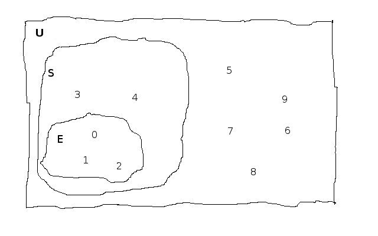

= My Glimpse Inside The Ivory Tower Of Mathematics
Tony Locke
:doctype: book
:entails: &#x22A8;
:notentails: &#x22AD;
:and: &#x2227;
:or: &#x2228;
:implies: &#x2192;
:not: &#x00AC;
:bicond: &#x2194;
:equiv: &#8801;
:isin: &#x2208;
:notin: &#x2209;
:sube: &#x2286;
:sub: &#x2282;
:ne: &#x2260;
:nequiv: &#x2262;
:brarr: &#x21A6;
:emptyset: &#x2205;
:mathP: 𝓟
:Delta: &#x0394;
:Gamma: &#x0393;
:phi: &#x03C6;
:psi: &#x03C8;
:sigma: &#x03C3;
:cap: &#8745;
:cup: &#8746;
:toc:

:numbered:
== Introduction

I'm a mathematical barbarian, but a few days ago I broke into the ivory tower of
mathematics and learnt some of the basics. In order to help me learn it, I wrote
this tutorial. It helped me, and perhaps you'll find it useful too.

=== Licence

This work is licensed under a
http://creativecommons.org/licenses/by-sa/4.0/[Creative Commons
Attribution-ShareAlike 4.0 International License].

=== Forum

If you have any comments on this book, please visit
https://groups.google.com/forum/\#!forum/glimpse-of-mathematics[https://groups.google.com/forum/#!forum/glimpse-of-mathematics].

The source code for the book is at
https://github.com/tlocke/maths[https://github.com/tlocke/maths].

=== Formats

This book is available in the following formats:

[horizontal]
Web:: http://maths.tlocke.org.uk/
EPUB:: http://maths.tlocke.org.uk/maths.epub

== Propositional Logic

[[img-russel]]
.http://commons.wikimedia.org/wiki/File:Russell_in_1924_01.jpg#mediaviewer/File:Russell_in_1924_01.jpg[Bertrand Russell in 1924] by Unknown - http://www.humanities.mcmaster.ca/~bertrand/later.html. Licensed under Public domain via http://commons.wikimedia.org/wiki/[Wikimedia Commons].
image::russell.jpg[Bertrand Russell in 1924]

=== True and false

In the realm of Propositional Logic, I found that they deal with things that are
either true or false. In the English language, sentences that are either true or
false are known as _statements_. Here are some sentences together with
explanations of whether they are statements or not:

[example]
How many miles to Crinnis?

This is a question, so not a statement.

[example]
Elephants have four legs.

Yay, an actual statement! It's a sentence that is either true or false.

[example]
Don't dilly-dally.

This isn't true or false, it sounds like someone admonishing somebody. Not a
statement.

[example]
The capital of France is Paris.

Yes, a statement.

[example]
He likes chocolate.

This sounds like a statement, but according to those logicians in the ivory
tower it doesn't count because it relies on knowing who '`he`' is.

[example]
Don't spoil the ship for a ha'peth of tar.

This is a proverb, not a statement.

I've got this nagging doubt in my mind. Most statements I can think of aren't
_totally_ ambiguous. Take the '`Elephants have four legs`' example. Maybe
there's a three legged elephant in existence, perhaps one in a zoo got
gangrene or something and had to have a leg amputated... Nevertheless, let's
suspend our disbelief and imagine all those perfect statements.

At that point, Alfred Tarski spoke up, '`What about this then?`'.

[example]
This statement is false.

Well, I'm not sure what to do. It seems like a statement, but if it's true then
it's false, and if it's false then it's true! Okay, let's get round it by saying
that this isn't really a statement. What do you think Taski? But Tarski's mind
was on other things...

:numbered!:
==== Questions

. Which of the following are statements?
.. Who is John Galt?
.. He's over there.
.. Three divided by three is one.
.. Belgium is a European country.
.. Praise be!
.. Blue is a colour.

. Are the following statements true or false?
.. Four is greater than two.
.. Tennis is a colour.
.. A square has eight sides.
.. A cube has eight corners.
.. Birmingham is a city in England.
.. The word '`rotavator`' is a
      http://en.wiktionary.org/wiki/palindrome[palindrome].

==== Answers

. {empty}
.. Not a statement.
.. Not a statement.
.. A statement.
.. A statement.
.. Not a statement.
.. A statement.
. {empty}
.. True.
.. False.
.. False.
.. True.
.. True.
.. True.

:numbered:
=== Compound Statements

It seems that the next thing the logicians do is string together simple
statements to make compound statements. So two simple statements might be:

[example]
Abelard likes coffee. +
Abelard likes cake.

And a compound statement formed from these two simple statements is:

[example]
Abelard likes coffee and Abelard likes cake.

We've joined the two simple statements together with the _logical conective_
'`and`'. This compound statement is true if both the simple statements are true,
otherwise it is false. Another compound statement we can make from our two
simple statements is:

[example]
Abelard likes coffee or Abelard likes cake.

Here's we've joined the two simple statements together with the logical
connective '`or`'. This compound statment is false if both simple statements are
false, otherwise it's true.

:numbered!:
==== Questions

. Are the following compound statements true or false?
.. The film Erin Brokovich stars Julia Roberts and 16 is greater than 4.
.. London is the capital of France or Paris is the capital of France.
.. Some people have brown eyes and humans lay eggs.
.. Four multiplied by two is twenty or it has never rained in Wales.
.. Toothpaste is harder than diamond and less than 100 films have ever been
   made.

==== Answers

. {empty}
.. True.
.. True.
.. False.
.. False.
.. False.

:numbered:
=== Formulas

Rather than always writing statements out in full, those work-shy logicians
write them in a shorthand. First they label each simple statement with a capital
letter of the alphabet. They call the label an _atomic formula_. Then they use
funny symbols to denote logical connectives. Here's a table of the symbols used
for logical connectives:

|===
| Logical connective | Symbol

| and                | {and}
| or                 | {or}
|===

So for the compound statement:

[example]
Abelard likes coffee and Abelard likes cake.

the two simple statements can have the atomic formulas P and Q:

[example]
P: Abelard likes coffee. +
Q: Abelard likes cake.

and the compound statement can be written as the _compound formula_:

[example]
(P {and} Q)

Now that we've said what P and Q stand for we can take this compound statement:

[example]
Abelard likes coffe or Abelard likes cake.

and write it using the atomic formulas to give the compound formula:

[example]
(P {or} Q)

You'll notice that the formulas have brackets round them. This is useful for
later on when formulas get more complicated.

Let's say that Abelard does like coffee, but doesn't like cake. Then:

[example]
P is true +
Q is false

Then using our common sense reasoning we know that it isn't true that Abelard likes coffee and likes cake, so this is written formally as:

[example]
(P {and} Q) +
(true {and} false) +
false

and also we know that it is true that either Abelard likes coffee or Abelard
likes cake and this is written formally as:

[example]
(P {or} Q) +
(true {or} false) +
true

This process of taking a formula and substituting in the true or false values
and working out if the formula as a whole is true or false, they call
_evaluating_ the formula for particular values.

:numbered!:
==== Questions

. Write the following compound statements as formulas:
.. The film Erin Brokovich stars Julia Roberts and 16 is greater than 4.
.. London is the capital of France or Paris is the capital of France.
.. Some people have brown eyes and humans lay eggs.
.. Four multiplied by two is twenty or it has never rained in Wales.
.. Toothpaste is harder than diamond and less than 100 films have ever been
   made.
. For each of the formulas in your answers to question 1, evalute them using
  values of the atomic formulas from your general knowledge.

==== Answers

. Write the following compound statements as formulas:
.. The film Erin Brokovich stars Julia Roberts and 16 is greater than 4. +
   P: The film Erin Brokovich stars Julia Roberts. +
   Q: 16 is greater than 4. +
   (P {and} Q)
.. London is the capital of France or Paris is the capital of France. +
   A: London is the capital of France. +
   B: Paris is the capital of France. +
   (A {or} B)
.. Some people have brown eyes and humans lay eggs. +
   P: Some people have brown eyes. +
   Q: Humans lay eggs. +
   (P {and} Q)
.. Four multiplied by two is twenty or it has never rained in Wales. +
   P: Four multiplied by two is twenty. +
   Q: It has never rained in Wales. +
   (P {or} Q)
.. Toothpaste is harder than diamond and less than 100 films have ever been
   made. +
   P: Toothpaste is harder than diamond. +
   Q: Fewer than 100 films have ever been made. +
   (P {and} Q)
. For each of the formulas in your answers to question 1, evalute them using
  values of the atomic formulas from your general knowledge.
.. The film Erin Brokovich stars Julia Roberts and 16 is greater than 4. +
   P: The film Erin Brokovich stars Julia Roberts. +
   Q: 16 is greater than 4. +
   (P {and} Q) +
   P is true +
   Q is true +
   (true {and} true) is true
.. London is the capital of France or Paris is the capital of France. +
   A: London is the capital of France. +
   B: Paris is the capital of France. +
   (A {or} B) +
   A is false. +
   B is true. +
   (false {or} true) is true.
.. Some people have brown eyes and humans lay eggs. +
   P: Some people have brown eyes. +
   Q: Humans lay eggs. +
   (P {and} Q) +
   P is true. +
   Q is false. +
   (true {and} false) is true.
.. Four multiplied by two is twenty or it has never rained in Wales. +
   P: Four multiplied by two is twenty. +
   Q: It has never rained in Wales. +
   (P {or} Q) +
   P is false. +
   Q is false. +
   (false {or} false) is false. +
.. Toothpaste is harder than diamond and less than 100 films have ever been
   made. +
   P: Toothpaste is harder than diamond. +
   Q: Fewer than 100 films have ever been made. +
   (P {and} Q) +
   P is false. +
   Q is false. +
   (false {and} false) is false.

:numbered:
=== Ambiguous Compound Statements

Here's an ambiguous compound statement:

[example]
London is the capital of the UK or London is the capital of France and Paris is
the captital of the UK.

Assigning labels to the simple statements:

[example]
P: London is the capital of the UK. +
Q: London is the capital of France. +
R: Paris is the capital of the UK. +

the compound statement can be transated into two formulas with different
meanings:

[example]
\((P {or} Q) {and} R) +
(P {or} (Q {and} R))

'`Hold on, you blithely said that these two formulas have different meanings,
but how do you know that?`'. Good point, erm, what would Bertrand Russell do?
Bear with me.  Okay, using our geography knowledge we know that P is true, Q is
false and R is false and so evaluating the first formula gives:

[example]
((P {or} Q) {and} R) +
((true {or} false) {and} false) +
(true {and} false) +
false

and the second formula evaluates to:

[example]
(P {or} (Q {and} R)) +
(true {or} (false {and} false)) +
(true {or} false) +
true

So when substituting in the same values, the first formula evaluates to false
and the second evaluates to true, and so the two formulas are different.

I think what the Ivory Tower is teaching me here is that even though I started
out translating from English (what they call a natural language) to formulas
(what they call a formal language), it turns out that as well as being shorter,
formulas are unambiguous. It seems to me that the English statements are just a
jumping off point, and formulas are much better at describing this mathematical
realm. W00t, I said, '`mathematical realm`'!!!

:numbered!:
==== Questions

. For the following ambiguous compound statements in English, write down all the
  possible meanings as formulas.
.. Two is less than four or Alaska begins with A and purple is a number.
.. Purple is a number and Alaska begins with A or two is less than four.
. For each of the answers in question 1, evaluate the formulas using the values
  that you know from general knowledge.

==== Answers

. For the following ambiguous compound statements in English, write down all the
  possible meanings as formulas. +
  P: Two is less than four. +
  Q: Alaska begins with A. +
  R: Purple is a number.
.. Two is less than four or Alaska begins with A and purple is a number. +
   (P {or} (Q {and} R)) +
   ((P {or} Q) {and} R)
.. Purple is a number and Alaska begins with A or two is less than four. +
   (R {and} (Q {or} P)) +
   ((R {and} Q) {or} P)
. For each of the answers in question 1, evaluate the formulas using the values
  that you know from general knowledge.
  P: Two is less than four. +
  Q: Alaska begins with A. +
  R: Purple is a number.
  P is true +
  Q is true
  R is false
.. Two is less than four or Alaska begins with A and purple is a number. +
   (P {or} (Q {and} R)) +
   (true {or} (true {and} false)) +
   (true {or} false) +
   true +
    +
   ((P {or} Q) {and} R) +
   ((true {or} true) {and} false) +
   (true {and} false) +
   false +
.. Purple is a number and Alaska begins with A or two is less than four. +
   (R {and} (Q {or} P)) +
   (false {and} (true {or} true)) +
   (false {and} true) +
   false +
    +
   ((R {and} Q) {or} P) +
   ((false {and} true) {or} true) +
   (false {or} true) +
   true

:numbered:
=== Interpretations

Say you've got a formula:

[example]
(P {and} Q)

To logicians, an _interpretation_ (also called a _truth assignment_) is the
assignment of true or false to P and Q. So one interpretation is:

[example]
P is false +
Q is false

and another is:

[example]
P is true +
Q is false

so for a compound formula with two atomic formulas, there are four possible
interpretations:

|===
| P     | Q

| True  | True
| False | True
| True  | False
| False | False 
|===

and to make it easier to write they use T for true and F for false:

|===
| P | Q

| T | T
| F | T
| T | F
| F | F
|===

:numbered!:
==== Questions

. For a compound formula with three atomic formulas, there are eight possible
  interpretations. Show those eight possible interpretation in a table.

==== Answers

. For a compound formula with three atomic formulas, there are eight possible
  interpretations. Show those eight possible interpretation in a table.
+
|===
| P | Q | R

| T | T | T
| F | T | T
| T | F | T
| F | F | T
| T | T | F
| F | T | F
| T | F | F
| F | F | F
|===

:numbered:
=== Truth Tables

A truth table. A medieval device for extracting a confession? No, a
mathematical device for showing if a formula is true or false for every possible
<<_interpretations, interpretation>>. The truth table for (P {and} Q) is:

|===
| P | Q | (P {and} Q)

| T | T | T
| F | T | F
| T | F | F
| F | F | F
|===

so what we've done is written a row for each interpretation of P and Q, and then
in the final column we've put the result of evaluating (P {and} Q). The truth
table for (P {or} Q) is:

|===
| P | Q | (P {or} Q)

| T | T | T
| F | T | T
| T | F | T
| F | F | F
|===

You can use a truth table to show that (P {and} Q) means the same as
(Q {and} P):

|===
| P | Q | (P {and} Q) | (Q {and} P)

| T | T | T           | T
| F | T | F           | F
| T | F | F           | F
| F | F | F           | F
|===

For each interpretation, the last two columns are the same, and so (P {and} Q)
means the same as (Q {and} P).

:numbered!:
==== Questions

. Use a truth table to show that (P {or} Q) means the same thing as (Q {or} P).

==== Answers

. Use a truth table to show that (P {or} Q) means the same thing as (Q {or} P).
+
|===
| P | Q | (P {or} Q) | (Q {or} P)

| T | T | T          | T
| F | T | T          | T
| T | F | T          | T
| F | F | F          | F
|===

For each row of the truth table, the last two columns are the same, and so
(P {or} Q) means the same as (Q {or} P).

:numbered:
=== Not

There's another logical connective called _not_, which has the symbol {not} and
the truth table:

|===
| P | ({not}P)

| T | F
| F | T
|===

Usually the brackets are omitted for {not}, so when you see:

[example]
{not}P

it's taken to mean:

[example]
({not}P)

Anyway, let us cast it loose amongst the other functions and employ the truth
table to see what results. Picking a formula at random, let's try:

[example]
(({not}P) {or} Q)

which gives the truth table:

|===
| P | Q | {not}P | ({not}P {or} Q)

| T | T | F      | T
| F | T | T      | T
| T | F | F      | F
| F | F | T      | T
|===

Let us now extract a full confession from:

[example]
{not}(P {or} Q)

which gives the truth table:

|===
| P | Q | (P {or} Q) | {not}(P {or} Q)

| T | T | T        | F
| F | T | T        | F
| T | F | T        | F
| F | F | F        | T
|===

One other thing, the first two logical connectives we encountered ({and} and
{or}) both acted on two formulas, and so they're known as _binary_ connectives.
The {not} connective acts on one formula and so is called a _unary_ connective.

:numbered!:
==== Questions

. Give the truth tables for:
.. {not}(P {and} Q)
.. (P {or} {not}Q)
.. {not}{not}P
.. {not}((P {or} Q) {or} R)
.. {not}((P {or} Q) {and} R)

==== Answers

. Give the truth tables for:
.. {not}(P {and} Q)
+
|===
| P | Q | (P {and} Q) | {not}(P {and} Q)

| T | T | T           | F
| F | T | F           | T
| T | F | F           | T
| F | F | F           | T
|===
+
.. (P {or} {not}Q)
+
|===
| P | Q | {not}Q | (P {or} {not}Q)

| T | T | F      | T
| F | T | F      | F
| T | F | T      | T
| F | F | T      | T
|===
+
.. {not}{not}P
+
|===
| P | {not}P | {not}{not}P

| T | F      | T
| F | T      | F
|===
+
.. {not}((P {or} Q) {or} R)
+
|===
| P | Q | R | (P {or} Q) | ((P {or} Q) {or} R) | {not}((P {or} Q) {or} R)

| T | T | T | T          | T                   | F
| F | T | T | T          | T                   | F
| T | F | T | T          | T                   | F
| F | F | T | F          | T                   | F
| T | T | F | T          | T                   | F
| F | T | F | T          | T                   | F
| T | F | F | T          | T                   | F
| F | F | F | F          | F                   | T
|===
+
.. {not}((P {or} Q) {and} R)
+
|===
| P | Q | R | (P {or} Q) | ((P {or} Q) {and} R) | {not}((P {or} Q) {and} R)

| T | T | T | T          | T                    | F
| F | T | T | T          | T                    | F
| T | F | T | T          | T                    | F
| F | F | T | F          | F                    | T
| T | T | F | T          | F                    | T
| F | T | F | T          | F                    | T
| T | F | F | T          | F                    | T
| F | F | F | F          | F                    | T
|===

:numbered:
=== Satisfaction

'`Sir, I demand satisfaction!`'. Yeah, we're not in Poldark, they don't watch
that in their Ivory Tower. Why waste time on TV dramas when you could be doing
maths?

An interpretation _satisfies_ a formula if it is true under that interpretation.
An example you say? An example? Okay, okay, you started off humble and now
you're making demands. I just feel you need to take a moment to think about
your attitude to this whole thing.

Under the interpretation:

[example]
P is false +
Q is true

the formula:

[example]
({not}P {and} Q)

evaluates to:

[example]
({not}false {and} true) +
(true {and} true) +
true

since it's true, we can say that this interpretation satisfies this formula.
'`Could you show me another example please?`', '`Certainly dear reader`'.
Under the interpretation:

[example]
A is true +
B is true +
C is true +

the formula:

[example]
((B {or} A) {or} {not}C)

evaluates to:

[example]
((true {or} true) {or} {not}true) +
(true {or} false) +
true

and so this interpretation satisfies this formula.

:numbered!:
==== Questions

. For the following pairs of formulas and interpretations, show that the
  interpretation satisfies the formula:
.. (P {or} Q) when P is true and Q is false.
.. ({not}P {or} {not}Q) when P is true and Q is false.
.. ({not}A {and} B) when A is false and B is true.

==== Answers

. For the following pairs of formulas and interpretations, show that the
  interpretation satisfies the formula:
.. (P {or} Q) when P is true and Q is false. +
   (P {or} Q) +
   (true {or} false) +
   true +
   so the interpretation satisfies the formula.
.. ({not}P {or} {not}Q) when P is true and Q is false. +
   ({not}P {or} {not}Q) +
   ({not}true {or} {not}false) +
   (false {or} true) +
   true
   so the interpretation satisfies the formula.
.. ({not}A {and} B) when A is false and B is true. +
   ({not}A {and} B) +
   ({not}false {and} true) +
   (true {and} true) +
   true +
   so the interpretation satisfies the formula.

:numbered:
=== Falsification

This is the opposite of <<_satisfaction,satisfaction>>. An interpretation
_falsifies_ a formula if it is false under that interpretation. Under the
interpretation:

[example]
P is true +
Q is true

the formula:

[example]
({not}P {and} Q)

evaluates to:

[example]
({not}true {and} true) +
(false {and} true) +
false

since it's false, we can say that this interpretation falsifies this formula.
Under the interpretation:

[example]
A is true +
B is true +
C is true +

the formula:

[example]
((B {or} A) {and} {not}C)

evaluates to:

[example]
((true {or} true) {and} {not}true) +
(true {and} false) +
false

and so this interpretation satisfies this formula.

:numbered!:
==== Questions

. For the following pairs of formulas and interpretations, show that the
  interpretation falsifies the formula:
.. (P {or} Q) when P is false and Q is false.
.. ({not}P {or} {not}Q) when P is true and Q is true.
.. ({not}A {and} B) when A is false and B is false.

==== Answers

. For the following pairs of formulas and interpretations, show that the
  interpretation falsifies the formula:
.. (P {or} Q) when P is false and Q is false. +
   (P {or} Q) +
   (false {or} false) +
   false +
   so the interpretation falsifies the formula.
.. ({not}P {or} {not}Q) when P is true and Q is true. +
   ({not}P {or} {not}Q) +
   ({not}true {or} {not}true) +
   (false {or} false) +
   false
   so the interpretation falsifies the formula.
.. ({not}A {and} B) when A is false and B is false.
   ({not}A {and} B) +
   ({not}false {and} false) +
   (true {and} false) +
   false +
   so the interpretation falsifies the formula.

:numbered:
=== Valid Formula

The formula:

[example]
(P {or} {not}P)

has the truth table:

|===
| P | {not}P | (P {or} {not}P)

| T | F      | T
| F | T      | T
|===

which shows that every possible interpretation satisfies the formula. In the
Tower such a formula is called a _valid formula_.
 

:numbered!:
==== Questions

. Using a truth table, show that the following formula is valid:
.. ((P {or} Q) {or} {not}P)

==== Answers

. Using a truth table, show that the following formula is valid:
.. ((P {or} Q) {or} {not}P)
+
|===
| P | Q | {not}P | (P {or} Q) | ((P {or} Q) {or} {not}P)

| T | T | F      | T          | T
| F | T | T      | T          | T
| T | F | F      | T          | T
| F | F | T      | F          | T
|===
+
so the formula is valid.

:numbered:
=== Unsatisfiable Formula

The formula:

[example]
(P {and} {not}P)

has the truth table:

|===
| P | {not}P | (P {or} {not}P)

| T | F      | F
| F | T      | F
|===

which shows that every possible interpretation falsifies the formula. In the
Tower such a formula is called an _unsatisfiable formula_.

:numbered!:
==== Questions

. Using truth tables, show that the following formulas are unsatisfiable:
.. \((P {and} Q) {and} {not}(P {and} Q))
.. (P {and} (Q {and} {not}P))
.. \(({not}P {and} {not}Q) {and} {not}({not}P {and} {not}Q))
.. (((P {and} {not}P) {and} Q) {and} R)

==== Answers

. Using truth tables, show that the following formulas are unsatisfiable:
.. \((P {and} Q) {and} {not}(P {and} Q))
+
|===
| P | Q | (P {and} Q) | {not}(P {and} Q) | \((P {and} Q) {and} {not}(P {and} Q))

| T | T | T           | F                | F
| F | T | F           | T                | F
| T | F | F           | T                | F
| F | F | F           | T                | F
|===
+
so unsatisfiable.
.. (P {and} (Q {and} {not}P))
+
|===
| P | Q | {not}P | (Q {and} {not}P) | (P {and} (Q {and} {not}P))

| T | T | F      | F                | F
| F | T | T      | T                | F
| T | F | F      | F                | F
| F | F | T      | F                | F
|===
+
so the formula is unsatisfiable.
.. (((P {and} {not}P) {and} Q) {and} R)
+
[cols="7*", options="header"]
|===
| P
| Q
| {not}P
| {not}Q
| ({not}P {and} {not}Q)
| {not}({not}P {and} {not}Q)
| \(({not}P {and} {not}Q) {and} {not}({not}P {and} {not}Q))

| T | T | F | F | F | T | F
| F | T | T | F | F | T | F
| T | F | F | T | F | T | F
| F | F | T | T | T | F | F
|===
so the formula is unsatisfiable.
.. (((P {and} {not}P) {and} Q) {and} R)
+
[cols="7*", options="header"]
|===
| P
| Q
| R
| {not}P
| (P {and} {not}P)
| ((P {and} {not}P) {and} Q)
| (((P {and} {not}P) {and} Q) {and} R)

| T | T | T | F | F | F | F
| F | T | T | T | F | F | F
| T | F | T | F | F | F | F
| F | F | T | T | F | F | F
| T | T | F | F | F | F | F
| F | T | F | T | F | F | F
| T | F | F | F | F | F | F
| F | F | F | T | F | F | F
|===
so unsatisfiable.

:numbered:
=== Contingent Formula

A formula that is neither valid nor unsatisfiable is said to be _contingent_. For example the formula:

[example]
P {and} Q

has the truth table:

|===
| P | Q | P {and} Q

| T | T | T
| F | T | F
| T | F | F
| F | F | F
|===

which shows that the formula is neither valid not unsatisfiable and so it is
contingent. Another way of putting it is to say that a formula is contingent if
it is both satisfiable and falsifiable.

:numbered!:
==== Questions

. Using truth tables, show that the following formulas are contingent:
.. (P {and} {not}Q)
.. P
.. P {or} Q
.. {not}P

==== Answers

. Using truth tables, show that the following formulas are contingent:
.. (P {and} {not}Q)
+
|===
| P | Q | {not}Q | (P {and} {not}Q)

| T | T | F      | F
| F | T | F      | T
| T | F | T      | T
| F | F | T      | F
|===
+
so the formula is neither valid or unsatisfiable and so it's contingent.
.. P
+
|===
| P

| T
| F
|===
+
so the formula is neither valid or unsatisfiable and so it's contingent.
.. P {or} Q
+
|===
| P | Q | P {or} Q

| T | T | T
| F | T | T
| T | F | T
| F | F | F
|===
+
so the formula is neither valid or unsatisfiable and so it's contingent.
.. {not}P
+
|===
| P | {not}P

| T | T | F
| F | T | F
| T | F | T
| F | F | T
|===
+
so the formula is neither valid or unsatisfiable and so it's contingent.

:numbered:
=== Implies

There's another binary connective called _implies_ that has the truth table:

|===
| P | Q | (P {implies} Q)

| T | T | T
| F | T | T
| T | F | F
| F | F | T
|===

Take the two simple statements:

[example]
Abelard is at the cafe. +
The cafe is open.

Joining the two with an implication could give the compound statement:

[example]
Abelard is at the cafe only if the cafe is open.

If Abelard really is at the cafe and the cafe really is open, then this
compound statement is true. If Abelard isn't at the cafe, then whether or not
the cafe is open, the compound statement is still true (another way of putting
it is to say that if Abelard is not at the cafe, then this is still consistent
with with the statement that '`Abelard is at the cafe only when the cafe is
open`'). The only time the compound statement is false is if Abelard is at the
cafe but the cafe is not open.

There are a few different ways that '`implies`' occurs in English. The
statement:

[example]
Abelard is at the cafe only if the cafe is open.

could be written in these alternative ways:

[example]
* If Abelard is at the cafe then the cafe is open.
* Abelard being at the cafe implies that the cafe is open.
* The cafe being open is a necessary condition for Abelard to be at the cafe.
* The cafe being open follows from Abelard being at the cafe.

Here's an example of {implies} in action. The formula:

[example]
((P {and} {not}Q) {implies} Q)

Has the truth table:

|===
| P | Q | {not}Q | (P {and} {not}Q) | ((P {and} {not}(Q)) {implies} Q)

| T | T | F      | F                | T
| F | T | F      | F                | T
| T | F | T      | T                | F
| F | F | T      | F                | T
|===

Another example; the truth table for (Q {implies} (P {and} {not}Q)) is:

|===
| P | Q | {not}Q | (P {and} {not}Q) | (Q {implies} (P {and} {not}Q))

| T | T | F      | F              | F
| F | T | F      | F              | F
| T | F | T      | T              | T
| F | F | T      | F              | T
|===

:numbered!:
==== Questions

. Write the following English statements as logical formulas:
.. The washing is out only if it's a dry day.
.. If Keith is in Bath, then Keith is in England.
.. The sky being red at night implies that the shepherds are delighted.
. Create a truth table for each of the following formulas:
.. ({not}P {implies} Q)
.. (Q {implies} {not}Q)
.. ((P {implies} Q) {or} P)
.. ({not}(P {and} Q) {implies} ({not}P {or} {not}Q))
.. \((P {and} (P {implies} Q)) {implies} {not}P)

==== Answers

. Write the following English statements as logical formulas:
.. The washing is out only if it's a dry day. +
   P: The washing is out. +
   Q: It's a dry day. +
   (P {implies} Q)
.. If Keith is in Bath, then Keith is in England. +
   A: Keith is in Bath. +
   B: Keith is in England. +
   (A {implies} B)
.. The sky being red at night implies that the shepherds are delighted.
   A: The sky is red at night. +
   B: The shepherds are delighted. +
   (A {implies} B)
. Create a truth table for each of the following formulas:
.. ({not}P {implies} Q)
+
|===
| P | Q | {not}P | ({not}P {implies} Q)

| T | T | F      | T
| F | T | T      | T
| T | F | F      | T
| F | F | T      | F
|===
.. (Q {implies} {not}Q)
+
|===
| Q | {not}Q | (Q {implies} {not}Q)

| T | F      | F
| F | T      | T
|===
.. ((P {implies} Q) {or} P)
+
|===
| P | Q | (P {implies} Q) | ((P {implies} Q) {or} P)

| T | T | T             | T
| F | T | T             | T
| T | F | F             | T
| F | F | T             | T
|===
.. ({not}(P {and} Q) {implies} ({not}P {or} {not}Q))
+
[cols="8*", options="header"]
|===
| P
| Q
| (P {and} Q)
| {not}(P {and} Q)
| {not}P
| {not}Q
| ({not}P {or} {not}Q)
| ({not}(P {and} Q) {implies} ({not}P {or} {not}Q))

| T | T | T | F | F | F | F | T
| F | T | F | T | T | F | T | T
| T | F | F | T | F | T | T | T
| F | F | F | T | T | T | T | T
|===
.. \((P {and} (P {implies} Q)) {implies} {not}P)
+
[cols="6*", options="header"]
|===
| P
| Q
| (P {implies} Q)
| {not}P
| (P {and} (P {implies} Q))
| \((P {and} (P {implies} Q)) {implies} {not}P)

| T | T | T | F | T | F
| F | T | F | T | F | T
| T | F | F | F | F | T
| F | F | F | T | F | T
|===

:numbered:
=== Biconditional

The _biconditional_ connective is a binary connective with the truth table:

|===
| P | Q | (P {bicond} Q)

| T | T | T
| F | T | F
| T | F | F
| F | F | T
|===

Translating from English to a formula, the sentence:

[example]
It's Christmas Day if and only if it's the 25th of December.

is written:

[example]
P: It's Christmas Day. +
Q: It's the 25th of December. +
(P {bicond} Q)

which of course is true. An example that is false is:

[example]
It's Christmas Day if and only if it's the 2nd of March.

which is written:

[example]
P: It's Christmas Day. +
Q: It's the 2nd of March. +
(P {bicond} Q)

:numbered!:
==== Questions

. Translate the following English sentences into formulas:
.. The bike's back brake comes on if, and only if, the left brake lever is
   applied.
.. The fridge light is on if, and only if, the fridge door is open.
. Give the truth table for each of the following formulas:
.. (A {bicond} (B {and} C))
.. (B {or} (A {bicond} B))
.. (P {and} {not}(P {bicond} (Q {or} P)))
.. \((Q {bicond} {not}P) {and} (P {bicond} {not}{not}Q))

==== Answers

. Translate the following English sentences into formulas:
.. The bike's back brake comes on if, and only if, the left brake lever is
   applied. +
   P: The bike's back brake comes on. +
   Q: The left brake lever is applied. +
   (P {bicond} Q)
.. The fridge light is on if, and only if, the fridge door is open. +
   P: The fridge light is on. +
   Q: The fridge door is open. +
   (P {bicond} Q)
. Give the truth table for each of the following formulas:
.. (A {bicond} (B {and} C))
+
|===
| A | B | C | (B {and} C) | (A {bicond} (B {and} C)

| T | T | T | T           | T
| F | T | T | T           | F
| T | F | T | F           | F
| F | F | T | F           | T
| T | T | F | F           | F
| F | T | F | F           | T
| T | F | F | F           | F
| F | F | F | F           | T
|===
+
.. (B {or} (A {bicond} B))
+
|===
| A | B | (A {bicond} B) | (B {or} (A {bicond} B))

| T | T | T              | T
| F | T | F              | T
| T | F | F              | F
| F | F | T              | T
|===
+
.. (P {and} {not}(P {bicond} (Q {or} P)))
+
[cols="6*", options="header"]
|===
| P
| Q
| (Q {or} P)
| (P {bicond} (Q {or} P)
| {not}(P {bicond} (Q {or} P))
| (P {and} {not}(P {bicond} (Q {or} P)))

| T | T | T | T | F | F
| F | T | T | F | T | F
| T | F | T | T | F | F
| F | F | F | T | F | F
|===
+
.. \((Q {bicond} {not}P) {and} (P {bicond} {not}{not}Q))
+
[cols="8*", options="header"]
|===
| P
| Q
| {not}P
| (Q {bicond} {not}P)
| {not}Q
| {not}{not}Q
| (P {bicond} {not}{not}Q)
| \((Q {bicond} {not}P) {and} (P {bicond} {not}{not}Q))

| T | T | F | F | F | T | T | F
| F | T | T | T | F | T | F | F
| T | F | F | T | T | F | F | F
| F | F | T | F | T | F | T | F
|===

:numbered:
=== Identity

If two formulas are an _identity_ (also called _logically equivalent_), then
they mean the same under all interpretations. In other words if two formulas are
an identity, then the formula formed by joining them with the {bicond}
connective will be <<_valid_formula, valid>>. For example, if the pair of
formulas:

[example]
(A {implies} B) +
({not}A {or} B)

are an identity, then:

[example]
\((A {implies} B) {bicond} ({not}A {or} B))

will be valid. Its truth table is:

[cols="6*", options="header"]
|===
| A
| B
| (A {implies} B)
| {not}A
| ({not}A {or} B)
| \((A {implies} B) {bicond} ({not}A {or} B))

| T | T | T | F | T | T
| F | T | T | T | T | T
| T | F | F | F | F | T
| F | F | T | T | T | T
|===

and so indeed we can say that this pair of formulas is an identity. The symbol
for identity is {equiv}, and so we can write the identity as:

(A {implies} B) {equiv} ({not}A {or} B)

The two formulas in an identity can be substituted for each other in other
formulas, without changing the meaning of those other formulas. The commonly
used identities have their own names. The identity that we've just found:

[example]
(A {implies} B) {equiv} ({not}A {or} B)

is called the _material implication identity_.

:numbered!:
==== Questions

. Use the material implication identity to rewrite the following formulas while
  preserving their meaning:
.. (A {implies} B)
.. ({not}A {or} B)
.. (A {implies} {not}B)
.. (A {or} B)

==== Answers

. Use the material implication identity to rewrite the following formulas while
  preserving their meaning:
.. (A {implies} B) +
   ({not}A {or} B)
.. ({not}A {or} B) +
   (A {implies} B)
.. (A {implies} {not}B) +
   ({not}A {or} {not}B)
.. (A {or} B) +
   ({not}A {implies} B)

:numbered:
==== Material Equality Identity

Hot on the heels of meeting the Material Implication identity, I encountered the
Material Equality identity:

[example]
(P {bicond} Q) {equiv} \(({not}P {or} Q) {and} (P {or} {not}Q))

Actually I found loads of these identities in the Tower, some with names, some
without. I noted down the ones I thought were important, and the ones that had
a pattern to them and skipped over the rest. Is this the right approach?

:numbered!:
==== Questions

. Use the material equality identity to rewrite the following formulas while
  preserving their meaning:
.. (P {bicond} Q)
.. \(({not}P {or} Q) {and} (P {or} {not}Q))
.. ((P {bicond} Q) {and} P)
.. \(((P {or} Q) {and} ({not}P {or} {not}Q)) {or} {not}P)

==== Answers

. Use the material equality identity to rewrite the following formulas while
  preserving their meaning:
.. (P {bicond} Q) +
   \(({not}P {or} Q) {and} (P {or} {not}Q))
.. \(({not}P {or} Q) {and} (P {or} {not}Q)) +
   (P {bicond} Q)
.. \((P {bicond} Q) {and} P) +
   ((({not}P {or} Q) {and} (P {or} {not}Q)) {and} P)
.. \(((P {or} Q) {and} ({not}P {or} {not}Q)) {or} {not}P) +
   ((P {bicond} Q) {or} {not}P)

:numbered:
=== Commutativity

A special type of identity that some binary connectives have is _commutativity_.
The connective {and} is commutative which means that:

[example]
(A {and} B) {equiv} (B {and} A)

This identity is called _conjunction commutativity_. Not all
binary connectives are commutative though. For example the pair of formulas:

[example]
(A {implies} B) +
(B {implies} A)

is not an identity because:

[example]
\((A {implies} B) {bicond} (B {implies} A))

is not a valid formula, and so {implies} is not commutative. Here's a table
showing the binary functions, and whether they're commutative or not, and if
they are, giving the name of the associated identity.

|===
| Binary Function | Commutative? | Name Of Identity

| {and}           | Yes          | conjunction commutativity
| {or}            | Yes          | disjunction commutativity
| {implies}       | No           |
| {bicond}        | Yes          | biconditional commutativity
|===

:numbered!:
==== Questions

. For each of the four binary functions use a truth table to show if they
  are or are not commutative.

==== Answers

. For each of the four binary functions use a truth table to show if they
  are or are not commutative.
.. {and} is commutative if \((A {and} B) {bicond} (B {and} A)) is valid.
+
|===
| A | B | (A {and} B) | (B {and} A) | \((A {and} B) {bicond} (B {and} A))

| T | T | T           | T           | T
| F | T | F           | F           | T
| T | F | F           | F           | T
| F | F | F           | F           | T
|===
+
so it is valid and so {and} is commutative.
.. {or} is commutative if \((A {or} B) {bicond} (B {or} A)) is valid.
+
|===
| A | B | (A {or} B) | (B {or} A) | \((A {or} B) {bicond} (B {or} A))

| T | T | T          | T          | T
| F | T | T          | T          | T
| T | F | T          | T          | T
| F | F | F          | F          | T
|===
+
so it is valid and so {or} is commutative.
.. {implies} is commutative if \((A {implies} B) {bicond} (B {implies} A)) is 
   valid.
+
[cols="5*", options="header"]
|===
| A
| B
| (A {implies} B)
| (B {implies} A)
| \((A {implies} B) {bicond} (B {implies} A))

| T | T | T | T | T
| F | T | T | F | F
| T | F | F | T | F
| F | F | T | T | T
|===
+
it is not valid and so {implies} is not commutative.
.. {bicond} is commutative if \((A {bicond} B) {bicond} (B {bicond} A)) is
   valid.
+
[cols="5*", options="header"]
|===
| A
| B
| (A {bicond} B)
| (B {bicond} A)
| \((A {bicond} B) {bicond} (B {bicond} A))

| T | T | T | T | T
| F | T | F | F | T
| T | F | F | F | T
| F | F | T | T | T
|===
+
it is valid and so {bicond} is commutative.

:numbered:
=== Associativity

Another type of identity that some binary connectives have is _associativity_.
The {and} connective is associative, which means:

[example]
(P {and} (Q {and} R)) {equiv} ((P {and} Q) {and} R)

because the formula:

[example]
\((P {and} (Q {and} R)) {bicond} \((P {and} Q) {and} R))

is valid. So if you've got three formulas joined by {and}, it doesn't
make any difference if the first two are evaluated first, or the last two.
This identity is called _conjunction associativity_. Here's a
table showing all the binary connectives, and whether they're associative or
not, and if they are, giving the name of the identity:

|===
| Binary Connective | Associative? | Name Of Identity

| {and}             | Yes          | Conjunction associativity
| {or}              | Yes          | Disjunction associativity
| {implies}         | No           |
| {bicond}          | Yes          | Biconditional associativity
|===

:numbered!:
==== Questions

. For each of the four binary connectives use a truth table to show if they
  are or are not associative (big truth tables ahoy!).

==== Answers

. For each of the four binary connectives use a truth table to show if they
  are or are not associative (big truth tables ahoy!).
.. {and} is associative if
   \(((A {and} B) {and} C) {bicond} (A {and} (B {and} C))) is valid.
+
[cols="8*", options="header"]
|===
| A
| B
| C
| (A {and} B)
| ((A {and} B) {and} C)
| (B {and} C)
| (A {and} (B {and} C))
| \(((A {and} B) {and} C) {bicond} (A {and} (B {and} C)))

| T | T | T | T | T | T | T | T
| F | T | T | F | F | T | F | T
| T | F | T | F | F | F | F | T
| F | F | T | F | F | F | F | T
| T | T | F | T | F | F | F | T
| F | T | F | F | F | F | F | T
| T | F | F | F | F | F | F | T
| F | F | F | F | F | F | F | T
|===
+
it is valid and so {and} is associative.
.. {or} is associative if \(((A {or} B) {or} C) {bicond} (A {or} (B {or} C))) is
   valid.
+
[cols="8*", options="header"]
|===
| A
| B
| C
| (A {or} B)
| ((A {or} B) {or} C)
| (B {or} C)
| (A {or} (B {or} C))
| \(((A {or} B) {or} C) {bicond} (A {or} (B {or} C)))

| T | T | T | T | T | T | T | T
| F | T | T | T | T | T | T | T
| T | F | T | T | T | T | T | T
| F | F | T | F | T | T | T | T
| T | T | F | T | T | T | T | T
| F | T | F | T | T | T | T | T
| T | F | F | T | T | F | T | T
| F | F | F | F | F | F | F | T
|===
+
it is valid and so {or} is associative.
.. {implies} is associative if \(((A {implies} B) {implies} C) {bicond}
   (A {implies} (B {implies} C))) is valid.
+
[cols="8*", options="header"]
|===
| A
| B
| C
| (A {implies} B)
| ((A {implies} B) {implies} C)
| (B {implies} C)
| (A {implies} (B {implies} C))
| \(((A {implies} B) {implies} C) {bicond} (A {implies} (B {implies} C)))

| T | T | T | T | T | T | T | T
| F | T | T | T | T | T | T | T
| T | F | T | F | T | T | T | T
| F | F | T | T | T | T | T | T
| T | T | F | T | F | F | F | T
| F | T | F | T | F | F | T | F
| T | F | F | F | T | T | T | T
| F | F | F | T | F | T | T | F
|===
+
it is not valid and so {implies} is not associative.
.. {bicond} is associative if \(((A {bicond} B) {bicond} C) {bicond}
   (A {bicond} (B {bicond} C))) is valid.
+
[cols="8*", options="header"]
|===
| A
| B
| C
| (A {bicond} B)
| ((A {bicond} B) {bicond} C)
| (B {bicond} C)
| (A {bicond} (B {bicond} C))
| \(((A {bicond} B) {bicond} C) {bicond} (A {bicond} (B {bicond} C)))

| T | T | T | T | T | T | T | T
| F | T | T | F | F | T | F | T
| T | F | T | F | F | F | F | T
| F | F | T | T | T | F | T | T
| T | T | F | T | F | F | F | T
| F | T | F | F | T | F | T | T
| T | F | F | F | T | T | T | T
| F | F | F | T | F | T | F | T
|===
+
it is valid and so {bicond} is associative.

:numbered:
=== Distributivity

Another '`itivity`'. Here are the _distributivity_ identities:

|===
| Identity | Name

| (A {and} (B {and} C)) {equiv} \((A {and} B) {and} (A {and} C))
| Distribution of {and} over {and}

| (A {and} (B {or} C)) {equiv} \((A {and} B) {or} (A {and} C))
| Distribution of {and} over {or}

| (A {or} (B {and} C)) {equiv} \((A {or} B) {and} (A {or} C))
| Distribution of {or} over {and}

| (A {or} (B {or} C)) {equiv} \((A {or} B) {or} (A {or} C))
| Distribution of {or} over {or}

| (A {implies} (B {implies} C)) {equiv}
  \((A {implies} B) {implies} (A {implies} C))

| Distribution of {implies} over {implies}

| (A {implies} (B {bicond} C)) {equiv}
  \((A {implies} B) {bicond} (A {implies} C))

| Distribution of {implies} over {bicond}

| (A {or} (B {bicond} C)) {equiv} \((A {or} B) {bicond} (A {or} C))
| Distribution of {or} over {bicond}
|===

Here's the pattern as I see it. If there are two binary connectives y and z,
then if y distributes over z then:

[example]
(A y (B z C)) {equiv} \((A y B) z (A y C))

:numbered!:
==== Questions

. For the following distributivity identities use a truth table to show that
  they really are identities.
.. {and} over {and}
.. {implies} over {bicond}
.. {or} over {equals}

==== Answers

. For the following distributivity identities use a truth table to show that
  they really are identities.
.. If {and} is distributive over {and} then: +
   \((P {and} (Q {and} R)) {bicond} \((P {and} Q) {and} (P {and} R))) is valid.
+
[cols="9*", options="header"]
|===
| P
| Q
| R
| (Q {and} R)
| (P {and} (Q {and} R))
| (P {and} Q)
| (P {and} R)
| \((P {and} Q) {and} (P {and} R))
| \((P {and} (Q {and} R)) {bicond} \((P {and} Q) {and} (P {and} R)))

| T | T | T | T | T | T | T | T | T
| F | T | T | T | F | F | F | F | T
| T | F | T | F | F | F | T | F | T
| F | F | T | F | F | F | F | F | T
| T | T | F | F | F | T | F | F | T
| F | T | F | F | F | F | F | F | T
| T | F | F | F | F | F | F | F | T
| F | F | F | F | F | F | F | F | T
|===
+
the formula is indeed valid, so {and} is distributive over {and}.
.. {implies} over {bicond}
   If {implies} is distributive over {bicond} then: +
   \((P {implies} (Q {bicond} R)) {bicond}
   \((P {implies} Q) {bicond} (P {implies} R))) +
   is valid.
+
[cols="9*", options="header"]
|===
| P
| Q
| R
| (Q {bicond} R)
| (P {implies} (Q {bicond} R))
| (P {implies} Q)
| (P {implies} R)
| \((P {implies} Q) {bicond} (P {implies} R))
| \((P {implies} (Q {bicond} R)) {bicond}
  \((P {implies} Q) {bicond} (P {implies} R)))

| T | T | T | T | T | T | T | T | T
| F | T | T | T | T | T | T | T | T
| T | F | T | F | F | F | T | F | T
| F | F | T | F | T | T | T | T | T
| T | T | F | F | F | T | F | F | T
| F | T | F | F | T | T | T | T | T
| T | F | F | T | T | F | F | T | T
| F | F | F | T | T | T | T | T | T
|===
+
the formula is indeed valid, so {implies} is distributive over {bicond}.
.. If {or} is distributive over {bicond} then: +
   \((P {or} (Q {bicond} R)) {bicond} \((P {or} Q) {bicond} (P {or} R))) +
   is valid.
+
[cols="9*", options="header"]
|===
| P
| Q
| R
| (Q {bicond} R)
| (P {or} (Q {bicond} R))
| (P {or} Q)
| (P {or} R)
| \((P {or} Q) {bicond} (P {or} R))
| \((P {or} (Q {bicond} R)) {bicond} \((P {or} Q) {bicond} (P {or} R)))

| T | T | T | T | T | T | T | T | T
| F | T | T | T | T | T | T | T | T
| T | F | T | F | T | T | T | T | T
| F | F | T | F | F | F | T | F | T
| T | T | F | F | T | T | T | T | T
| F | T | F | F | F | T | F | F | T
| T | F | F | T | T | T | T | T | T
| F | F | F | T | T | F | F | T | T
|===
+
the formula is indeed valid, so {or} is distributive over {bicond}.

:numbered:
=== Idempotence

[[img-benjaminpeirce]]
.http://commons.wikimedia.org/wiki/File:BenjaminPeirce5.jpg#/media/File:BenjaminPeirce5.jpg[Benjamin Peirce] by http://www.pragmaticism.net/faq.htm[www.pragmaticism.net]. Licensed under Public Domain via http://commons.wikimedia.org/wiki/[Wikimedia Commons].
image::benjaminpeirce.jpg[Benjamin Peirce]

'`Hey, Tony`', Benjamin Peirce said as he tapped me on the knee and leaned over
confidentially, '`there's another type of identity that I call _idempotence_`'. The {and} connective is idempotent because:

[example]
(P {and} P) {equiv} P

and the {or} connective is idempotent because:

[example]
(P {or} P) {equiv} P

but {implies} is not idempotent. So I think what Peirce was telling me is that
a connective is idempotent if, when it joins a formula with itself, you end up
with the formula again. Like those tricks where you end up with the number you
first thought of. Ben showed me that {or} is idempotent by doing the following:

[example]
((P {or} P) {bicond} P)

is valid, as shown by truth table:

|===
| P | (P {or} P) | ((P {or} P) {bicond} P)

| T | T          | T
| F | F          | T
|===

and {implies} is not idempotent because:

[example]
((P {implies} P) {bicond} P)

is not valid, as shown by the truth table:

|===
| P | (P {implies} P) | ((P {implies} P) {bicond} P)

| T | T               | T
| F | T               | F
|===

Here's a table showing whether each function is idempotent or not.

|===
| Connective | Idempotent? | Identity Name

| {not}      | Yes         | Idempotence of negation
| {and}      | Yes         | Idempotence of conjunction
| {or}       | Yes         | Idempotence of disjunction
| {implies}  | No          |
| {bicond}   | No          |
|===

The unary connective {not} is idempotent because:

[example]
{not}{not}P {bicond} P

is valid.

:numbered!:
==== Questions

. For the following connectives, use a truth table to show whether or not the
  connective is idempotent.
.. {bicond}
.. {and}
. Use the idempotence of negation identity to simplify the following
  formulas:
.. (P {or} {not}{not}Q)
.. {not}{not}(P {or} Q)
.. ({not}{not}A {and} {not}{not}B)

==== Answers

. For the following connectives, use a truth table to show whether or not the
  connective is idempotent.
.. {bicond} is not idempotent because: +
   ((P {bicond} P) {bicond} P) +
   is not valid, as shown by truth table:
+
|===
| P | (P {bicond} P) | ((P {bicond} P) {bicond} P)

| T | T              | T
| F | T              | F
|===
.. {and} is idempotent because: +
   ((P {and} P) {bicond} P) +
   is valid, as shown by truth table:
+
|===
| P | (P {and} P) | ((P {and} P) {bicond} P)

| T | T           | T
| F | F           | T
|===
+
. Use the idempotence of negation identity to simplify the following
  formulas:
.. (P {or} {not}{not}Q) +
   (P {or} Q)
.. {not}{not}(P {or} Q) +
   (P {or} Q)
.. ({not}{not}A {and} {not}{not}B) +
   (A {and} B)

:numbered:
=== De Morgan's Laws

I found in the Tower that Mathematicians are often good at music too. De Morgan
was a flautist. I've got no musical ability. De Morgan's Laws are a couple of
identities:

[example]
(A {and} B) {equiv} {not}({not}A {or} {not}B)

and:

[example]
(A {or} B) {equiv} {not}({not}A {and} {not}B)

Some say they're obvious. Do you find them obvious? I don't.

:numbered!:
==== Questions

. For De Morgan's laws, use a truth table to show that they are identities.

==== Answers

. For De Morgan's laws, use a truth table to show that they are identities.
.. If: +
   (A {and} B) {equiv} {not}({not}A {or} {not}B) +
   then: +
   \((A {and} B) {bicond} {not}({not}A {or} {not}B)) +
   is valid. The truth table is:
+
[cols="8*", options="header"]
|===
| A
| B
| (A {and} B)
| {not}A
| {not}B
| ({not}A {or} {not}B)
| {not}({not}A {or} {not}B)
| \((A {and} B) {bicond} {not}({not}A {or} {not}B))

| T | T | T | F | F | F | T | T
| F | T | F | T | F | T | F | T
| T | F | F | F | T | T | F | T
| F | F | F | T | T | T | F | T
|===
+
which shows it is valid, and so the two formulas are equivalent.
.. If: +
   (A {or} B) {equiv} {not}({not}A {and} {not}B) +
   then: +
   \((A {or} B) {bicond} {not}({not}A {and} {not}B)) +
   is valid. The truth table for this formula is:
+
[cols="8*", options="header"]
|===
| A
| B
| (A {or} B)
| {not}A
| {not}B
| ({not}A {and} {not}B)
| {not}({not}A {and} {not}B)
| \((A {or} B) {bicond} {not}({not}A {and} {not}B)) +

| T | T | T | F | F | F | T | T
| F | T | T | T | F | F | T | T
| T | F | T | F | T | F | T | T
| F | F | F | T | T | T | F | T
|===
+
which shows it is valid, and so the pair of formulas we started with is an
identity.

:numbered:
=== Entailment

'`What does that _entail_, lol!`', yeah thanks for that. In English you might
have some _premises_ leading to a _conclusion_ such as:

[example]
Abelard ordered coffee or Abelard ordered cake. Abelard didn't order cake.
Therefore Abelard ordered coffee.

To convert the premises and conclusion from English into logical formulas, we
first of all define the atomic formulas:

[example]
A: Abelard ordered coffee. +
B: Abelard ordered cake.

So the premises and conclusion becomes:

[example]
Premises: (A {or} B), {not}B +
Conclusion: A

Now, do the premises _entail_ the conclusion? In other words, for every
interpretation where the premises are true, is the conclusion true? If the
premises entail the conclusion, the following formula must be valid:

[example]
(((A {or} B) {and} {not}B) {implies} A)

In effect we've joined the premises together with {and} and then added on the
conclusion with an {implies} to get the formula. Bring on the table of truth!

[cols="6*", options="header"]
|===

| A
| B
| (A {or} B)
| {not}B
| ((A {or} B) {and} {not}B)
| (((A {or} B) {and} {not}B) {implies} A)

| T | T | T | F | F | T
| F | T | T | F | F | T
| T | F | T | T | T | T
| F | F | F | T | F | T
|===

The last column is always true, so the formula is valid, so the premises do
entail the conclusion. Logicians denote an entailment with the {entails} symbol.
So the entailment we've just found can be written:

[example]
(A {or} B), {not}B {entails} A

Here's another example of some premises and a conclusion in English:

[example]
If we run out of petrol we won't get to the wedding on time. If we lose our
way we won't get to the wedding on time. We've run out of petrol. We won't get
to the wedding on time.

In logic symbols the argument is:

[example]
A: Run out of petrol. +
B: Get to the wedding on time. +
C: Lose our way. +
Premises: (A {implies} {not}B), (C {implies} {not}B), A +
Conclusion: {not}B

It's an entailment if:

[example]
((((A {implies} {not}B) {and} (C {implies} {not}B)) {and} A) {implies} {not}B)

is valid. Doing a giant truth table:

[cols="9*", options="header"]
|===
| A
| B
| C
| {not}B
| (A {implies} {not}B)
| (C {implies} {not}B)
| ((A {implies} {not}B) {and} (C {implies} {not}B))
| (((A {implies} {not}B) {and} (C {implies} {not}B)) {and} A)
| ((((A {implies} {not}B) {and} (C {implies} {not}B)) {and} A) {implies} {not}B)

| T | T | T | F | F | F | F | F | T
| F | T | T | F | T | F | F | F | T
| T | F | T | T | T | F | F | F | T
| F | F | T | T | T | T | T | F | T
| T | T | F | F | F | T | F | F | T
| F | T | F | F | T | T | T | F | T
| T | F | F | T | T | T | T | T | T
| F | F | F | T | T | T | T | F | T
|===

Shows that the formula is valid and so we can write that:

[example]
(A {implies} {not}B), (C {implies} {not}B), A {entails} {not}B

:numbered!:
==== Questions

. Construct logical formulas for the following premises and conclusions:
.. If it's a silent film then there's no sound. It's a silent film. Therefore
   there's no sound.
.. Scheherazade bought black paint or Scheherazade bought grey paint.
   Scheherazade did not buy grey paint. Therefore Scheherazade bought black
   paint.
.. It is not the case that Ben won a tennis match and Toby won a tennis match.
   Toby won a tennis match. Therefore Ben did not win a tennis match.
.. Bill orders 6x or Bill orders Tribute. If Bill orders 6x or Tribute then the
   pub is open. Bill does not order Tribute. Therefore the pub is open and Bill
   orders 6x.
.. The light switch is on or the light switch is off. The light switch is not on
   and off. This light switch is not on. Therefore the light switch is off.
. For the arguments given in question 1, show whether they are valid or not.

==== Answers

. Construct logical formulas for the following premises and conclusions:
.. If it's a silent film then there's no sound. It's a silent film. Therefore
   there's no sound. +
   P: It's a silent film. +
   Q: There's no sound. +
   Premises: (P {implies} Q), P +
   Conclusion: Q
.. A: Scheherazade bought black paint. +
   B: Scheherazade bought grey paint. +
   Premises: (A {or} B), {not}B +
   Conclusion: A
.. It is not the case that Ben won a tennis match and Toby won a tennis match.
   Toby won a tennis match. Therefore Ben did not win a tennis match. +
   P: Ben won a tennis match. +
   Q: Toby won a tennis match. +
   Premises: {not}(P {and} Q), Q +
   Conclusion: {not}P
.. P: Bill orders 6x. +
   Q: Bill orders Tribute. +
   R: The pub is open. +
   Premises: (P {or} Q), ((P {or} Q) {implies} R), {not}Q +
   Conclusion: (R {and} P)
.. P: The light switch is on. +
   Q: The light switch is off. +
   Premises: (P {or} Q), {not}(P {and} Q), {not}P
   Conclusion: Q
. For the premises and conclusions given in question 1, show whether they are
  entailments not.
.. Premises: (P {implies} Q), P +
   Conclusion: Q +
   The truth table below shows that the formula
   (((P {implies} Q) {and} P) {implies} Q) is valid, and so +
   (P {implies} Q), P {entails} Q
+
[cols="5*", options="header"]
|===
| P
| Q
| (P {implies} Q)
| ((P {implies} Q) {and} P)
| (((P {implies} Q) {and} P) {implies} Q)

| T | T | T | T | T
| F | T | T | F | T
| T | F | F | F | T
| F | F | T | F | T
|===
+
.. Premises: (A {or} B), {not}B +
   Conclusion: A +
   The truth table below shows that the formula
   (((A {or} B) {and} {not}B) {implies} A) is valid, and so: +
   (A {or} B), {not}B {entails} A
+
[cols="6*", options="header"]
|===
| A
| B
| (A {or} B)
| {not}B
| ((A {or} B) {and} {not}B)
| (((A {or} B) {and} {not}B) {implies} A)

| T | T | T | F | F | T
| F | T | T | F | F | T
| T | F | T | T | T | T
| F | F | F | T | F | T
|===
+
.. Premises: {not}(P {and} Q), Q +
   Conclusion: {not}P +
   The truth table below shows that the formula: +
   (({not}(P {and} Q) {and} Q) {implies} {not}P) +
   is valid and so the premises entail the conclusion.
+
[cols="7*", options="header"]
|===
| P
| Q
| (P {and} Q)
| {not}(P {and} Q)
| ({not}(P {and} Q) {and} Q)
| {not}P
| (({not}(P {and} Q) {and} Q) {implies} {not}P)

| T | T | T | F | F | F | T
| F | T | F | T | T | T | T
| T | F | F | T | F | F | T
| F | F | F | T | F | T | T
|===
+
.. Premises: (P {or} Q), \((P {or} Q) {implies} R), {not}Q +
   Conclusion: (R {and} P) +
   The truth table below shows that the formula: +
   ((((P {or} Q) {and} ((P {or} Q) {implies} R)) {and} {not}Q) {implies}
   (R {and} P)) +
   is valid and so: +
   (P {or} Q), ((P {or} Q) {implies} R), {not}Q {entails} (R {and} P)
+
[cols="10*", options="header"]
|===
| P
| Q
| R
| (P {or} Q)
| ((P {or} Q) {implies} R)
| {not}Q
| ((P {or} Q) {and} ((P {or} Q) {implies} R))
| (((P {or} Q) {and} ((P {or} Q) {implies} R)) {and} {not}Q)
| (R {and} P)
| (((P {or} Q) {and} ((P {or} Q) {implies} R)) {and} {not}Q) {implies}
  (R {and} P)

| T | T | T | T | T | T | F | T | F | T
| F | T | T | F | T | F | F | F | F | T
| T | F | T | F | F | T | T | F | F | T
| F | F | T | F | T | F | T | F | F | T
| T | T | F | T | F | F | F | F | F | T
| F | T | F | F | T | F | F | F | F | T
| T | F | F | F | T | F | T | F | F | T
| F | F | F | F | T | F | T | F | F | T
|===
+
.. Premises: (P {or} Q), {not}(P {and} Q), {not}P +
   Conclusion: Q +
   The truth table below shows that the formula: +
   ((((P {or} Q) {and} {not}(P {and} Q)) {and} {not}P) {implies} Q) +
   is valid and so: +
   (P {or} Q), {not}(P {and} Q), {not}P {entails} Q +
+
[cols="9*", options="header"]
|===
| P
| Q
| (P {or} Q)
| (P {and} Q)
| {not}(P {and} Q)
| ((P {or} Q) {and} {not}((P {and} Q)))
| {not}P
| (((P {or} Q) {and} {not}(P {and} Q)) {and} {not}P)
| ((((P {or} Q) {and} {not}(P {and} Q)) {and} {not}P) {implies} Q)

| T | T | T | T | F | F | F | F | T
| F | T | T | F | T | T | T | T | T
| T | F | T | F | T | T | F | F | T
| F | F | F | F | T | F | T | F | T
|===

:numbered:
=== Implicit parentheses

Writing down formulas involves writing a lot of parentheses. There are a couple
of conventions for reducing the number of parentheses you have to write, while
still keeping a formula unambiguous. I've already discovered that logicians
write:

[example]
{not}P

to mean:

[example]
({not}P)

They also assume that if brackets aren't explicitly written, then they they
implicity exist from left to right. For example the following formula has no
explicit parentheses:

[example]
A {or} B {and} C

But the implied formula is:

[example]
(\(A {or} B) {and} C)

:numbered!:
==== Questions

. For the following formulas, rewrite the formulas with explicit parentheses:
.. {not}P {and} Q
.. {not}(P {and} Q)
.. {not}P {and} Q {or} R
. For the following formulas, rewrite the formulas with implicit parentheses:
.. (\(P {or} Q) {or} R)
.. ({not}R)
.. ({not}(P {and} (Q {or} R)))

:numbered!:
==== Answers

. For the following formulas, rewrite the formulas with explicit parentheses:
.. {not}P {and} Q +
   (\({not}P) {and) Q)
.. {not}(P {and} Q) +
   ({not}(P {and} Q))
.. {not}P {and} Q {or} R +
   (\(\({not}P) {and} Q) {or} R)
. For the following formulas, rewrite the formulas with implicit parentheses:
.. (\(P {or} Q) {or} R) +
   P {or} Q {or} R
.. ({not}R) +
   {not}R
.. ({not}(P {and} (Q {or} R))) +
   {not}(P {and} (Q {or} R))

:numbered:
== Sets

[[img-gottlob_frege]]
.http://commons.wikimedia.org/wiki/File:Young_frege.jpg#media/File:Young_frege.jpg[Gottlob Frege] Licensed under Public Domain via http://commons.wikimedia.org/wiki/[Wikimedia Commons].
image::gottlob_frege.jpg[Gottlob Frege]

'`Tony`', '`Yes Professor Frege?`', '`You should really learn about _sets_`',
'`Okay, whatevs Prof`'.

=== What's A Set?

A _set_ is a collection of distinct _elements_, where there's no order, and
duplicates aren't allowed. Some example are:

* Primary colours.
* Even integers
* Letters of the alphabet.
* Natural numbers.

Written out in _set notation_, these look like:

* {red, green, blue}
* {..., -4, -2, 0, 2, 4, ...}
* {a, b, c, ..., x, y, z}
* {0, 1, 2, 3, ...}

When the set includes an elipsis (...) at one end or both, it denotes an
infinite series. An ellipsis in the middle of a set of elements is used to
save writing out all the items of an obvious set.

The terms _finite set_ and _infinite set_ mean what you think they mean, a set
with a finite number of elements and a set with an infinite number of elements.

:numbered!:
==== Questions

. Write out the following sets in set notation:
.. Vowels
.. Minutes on a clock
.. Days of the week
. For the sets in question 1, say whether they are finite or infinite.

==== Answers

. Write out the following sets in set notation:
.. Vowels +
   {A, E, I, O, U}
.. Minutes on a clock +
   {0, 1, 2, ..., 57, 58, 59}
.. Days of the week +
   {Monday, Tuesday, Wednesday, Thursday, Friday, Saturday, Sunday}
. For the sets in question 1, say whether they are finite or infinite. +
  They are all finite.

:numbered:
=== Common Sets Of Numbers

Some sets of numbers are common enough to have their own names and symbols:

[cols="3*", options="header"]
|===
| Name | Symbol | Definition

| Real Numbers
| *R*
| {All the numbers on a continuous line from negative infinity to positive
infinity}

| Integers
| *Z*
| {..., -2, -1, 0, 1, 2, ...}

| Natural Numbers
| *N*
| {0, 1, 2, ...}

| Positive Integers
| *Z+*
| {1, 2, 3, ...}

| Boolean Values
| *B*
| {1, 0} +
By convention, 1 is interpreted as true, and 0 as false.

| Rational Numbers
| *Q*
| Numbers of the form p / q, where p and q are integers and p {ne} 0

| Empty Set
| {emptyset}
| {}
|===

:numbered:
=== Equality

If two sets have exactly the same elements in them, then they are equal. In set
notation, if sets A and B are equal, set theorists write:

[example]
A = B

if A and B aren't equal they write:

[example]
A {ne} B

Let's say we've got two sets S and T:

[example]
S is {1, 2} +
T is {2, 1}

S and T are equal because all that matters for identity is that the two sets
have the same elements in them. So we can write:

[example]
S = T

Let's make up two sets A and B:

[example]
A is {1, 2, 2} +
B is {1, 2}

Sets don't have any duplicates so the two sets A and B are equal and we can
write:

[example]
A = B

'`Hey, you said that sets can't have duplicates, but then you wrote `{1, 2, 2}`.
What gives?`'. When you write `{1, 2, 2}`, you're describing a
set with two elements, `1` and `2`. So `{1, 2, 2}` = `{1, 2}`. So these
are two ways of describing the same set. '`Well, okay I suppose. I have to say
I'm not entirely convinced, but carry on for now`'.

And another thing, it's the convention for sets to be represented by capital
letters, and elements to represented by lower case letters.

:numbered!:
==== Questions

. For the following sets, say if they're equal or not:
.. {1, 5, 8} and {1, 6, 8}
.. {1, 5, 8, 1} and {1, 5, 8}
.. {8, 5, 1} and {1, 5, 8}

==== Answers

. For the following sets, say if they're equal or not:
.. {1, 5, 8} and {1, 6, 8} +
   Not equal. 
.. {1, 5, 8, 1} and {1, 5, 8}
   Duplicates don't matter, so equal.
.. {8, 5, 1} and {1, 5, 8}
   Order doesn't matter, so equal.

:numbered:
=== Set Membership

I learnt from <<_common_sets_of_numbers>> that *Z* stands for the set of
integers. So the number 1 is an element of *Z*. Or equivalently the number 1 is
a member of *Z*, or simply 1 is in *Z*. Set theorists write this as:

[example]
1 {isin} *Z*

The number 1.5 is not in *Z*. They write this as:

[example]
1.5 {notin} *Z*

:numbered!:
==== Questions

. Translate the following into set notation:
.. 1.6 is a member of *R*.
.. Monday is not in {Tuesday, Friday}
.. 2009 is in *N*
. Say whether the following mathematical statements are true or false:
.. 0.5 {isin} *Z*
.. 5 {notin} {6, 7, 8, ..., 99, 100, 101}
.. 0 {isin} *R*

==== Answers

. Translate the following into set notation:
.. 1.6 is a member of *R*. +
   1.6 {isin} *R*
.. Monday is not in {Tuesday, Friday} +
   Monday {notin} {Tuesday, Friday}
.. 2009 is in *N* +
   2009 {isin} *N*
. Say whether the following mathematical statements are true or false:
.. 0.5 {isin} *Z* +
   False.
.. 5 {notin} {6, 7, 8, ..., 99, 100, 101} +
   True
.. 0 {isin} *R* +
   True

:numbered:
=== Set Builder Notation

Up to this point I'd seen sets specified in three ways:

* Written in natural language eg. *R* = {All the numbers on a continuous line
from negative infinity to positive infinity}
* Each element in the set given explicitly eg. W = {Monday, Tuesday, Wednesday,
  Thursday, Friday, Saturday, Sunday}.
* Using ellipses to imply elements, eg. M = {0, 1, 2, ..., 57, 58, 59}

Then I came across a method of defining a set by specifying a rule in
a mathematical notation called __set builder notation__. For example:

[example]
{x | x {isin} *Z* {and} x > 7}

which specifies the set:

[example]
{8, 9, 10, ...}

This rule is read as, '`the set consists of all values of x such that
x is an integer and x is greater than 7.`' The condition on the right hand side
of the bar re-uses the connectives from <<_propositional_logic>>. Another
example of set builder notation is:

[example]
{x | x {isin} *R* {and} x = x^2^}

which specifies the set:

[example]
{0, 1}

This rule is read as, '`the set consists of all values of x such that
x is a real number and x equals x squared.`'

:numbered!:
==== Questions

. Define the following sets in set builder notation:
.. {34, 35, 36, ...}
.. {34, 35, 36, ..., 102, 103, 104}
.. {Real numbers greater than 8.1}
. Write down the sets specified by the following set builder notation:
.. {x | x = 0}
.. {x | x {isin} *Z* {and} x < 30}
.. {x | x = 1 {and} x = 0}

==== Answers

. Specify the following sets in set builder notation:
.. {34, 35, 36, ...} +
   {x | x {isin} *Z* {and} x > 33}
.. {34, 35, 36, ..., 102, 103, 104} +
   {x | x {isin} *Z* {and} x > 33 {and} x < 105}
.. {Real numbers greater than 8.1} +
   {x | x {isin} *R* {and} x > 8.1}
. Write down the sets specified by the following set builder notation:
.. {x | x = 0} +
   \{0}
.. {x | x {isin} *Z* {and} x < 30} +
   {..., 27, 28, 29}
.. {x | x = 1 {and} x = 0} +
   {}

:numbered:
=== Universal Set

[[img-venn]]
.https://commons.wikimedia.org/wiki/File:Venn-stainedglass-gonville-caius.jpg#/media/File:Venn-stainedglass-gonville-caius.jpg[Venn stained glass gonville caius] by https://commons.wikimedia.org/wiki/User:Schutz[User:Schutz]. The stained glass was designed by Maria McClafferty and installed in 1989. Licensed under http://creativecommons.org/licenses/by-sa/2.5[CC BY-SA 2.5] via https://commons.wikimedia.org/wiki/[Wikimedia Commons].
image::venn.jpg[Venn Diagram]

Let's say we're talking about a set of books:

*U* = {Emma by Jane Austen, Anna Karenina by Leo Tolstoy, Crime and Punishment
by Fyodor Dostoevsky, Use of Weapons by Ian Banks, Wuthering Heights by
Charlotte Bronte, The New Men by C. P. Snow}

Since we're only considering this set for the time being, it's called the
_universal set_. In different situations we can specify a different universal
set. For example if we're only talking about natural numbers, then that would
be our universal set. A Venn diagram of our universal set:

=== Subset

For two sets A and B, A is a __subset__ of B if and only if every element of A
is a member of B. The set theorist will write:

[example]
A {sube} B

Going back to our universal set of books, let's define two sets:

[example]
T = {written before the 20th century} +
F = {written by female authors}

then:

[example]
F {sube} T

written as a Venn diagram:

In other words we're saying that for the books in our univeral set, those
written by female authors are a subset of those written before the 20th
century.

A theorem is a mathematical statement that has been proven to be true. It's a
theorem that for any set S you can say that:

[example]
S {sube} S

A proof is an argument made up of small, incontrovertible steps that lead
to the theorem. A proof that S {sube} S is:

. A {sube} B is defined as being true if and only if every element of A is in B.
. Every element of S must be in S.
. Therefore S {sube} S.

Another theorem that I came across says that for any set S:

[example]
{emptyset} {sube} S

A proof of {emptyset} {sube} S is:

. A {sube} B is defined as being true if and only if every element of A is in B.
. If it were false that {emptyset} {sube} S, then there would be an element of
  {emptyset} that wasn't in S. There are no elements of {emptyset}, so that
  isn't possible.
. Therefore it must be true that {emptyset} {sube} S.

:numbered!:
==== Questions

. Assume *U* is {0, 1, 2, ..., 7, 8, 9} and S is the set '`less than 5`' and E
  is the set '`less than 3`'.
.. Say whether the following statements are true or false:
... *U* {sube} E
... *U* {sube} S
... *U* {sube} *U*
... E {sube} S
... S {sube} E
... E {sube} E
... S {sube} S
.. Draw a Venn diagram of *U*, S and E.

==== Answers

. Assume *U* is {0, 1, 2, ..., 7, 8, 9} and S is the set '`less than 5`' and E
  is the set '`less than 3`'.
.. Say whether the following statements are true or false:
... *U* {sube} E +
    False
... *U* {sube} S +
    False
... *U* {sube} *U* +
    True 
... E {sube} S +
    True
... S {sube} E +
    False
... E {sube} S +
    True
... S {sube} S +
    True
.. Draw a Venn diagram of *U*, S and E.

:numbered:
=== Proper Subset

For two sets A and B, A is a __proper subset__ of B if and only if A {sube} B
and A {ne} B. Set theorists write:

[example]
A {sub} B

With the universal set of books and the two sets:

[example]
T = {written before the 20th century} +
F = {written by female authors}

then:

[example]
F {sub} T

drawn as a Venn diagram:

:numbered!:
==== Questions

. Assume *U* is {0, 1, 2, ..., 7, 8, 9} and S is the set '`less than 5`' and E
  is the set '`less than 3`'.
.. Say whether the following statements are true or false:
... *U* {sub} E
... *U* {sub} S
... *U* {sub} *U*
... E {sub} S
... S {sub} E
... E {sub} E
... S {sub} S
.. Draw a Venn diagram of *U*, S and E.

==== Answers

. Assume *U* is {0, 1, 2, ..., 7, 8, 9} and S is the set '`less than 5`' and E
  is the set '`less than 3`'.
.. Say whether the following statements are true or false:
... *U* {sub} E +
    False
... *U* {sub} S +
    False
... *U* {sub} *U* +
    False
... E {sub} S +
    True
... S {sub} E +
    False
... E {sub} E +
    True
... S {sub} S +
    True
.. Draw a Venn diagram of *U*, S and E.

:numbered:
=== Union

The set that you get from adding two sets together is the __union__ of the the
two sets. As I've come to expect, there's a special symbol for this operation,
{cup}. Going back to our example with the universal set of books we could define two sets

[example]
T = {written before the 20th century} = {Emma by Jane Austen,
Anna Karenina by Leo Tolstoy, Crime and Punishment by Fyodor Dostoevsky,
Wuthering Heights by Charlotte Bronte} +
F = {written by female authors} = {Emma by Jane Austen,
Wuthering Heights by Charlotte Bronte}

then:

[example]
F {cup} T = {Emma by Jane Austen, Anna Karenina by Leo Tolstoy,
Crime and Punishment by Fyodor Dostoevsky,
Wuthering Heights by Charlotte Bronte}

:numbered!:
==== Questions
. Write the union of the following sets:
.. P = {0, 2, 4, 6} +
   Q = {1, 3, 5, 7}
.. P = {0, 1, 2, 3} +
   Q = {3, 4, 5, 6}
.. D = {Monday, Tuesday, Wednesday} +
   W = {Monday, Tuesday, Wednesday}
.. P = {emptyset} +
   Q = {0, -6}
. Write A {cup} B in set builder notation.

==== Answers
. Write the union of the following sets:
.. P = {0, 2, 4, 6} +
   Q = {1, 3, 5, 7} +
   P {cup} Q = {0, 1, 2, 3, 4, 5, 6, 7}
.. P = {0, 1, 2, 3} +
   Q = {3, 4, 5, 6} +
   P {cup} Q = {0, 1, 2, 3, 4, 5, 6}
.. D = {Monday, Tuesday, Wednesday} +
   W = {Monday, Tuesday, Wednesday} +
   D {cup} W = {Monday, Tuesday, Wednesday}
.. P = {emptyset} +
   Q = {0, -6} +
   P {cup} Q = {0, -6}
. Write A {cup} B in set builder notation. +
  A {cup} B = {x | x {isin} A {or} x {isin} B}

:numbered:
=== Intersection

For two sets A and B, the __intersection__ of A and B is the set of elements
that and in both A and B. The symbol for this operation is {cap}. Going back to
the example with the universal set of books we could define two sets:

[example]
T = {written before the 20th century} = {Emma by Jane Austen,
Anna Karenina by Leo Tolstoy, Crime and Punishment by Fyodor Dostoevsky,
Wuthering Heights by Charlotte Bronte} +
F = {written by female authors} = {Emma by Jane Austen,
Wuthering Heights by Charlotte Bronte}

then:

[example]
F {cap} T = {Emma by Jane Austen, Wuthering Heights by Charlotte Bronte}

:numbered!:
==== Questions
. Write the intersection of the following sets:
.. P = {0, 2, 4, 6} +
   Q = {1, 3, 5, 7}
.. P = {0, 1, 2, 3} +
   Q = {3, 4, 5, 6}
.. D = {Monday, Tuesday, Wednesday} +
   W = {Monday, Tuesday, Wednesday}
.. P = {emptyset} +
   Q = {0, -6}
. Write A {cap} B in set builder notation.

==== Answers
. Write the intersection of the following sets:
.. P = {0, 2, 4, 6} +
   Q = {1, 3, 5, 7} +
   P {cap} Q = {emptyset}
.. P = {0, 1, 2, 3} +
   Q = {3, 4, 5, 6} +
   P {cap} Q = {3}
.. D = {Monday, Tuesday, Wednesday} +
   W = {Monday, Tuesday, Wednesday} +
   D {cap} W = {Monday, Tuesday, Wednesday}
.. P = {emptyset} +
   Q = {0, -6} +
   P {cap} Q = {emptyset}
. Write A {cap} B in set builder notation. +
  A {cap} B = {x | x {isin} A {and} x {isin} B}

:numbered:
=== Cardinality

Cardinality is the size of a set. For a finite set this is the number of
elements of the set. So for:

[example]
D = {days of the week}

the cardinality of D is 7. Set theorists write this as:

[example]
|D| = 7

:numbered!:
==== Questions
. Give the cardinality of the following sets:
.. V = {A, E, I, O, U}
.. M = {0, 1, 2, ..., 57, 58, 59}
.. T = {2, 4, 6, 8, 10, 12}
.. {emptyset}

==== Answers
. Give the cardinality of the following sets:
.. V = {A, E, I, O, U} +
   |V| = 5
.. M = {0, 1, 2, ..., 57, 58, 59} +
   |M| = 60
.. T = {2, 4, 6, 8, 10, 12} +
   |T| = 6
.. {emptyset} +
   |{emptyset}| = 0

:numbered:
=== Power Set

The _power set_ of a set S is the set of all the subsets of S. The power set of
S is written:

[example]
{mathP}(S)

Take for example the set of primary colours:

[example]
C = {red, green, blue}

The subsets of C are:

* {emptyset}
* \{red}
* \{green}
* \{blue}
* {red, green}
* {red, blue}
* {green, blue}
* {red, green, blue}

so the power set is:

[example]
{mathP}\(C) = {{emptyset}, \{red}, \{green}, \{blue}, {red, green}, {red, blue},
{green, blue}, {red, green, blue}}

:numbered!:
==== Questions
. Write down the power set of each of the following sets:
.. {emptyset}
.. \{1}
.. {1, 2}
.. {1, 2, 3}
.. {True, False}

==== Answers
. Write down the power set of each of the following sets:
.. {emptyset} +
   {{emptyset}}
.. \{1} +
   {{emptyset}, \{1}}
.. {1, 2} +
   {{emptyset}, \{1}, \{2}, {1, 2}}
.. {1, 2, 3} +
   {{emptyset}, \{1}, \{2}, {1, 2}, \{3}, {1, 3}, {2, 3}, {1, 2, 3}}
.. {True, False} +
   {{emptyset}, \{True}, \{False}, {True, False}}

:numbered:
=== Cardinality Of The Power Set

Set theorists have shown that if a set S has cardinality |S| = n, then:

[example]
|{mathP}(S)| = 2^n^

Looking at the cardinalities of the power sets of sets with cardinality
0, 1, 2, 3 we get:

* |{mathP}({emptyset})| = |{{emptyset}}| = 1
* |{mathP}(\{1})| = |{{emptyset}, \{1}}| = 2
* |{mathP}({1, 2})| = |{{emptyset}, \{1}, \{2}, {1, 2}}| = 4
* |{mathP}({1, 2, 3})| =  |{{emptyset}, \{1}, \{2}, {1, 2}, \{3}, {1, 3},
  {2, 3}, {1, 2, 3}}| = 8

I find that writing this out in a table makes it easier to spot what's going
on:

[cols="2*", options="header"]
|===

| S
| {mathP}(S)

| {emptyset}
| {{emptyset}}

| \{1}
| {{emptyset}, \{1}}

| {1, 2}
| {{emptyset}, \{1}, \{2}, {1, 2}}

| {1, 2, 3}
| {{emptyset}, \{1}, \{2}, {1, 2}, \{3}, {1, 3}, {2, 3}, {1, 2, 3}}
|===

So I saw that the next S is the previous S with the new element added. Also,
the next {mathP}(S) is all the sets in the previous {mathP}(S) and also
all the sets in the previous {mathP}(S) with the new element added to each one.

So the theorem |{mathP}(S)| = 2^n^ is working for all the cardinalities of S
we've tried. From wandering round in the Ivory Tower, I found that in maths you
have to have things nailed down inescapably, it's no good to just say that it
looks like it works after a few tries. That's the purpose of a proof, to give
a water-tight argument for why a mathematical statement is true.

Here's a proof of |{mathP}(S)| = 2^n^:

. Looking at the case for n = 0
.. If n = 0 then S = {emptyset}, so
.. |{mathP}({emptyset})| = |{{emptyset}}|
.. |{{emptyset}}| = 1
.. 1 = 2^0^
.. So the theorem is correct for the case n = 0
. Take a set S with cardinality n.
. If a new set T were formed that had all the elements of S but also a new
  element x, then T would have cardinality n + 1.
. Then {mathP}(T) would be {mathP}(S) combined with each set in {mathP}(S)
  having the element x added to it.
. So |{mathP}(T)| = 2 * |{mathP}(S)|
. In other words if the cardinality if a set increases by 1, then the
  cardinality of the power set is multiplies by 2.
. Starting at n = 0 we get the series 1, 1 * 2, 1 * 2 * 2, 1 * 2 * 2 * 2, ...
. which is the same as the series generated by 2^n^
. So for a set S of cardinality n, |{mathP}(S)| = 2^n^

=== Proof By Induction

I'm told that the proof we just did of |{mathP}(S)| = 2^n^ was an example of
_proof by induction_. I tried to find out the underlying form of proof by
induction and it turns out to have three parts:

Say we've got a mathematical statment P that depends on n {isin} *N*. It's the
purpose of the proof to show that P is true for all values of n.

. Basis for the induction +
  In this step we show that P is true when n = 0.
. Induction hypothesis +
  We assume that P is true for n.
. Induction step +
  We show that if P is true for n, then P is true for n + 1.

Here's another example of proof by induction. Say we've got a set:

[example]
S = {0, 1, 2, ..., n}

Our proposition P is:

[example]
The sum of all the elements of S is n(n + 1) / 2

. Basis for the induction +
  If n = 0, S = \{0} and so the sum is 0. Working this out for n = 0 using the
  proposition gives 0(0 + 1) / 2 = 0. So we've shown that the proposition is
  true for n = 0.
. Induction hypothesis +
  Assume that P is true for n.
. Induction step +
  We need to show that if P is true for n, then it's true for n + 1. So we need
  to show that +
  (0 + 1 + 2 + ... + n) + (n + 1) = (n + 1)(n + 2) / 2 +
  From the induction hypothesis we're assuming P is true for n then the above
  can be rewritten: +
  n(n + 1) / 2 + (n + 1) = (n + 1)(n + 2) / 2 +
  1/2n^2^ + 1/2n + n + 1 = 1/2n^2^ + 3/2n + 1 +
  1/2n^2^ + 3/2n + 1 = 1/2n^2^ + 3/2n + 1 +
  and so the proposition is true for all n.

Query: Is this similar to recursion in say Haskell?

:numbered:
=== Counterexample

Sometimes a mathematician will come up with statement that she thinks is true,
a conjecture in other words, then another mathematician could disprove the
conjecture with a _counterexample_. A conjecture might be:

[example]
All sets have cardinality greater than 3.

Another mathematician can say, '`that can't be true, what about the set {1},
that has cardinality one?`'. Thus the conjecture has been disproved by
counterexample.

:numbered!:
==== Questions
. Disprove the following conjectures by coming up with a counterexample:
.. There is no higher number than 100.
.. For all prime numbers p, 2p + 1 is prime.
.. For two sets A and B, |A {cup} B| = |A| + |B|
.. For two sets A and B, |A {cap} B| = |A| - |B|

==== Answers
. Disprove the following conjectures by coming up with a counterexample:
.. There is no higher number than 100. +
   Counterexample: 100
.. For all prime numbers p, 2p + 1 is prime. +
   Counterexample: 7
.. For any two sets A and B, |A {cup} B| = |A| + |B| +
   Counterexample: A = {1} and B = {1}
.. For any two sets A and B, |A {cap} B| = |A| - |B| +
   Counterexample: A = {1} and B = {1}

:numbered:
=== Set Difference

Set difference

:numbered:
=== Set Intersection

Set Intersection {cap}.

:numbered:
=== Russell's Paradox

On your first day as an assistant librarian, you're asked to compile a book
that is a catalogue of all of the books in the library that don't mention
themselves. Eventually you present the chief librarian with your completed
catalogue. The chief librarian asks, '`Does the catalogue mention the
catalogue?`'. Well no, you answer...but then if the catalogue doesn't mention
itself, then it should be in the catalogue, in which case it shouldn't...

You've become a victim of Russell's Paradox, and you're fired. Lol!

In terms of sets, Russell's Paradox is asking, what's the set of all sets that
don't have themselves as an element? That set doesn't exist.

So, that's solved it in maths language, but how should you have answered the
chief librarian? Well, you could say that the book (set) he's asked for can't
exist. But you can write a book (set), which has the same
contents as has been requested, except that it doesn't contain itself.

=== Other Paradoxes

Curry's Paradox is:

[example]
If this sentence is true, then you owe me a million pounds.

Do you owe me a million pounds then? Anyway, they told me that there's an
equivalent paradox for sets.

They also told me that there's a paradox with the set of all sets, so that
doesn't exist either. As it seems to me, a paradox is something that is clearly
incorrect, but you can't see the flaw in the argument. Of course, all paradoxes
can be resolved, and the resolution deepens one's understanding. '`Ooh, hark at
him pontificating on the philosophy of it all!!`' Okay, okay.

=== Sources

* http://www.mathsisfun.com/sets/sets-introduction.html
* http://people.cs.pitt.edu/~milos/courses/cs441/lectures/Class7.pdf
* http://www.wtamu.edu/academic/anns/mps/math/mathlab/int_algebra/int_alg_tut3_sets.htm

:numbered:
== Propositional Logic II

This is propositional logic that requires a knowledge of sets. In which we get
to use Greek capital letters!

:numbered:
=== Theory

I'm not quite sure why yet, but in maths land they talk about sets of formulas,
calling them __theories__ and often giving them Greek capital letters! So they
say:

[example]
{Gamma} = {{phi}~1~, ...,{phi}~n~}

Also, if {psi} is a formula then:

[example]
{Gamma} {entails} {psi}

stands for:

[example]
{phi}~1~ {and} {phi}~2~ {and} ... {and} {phi}~n~ {entails} {psi}

:numbered!:
==== Questions

. If {Delta} = {{phi}~1~, {phi}~2~} and {Gamma} = {{phi}~2~, {phi}~3~} then
write the following in terms of individual formalas:
.. {Delta} {entails} {psi}
.. {Delta} {cap} {Gamma} {entails} {psi}
.. {Gamma} {cup} {Delta} {entails} {psi}
. If {Delta} and {Gamma} are theories, say whether the following are true or
  false:
.. If {Delta} {entails} {psi} and {Gamma} {entails} {psi} then
   {Delta} {cup} {Gamma} {entails} {psi}.
.. If {Delta} {entails} {psi} and {Gamma} {entails} {psi} then
   {Delta} {cap} {Gamma} {entails} {psi}.
.. If {Delta} {entails} {psi} and {Gamma} {notentails} {psi} then
   {Delta} {cup} {Gamma} {entails} {psi}.
.. If {Delta} {notentails} {psi} then {Delta} {entails} {not}{psi}.

==== Answers

. If {Delta} = {{phi}~1~, {phi}~2~} and {Gamma} = {{phi}~2~, {phi}~3~} then
  write the following in terms of individual formulas:
.. {Delta} {entails} {psi} +
   {phi}~1~ {and} {phi}~2~ {entails} {psi}
.. {Delta} {cap} {Gamma} {entails} {psi} +
   {phi}~2~ {entails} {psi}
.. {Gamma} {cup} {Delta} {entails} {psi} +
   {phi}~1~ {and} {phi}~2~ {and} {phi}~3~ {entails} {psi}
. If {Delta} and {Gamma} are theories, say whether the following are true or
  false:
.. If {Delta} {entails} {psi} and {Gamma} {entails} {psi} then
   {Delta} {cup} {Gamma} {entails} {psi}. +
   If: +
   {empty} +
   {Delta} = {{phi}~1~, {phi}~2~, ..., {phi}~n~} +
   {Gamma} = {{sigma}~1~, {sigma}~2~, ..., {sigma}~n~} +
   {empty} +
   and if: +
   {empty} +
   {Delta} {entails} {psi} +
   {empty} +
   then: +
   {empty} +
   {phi}~1~ {and} {phi}~2~ {and} ... {and} {phi}~n~ {implies} {psi} +
   {empty} +
   is valid. Adding extra {and} terms on to the left hand side of the {implies}
   can never make it true if it was already false, and so the expression: +
   {empty} +
   {phi}~1~ {and} {phi}~2~ {and} ... {and} {phi}~n~ {and} {sigma}~1~ {and}
   {sigma}~2~ {and} ... {sigma}~n~ {implies} {psi} +
   {empty} +
   is valid, and so: +
   {empty} +
   {Delta} {cup} {Gamma} {entails} {psi} +
   {empty} +
   is true.
.. If {Delta} {entails} {psi} and {Gamma} {entails} {psi} then
   {Delta} {cap} {Gamma} {entails} {psi}. +
   {empty} +
   Proof by counter-example! Say: +
   {empty} +
   {Delta} = {P {or} {not}P, P {and} {not}P} +
   {Gamma} = {P {or} {not}P, Q {and} {not}Q} +
   {empty} +
   then: +
   {empty} +
   {Delta} {cap} {Gamma} = {P {or} {not}P} +
   {empty} +
   and: +
   {empty} +
   {P {or} {not}P} {implies} {psi} +
   {empty} +
   Is not valid, and so: +
   {empty} +
   {Delta} {cap} {Gamma} {entails} {psi} +
   {empty} +
   is not true.
   {empty} +
.. If {Delta} {entails} {psi} and {Gamma} {notentails} {psi} then
   {Delta} {cup} {Gamma} {entails} {psi}.
   {empty} +
   If: +
   {empty} +
   {Delta} = {{phi}~1~, {phi}~2~, ..., {phi}~n~} +
   {empty} +
   and: +
   {empty} +
   {Delta} {entails} {psi} +
   {empty} +
   then: +
   {empty} +
   {phi}~1~ {and} {phi}~2~ {and} ... {and} {phi}~n~ {implies} {psi} +
   {empty} +
   is valid. Adding extra '`and`' terms to the left hand side can never make the
   formula invalid so the expression: +
   {empty} +
   {phi}~1~ {and} {phi}~2~ {and} ... {and} {phi}~n~ {and} {sigma}~1~ {and}
   {sigma}~2~ {and} ... {sigma}~n~ {implies} {psi} +
   {empty} +
   is also valid. So if: +
   {empty} +
   {Gamma} = {{sigma}~1~, {sigma}~2~, ..., {sigma}~n~} +
   {empty} +
   then: +
   {empty} +
   {Delta} {cup} {Gamma} {entails} {psi} +
   {empty} +
   is true.
.. If {Delta} {notentails} {psi} then {Delta} {entails} {not}{psi}. +
   {empty} +
   Proof by counter-example. If: +
   {empty} +
   {Delta} = {{phi} {or} {not}{phi}} +
   {empty} +
   then: +
   {empty} +
   {phi} {or} {not}{phi} {implies} {phi} +
   {empty} +
   is not valid, so: +
   {empty} +
   {Delta} {notentails} {phi} +
   {empty} +
   but if: +
   {empty} +
   {Delta} {entails} {not}{phi} +
   {empty} +
   then: +
   {empty} +
   {phi} {or} {not}{phi} {implies} {not}{phi} +
   {empty} +
   which isn't valid, so: +
   {empty} +
   {Delta} {entails} {not}{phi} +
   {empty} +
   is not true.

:numbered:
=== Semantic Consistency

A theory is __semantically consistent__ if and only if there's an interpretation
where all the formulas of the theory are true. In other words if there's a
theory {Delta}:

[example]
{Delta} = {{phi}~1~, ...,{phi}~n~}

Then {Delta} is semantically consistent if:

[example]
{phi}~1~ {and} {phi}~2~ {and} ... {and} {phi}~n~

is satisfiable. An example you say? Okay, if:

[example]
{Gamma} = {P, Q {and} P, Q {or} P, Q}

then {Gamma} is consistent if:

[example]
P {and} (Q {and} P) {and} (Q {or} P) {and} Q

is satisfiable. Using a truth table:

[cols="5*", options="header"]
|===
| P
| Q
| Q {and} P
| Q {or} P
| P {and} (Q {and} P) {and} (Q {or} P) {and} Q

| T
| T
| T
| T
| T

| F
| T
| F
| T
| F

| T
| F
| F
| T
| F

| F
| F
| F
| F
| F
|===

the formula is satisfiable and so {Delta} is semantically consistent.

:numbered!:
==== Questions

. Say whether the following theories are consistent or not:
.. {Delta} = {Q, {not}Q}
.. {Gamma} = {P {and} Q, Q}
.. {Gamma} = {P {or} Q, {not}Q}
.. {Gamma} = {P {implies} Q, Q {implies} {not}P}
.. {Gamma} = {{not}P, {not}Q, P {bicond} Q}
. Disprove the following conjectures with a counterexample:
.. If {{psi}, {phi}} is consistent, then {psi} {equiv} {phi}.
.. If {{psi}, {phi}} is consistent, then {psi} {entails} {phi}.
.. If {psi} {equiv} {phi}, then {{psi}, {phi}} is consistent.
.. If {psi} {entails} {phi}, then {{psi}, {phi}} is consistent.

==== Answers

. Say whether the following theories are consistent or not:
.. {Delta} = {Q, {not}Q} +
   {Delta} is consistent if Q {and} {not}Q is satisfiable:
+
|===
| Q | {not}Q | Q {and} {not}Q

| T | F | F
| F | T | F
|===
+
So the theory {Delta} is not consistent.
.. {Gamma} = {P {and} Q, Q} +
   {Gamma} is consistent if P {and} Q {and} Q is satisfiable
+
|===
| P | Q | P {and} Q | P {and} Q {and} Q

| T | T | T         | T
| F | T | F         | F
| T | F | F         | F
| F | F | F         | F
|===
+
So the theory {Gamma} is consistent.
.. {Gamma} = {P {or} Q, {not}Q} +
   {Gamma} is consistent if (P {or} Q) {and} {not}Q is satisfiable
+
|===
| P | Q | P {or} Q | {not}Q | (P {or} Q) {and} {not}Q

| T | T | T        | F      | F
| F | T | T        | F      | F
| T | F | T        | T      | T
| F | F | F        | T      | F
|===
+
So the theory {Gamma} is consistent.
.. {Gamma} = {P {implies} Q, Q {implies} {not}P} +
   {Gamma} is consistent if (P {implies} Q) {and} (Q {implies} {not}P) is
   satisfiable.
+
[cols="6*", options="header"]
|===
| P
| Q
| P {implies} Q
| {not}P
| Q {implies} {not}P
| (P {implies} Q) {and} (Q {implies} {not}P)

| T
| T
| T
| F
| F
| F

| F
| T
| T
| T
| T
| T

| T
| F
| F
| F
| T
| F

| F
| F
| T
| T
| T
| T
|===
+
So the theory {Gamma} is consistent.
.. {Gamma} = {{not}P, {not}Q, P {bicond} Q} +
   {Gamma} is consistent if {not}P {and} {not}Q {and} (P {bicond} Q) is
   satisfiable
+
[cols="6*", options="header"]
|===
| P
| Q
| {not}P
| {not}Q
| P {bicond} Q
| {not}P {and} {not}Q {and} (P {bicond} Q)

| T
| T
| F
| F
| T
| F

| F
| T
| T
| F
| F
| F

| T
| F
| F
| T
| F
| F

| F
| F
| T
| T
| T
| T
|===
+
So the theory {Gamma} is consistent.
. Disprove the following conjectures with a counterexample:
.. If {{psi}, {phi}} is consistent, then {psi} {equiv} {phi}. +
   If {{psi}, {phi}} is consistent then ({psi} {and} {phi}) is satisfiable. Say
   {psi} is (P {or} {or}P) and {phi} is P, then ({psi} {and} {phi}) is
   satisfiable, but {psi} is not equivalent to {phi}, so the conjecture is
   false.
.. If {{psi}, {phi}} is consistent, then {psi} {entails} {phi}. +
   If {{psi}, {phi}} is consistent then ({psi} {and} {phi}) is satisfiable. If
   {psi} {entails} {phi} then ({psi} {implies} {phi}) is valid. But if {psi} is
   (P {and} {not}P) and {phi} is P, then ({psi} {and} {phi}) is satisfiable and
   ({psi} {implies} {phi}) is not valid, so the conjecture is false.
.. If {psi} {equiv} {phi}, then {{psi}, {phi}} is consistent. +
   If {psi} {equiv} {phi} then ({psi} {bicond} {phi}) is valid. If
   {{psi}, {phi}} is consistent then ({psi} {and} {phi}) is valid. But if
   {psi} is ( the theory {{psi}, {phi}} is consistent, then
   ({psi} {and} {phi}) is
.. If {psi} {entails} {phi}, then {{psi}, {phi}} is consistent.

:numbered:
=== Unsatisfiability Theorem

I would like, dear reader, to present to you a mathematical theorem. '`Oooh,
hark at him with his theorems! He's just got started in maths and now he thinks
he's Bertrand Russell!`'. Well, okay reader maybe I was being a bit pompous, but
anyway I found that a theorem is a statement about maths that's been proven to
be true. The _Unsatisfiability Theorem_ states that for a set of formulas {Delta} and a formula {phi}:

[example]
{Delta} {entails} {phi} if and only if {Delta} {cup} {{not}{phi}} is
unsatisfiable.

So what's the proof of the Unsatisfiability Theorem? Well, if an interpretation
satisfies {Delta}, then it must satisfy {phi}, and therefore it can't satisfy
{not}{phi}. So for every interpretation, {Delta} {cup} {{not}{phi}} is
unsatisfiable. That's looking at it from one direction, it says 'if and only if'
, so we have to look at it from the other direction too. If
{Delta} {cup} {{not}{phi}} is unsatisfiable, then every interpretation that satisfies {Delta} must not satisfy {not}{phi} (so must satisfy {phi}). So {Delta} must entail {phi}.

I found that I had to think about that for quite a long time before I accepted
it to be true. So what's a proof exactly? It's a chain of small self-evidently
true steps that lead to the theorem.

While we're on the subject of theorems, in the <<_entailment>> section I
actually encountered the _Deduction Theorem_ but I didn't know it was called
that at the time. The Deduction Theorem is a statement about formulas (a
metalogical statement no less) that says that for a theory {Delta}:

[example]
{Delta} = {{psi}~1~, ...,{psi}~n~}

if:

[example]
{Delta} {entails} {phi}

then:

[example]
{{psi}~1~ {and} ... {and} {psi}~n~} {implies} {phi}

And in the <<_identity>> section I came across the idea that for two formulas
{phi} and {psi} if:

[example]
{phi} {equiv} {psi}

then:

[example]
{phi} {bicond} {psi}

is valid. That idea is called the _equivalence theorem_.

:numbered!:
==== Questions

. 
.. or(A, implies(not(B), A))
.. implies(implies(A, B), C)
.. or(P, equals(Q, not(P)))
.. or(and(A, B), and(A, C))
.. and(and(A, B), and(A, C))

==== Answers

. {empty}
.. or(A, implies(not(B), A)) +
   or(A, or(not(not(B)), A)) [Material Implication] +
   or(A, or(B, A)) [Idempotence of '`not`'] +
   or(or(A, B), A) [Associativity of '`or`']
.. implies(implies(A, B), C) +
   implies(or(not(A), B), C) [Material Implication] +
   or(not(or(not(A), B)), C) [Material Implication] +
   or(and(not(not(A), not(B)), C) [De Morgan's Laws] +
   or(and(A, not(B)), C) [Idempotence of '`not`'] +
   and(or(C, A), or(C, not(B))) [Distribute '`or`' over '`and`']
.. or(P, equals(Q, not(P))) +
   or(P, and(or(not(Q), not(P)), or(Q, not(not(P))))) [Material Equality] +
   or(P, and(or(not(Q), not(P)), or(Q, P))) [Idempotence of '`not`'] +
   and(or(P, or(not(Q), not(P))), or(P, or(Q, P))) [Distribute '`or`' over
   '`and`']
.. or(and(A, B), and(A, C)) +
   and(or(and(A, B), A), or(and(A, B), C)) [Distribute '`or`' over '`and`'] +
   and(and(or(A, A), or(B, A)), and(or(A, C), or(B, C))) [Distribute '`or`' over
   '`and`'] +
   and(and(and(or(A, A), or(B, A)), or(A, C)), or(B, C)) ['`and`' is
   associative]
.. and(and(A, B), and(A, C)) +
   and(and(and(A, B), A), C) ['`and`' is associative]

:numbered:
=== Conjunctive Normal Form (CNF)

When I got to this point in the Ivory Tower, John Alan Robinson took me by the
scruff of the neck and said, '`Look, you've just got to learn this, don't ask
why`'. '`Okay, I replied meekly`'.

A _literal_ is an atomic formula or the '`not`' of an atomic formula. Eg:

[example]
P +
not(P)

A _clause_ is a number of literals joined by the '`or`' function. Eg:

[example]
or(not(P), Q) +
P +
or(or(P, Q), not\(R))

A formula in CNF is a number of clauses joined by the '`and`' function. Eg:

and(and(or(not(P), Q), P), or(or(P, Q), not\(R)))

Anyway, John Alan Robinson went on to tell me the most remarkable thing, _any_
formula can be written in CNF. You simply (!) use the following identities
(which we've previously encountered), applying them in the given order:

[cols="3"]
|===
.2+| Step 1: Implications
| Material Implication
| implies(P, Q) {equiv} or(not(P), Q)

| Material Equivalence
| equals(P, Q) {equiv} and(or(not(P), Q), or(P, not(Q)))

.2+| Step 2: Negations
| Idempotence of '`not`'
| not(not(P)) {equiv} P

| De Morgan's Laws
| and(A, B) {equiv} not(or(not(A), not(B))) +
  or(A, B) {equiv} not(and(not(A), not(B)))

.4+| Step 3: Distributivity
| '`and`' over '`and`'
| and(A, and(B, C)) {equiv} and(and(A, B), and(A, C))

| '`and`' over '`or`'
| and(A, or(B, C)) {equiv} or(and(A, B), and(A, C))

| '`or`' over '`and`'
| or(A, and(B, C)) {equiv} and(or(A, B), or(A, C))

| '`or`' over '`or`'
| or(A, or(B, C)) {equiv} or(or(A, B), or(A, C))

.2+| Step 4: Associativity
| '`and`'
| and(A, and(B, C)) {equiv} and(and(A, B), C)

| '`or`'
| or(A, or(B, C)) {equiv} or(or(A, B), C)
|===

Here's are a couple of examples that I was shown. We start out with an example
formula in the normal logical notation:

[example]
implies(and(A, not(B)), implies(C, B))

Applying step 1, Material Implication, we get:

[example]
implies(and(A, not(B)), or(not\(C), B))

applying Material Implication again gives us:

[example]
or(not(and(A, not(B))), or(not\(C), B))

so now we've got rid of the '`implies`' functions. Now let's plough on with
step 2, Negations, where the application of De Morgan's Laws, gives:

[example]
or(or(not(A), not(not(B))), or(not\(C), B))

Idempotence of '`not`' alert!

[example]
or(or(not(A), B), or(not\(C), B))

We're so nearly in CNF, but not quite. Since '`or`' is associative:

[example]
or(or(or(not(A), B), not\(C)), B)

Hah! We're now in CNF. Okay, in the second example we've got to convert:

[example]
or(equals(A, B), not\(C))

into CNF. Starting with step 1, Implications:

[example]
or(and(or(not(A), B), or(A, not(B))), not\(C))

there aren't any negations to do, so skipping on to step 3, distributivity:

[example]
and(or(not\(C), or(not(A), B)), or(not\(C), or(A, not(B))))

using the associativity of {or}:

[example]
and(or(or(not\(C), not(A)), B), or(or(not\(C), A), not(B)))

we've got it in CNF.

:numbered!:
==== Questions

. Write the following formulas in CNF notation:
.. or(A, implies(not(B), A))
.. implies(implies(A, B), C)
.. or(P, equals(Q, not(P)))
.. or(and(A, B), and(A, C))
.. and(and(A, B), and(A, C))

==== Answers

. {empty}
.. or(A, implies(not(B), A)) +
   or(A, or(not(not(B)), A)) [Material Implication] +
   or(A, or(B, A)) [Idempotence of '`not`'] +
   or(or(A, B), A) [Associativity of '`or`']
.. implies(implies(A, B), C) +
   implies(or(not(A), B), C) [Material Implication] +
   or(not(or(not(A), B)), C) [Material Implication] +
   or(and(not(not(A), not(B)), C) [De Morgan's Laws] +
   or(and(A, not(B)), C) [Idempotence of '`not`'] +
   and(or(C, A), or(C, not(B))) [Distribute '`or`' over '`and`']
.. or(P, equals(Q, not(P))) +
   or(P, and(or(not(Q), not(P)), or(Q, not(not(P))))) [Material Equality] +
   or(P, and(or(not(Q), not(P)), or(Q, P))) [Idempotence of '`not`'] +
   and(or(P, or(not(Q), not(P))), or(P, or(Q, P))) [Distribute '`or`' over
   '`and`']
.. or(and(A, B), and(A, C)) +
   and(or(and(A, B), A), or(and(A, B), C)) [Distribute '`or`' over '`and`'] +
   and(and(or(A, A), or(B, A)), and(or(A, C), or(B, C))) [Distribute '`or`' over
   '`and`'] +
   and(and(and(or(A, A), or(B, A)), or(A, C)), or(B, C)) ['`and`' is
   associative]
.. and(and(A, B), and(A, C)) +
   and(and(and(A, B), A), C) ['`and`' is associative]

:numbered:
=== CNF Set Notation

As we've seen, the '`or`' function is commutative and associative. Dr Robinson
told me that this means that for any CNF clause it doesn't matter how you
arrange the brackets and literals, each arrangement will be equivalent. Let's
try that out:

[example]
or(A, B) +
or(B, A)

well yes, that's easy because since '`or`' is commutative:

[example]
or(A, B) {equiv} or(B, A)

Here are all the different ways of arranging three literals:

[example]
or(or(A, B), C) +
or(or(A, C), B) +
or(or(B, A), C) +
or(or(B, C), A) +
or(or(C, A), B) +
or(or(C, B), A) +
or(A, or(B, C)) +
or(A, or(C, B)) +
or(B, or(A, C)) +
or(B, or(C, A)) +
or(C, or(A, B)) +
or(C, or(B, A))

I'll try and transform the second clause to be the same as the first:

[example]
or(or(A, C), B) +
or(A, or(C, B)) [associativity] +
or(A, or(B, C)) [commutativity] +
or(or(A, B), C) [associativity] +

and transforming the third clause to be the same as the first:

[example]
or(or(B, A), C) +
or(or(A, B), C) [commutativity]

Okay, so a collection of literals in any order is enough to specify a clause.
'`But wait`', cries Robinson, '`there's more! Since AND is commutative and
associative, all ways of arranging the clauses and brackets of a CNF formula
are equivalent`'. Well let's try that out with two clauses A and B:

[example]
and(A, B) +
and(B, A)

since '`and`' is commutative:

[example]
and(A, B) {equiv} and(B, A)

Here are all the different ways of arranging three clauses:

[example]
and(and(A, B), C) +
and(and(A, C), B) +
and(and(B, A), C) +
and(and(B, C), A) +
and(and(C, A), B) +
and(and(C, B), A) +
and(A, and(B, C)) +
and(A, and(C, B)) +
and(B, and(A, C)) +
and(B, and(C, A)) +
and(C, and(A, B)) +
and(C, and(B, A))

I'll try and transform the second formula to be the same as the first:

[example]
and(and(A, C), B) +
and(A, and(C, B)) [associativity] +
and(A, and(B, C)) [commutativity] +
and(and(A, B), C) [associativity] +

and then transform the third formula to be the same as the first:

[example]
and(and(B, A), C) +
and(and(A, B), C) [commutativity]

With that under my belt, Robinson exclaimed, '`Idempotence! We can ignore any
repeated literals in a CNF clause or repeated clauses in a CNF formula`'.
Robinson was used to quicker minds than mine, so I asked him to elaborate. If
we've got a clause:

[example]
or(A, A)

then since '`or`' is idempotent we can replace it with:

[example]
A

and with a more complicated example:

[example]
or(or(A, B), A)

since we know that we can put the brackets and literals anywhere we can write:

[example]
or(or(A, A), B) +
or(A, B) [idempotence]

Likewise, if we've got a CNF formula:

[example]
and(A, A)

them since '`and`' is idempotent we can replace it with:

[example]
A

and with a more complicated example:

[example]
and(and(A, B), A)

since we know that we can put the brackets and literals anywhere we can write:

[example]
and(and(A, A), B) +
and(A, B) [idempotence]

'`Do keep up Locke! I now want to introduce the idea of a _set_, which is a
collection of items which is unordered and no item is repeated. A
CNF clause can be written as a set of literals, and a CNF formual can be written
as a set of clauses`'. 

Here are some example clauses in the left hand column, and the clauses in set
notation in the right hand column:

|===
| CNF Clause           | Set Notation

| or(not(P), Q)        | {not(P), Q}
| P                    | \{P}
| or(or(P, Q), not\(R)) | {P, Q, not\(R)}
|===

So an example formula:

and(and(or(not(P), Q), P), or(or(P, Q), not\(R)))

is written in CNF set notation as:

{{not(P), Q}, \{P}, {P, Q, not\(R)}}

Yes, I like this CNF set notation. Much clearer and easier to write. How do you
find it? Here's another example:

[example]
or(or(not(A), B), not\(C))

which written in set notation is:

[example]
{{not(A), B, not\(C)}}

Okay, in the second example we've got to convert:

[example]
and(or(or(not\(C), not(A)), B), or(or(not\(C), A), not(B)))

into set notation which gives:

[example]
{{not\(C), not(A), B}, {not\(C), A, not(B)}}

So to go from CNF to CNF set notation:

. Remove repeated literals in clauses ('`or`' associativity, commutativity and
  idempotence)
. Remove repeated clauses in the formula ('`and`' associativity, commutativity
   and idempotence)
. Rewrite clauses as a comma separated list of literals surrounded by braces.
. Rewrite formula as comma separated list of clauses surrounded by braces.

:numbered!:
==== Questions

. Write the answers to the CNF section in CNF set notation:

==== Answers

. {empty}
.. and(or(C, A), or(C, not(B))) +
   {{C, A}, {C, not(B)}}
.. and(or(P, or(not(Q), not(P))), or(P, or(Q, P))) +
   and(or(P, or(not(Q), not(P))), or(P, Q)) ['`or`' associativity,
   commutativity and idempotence] +
   {{P, not(Q), not(P)}, {P, Q}} [set notation]
.. and(and(and(or(A, A), or(B, A)), or(A, C)), or(B, C)) +
   {\{A}, {B, A}, {A, C}, {B, C}} [set notation]
.. and(and(and(A, B), A), C) +
   and(and(B, A), C) ['`and`' associativity, commutativity and idempotence] +
   {\{B}, \{A}, \{C}} [Set notation]

:numbered:
=== Propositional Resolution

The logicians have discovered / invented other ways of showing if an argument is
valid or not. One of these methods is _Propositional Resolution_. 

Writing out truth tables gets tedious, especially as the number of rows grows
exponentially with the number of atomic formulas. The logicians have discovered

:numbered:
=== Mendelson's Axiomatic System

Writing out truth tables gets tedious, especially as the number of rows grows
exponentially with the number of atomic formulas. The logicians have discovered
/ invented other ways of showing if an argument is valid or not. One of these
methods is _Mendelson's Axiomatic System_. They tell me it may not be easier
than truth tables but enables them to introduce Big Ideas. I can't help but
feel that's somewhat patronising. These so-called Big Ideas better be worth it.
Mendelson's System only works if an argument is expressed using only the
functions {not} and {implies}. You have to rewrite the argument using the
following rules of replacement:

* (P {or} Q) {equiv} ({not}P {implies} Q)
* (P {and} Q) {equiv} {not}(P {implies} {not}Q)
* (P {bicond} Q) {equiv} {not}((P {implies} Q) {implies} {not}(Q {implies} P))

So for example we looked at this argument previously:

[example]
(A {or} B), {not}B {entails} A

Using the above rules of replacement we can rewrite it as:

[example]
({not}A {implies} B), {not}B {entails} A

about theseSo, I'll press on

and I find this attitude
somewhat patronising. It involves rewriting the assumptions in a progressively simpler and simpler form until you
end up with the conclusion. The simplifying substitutions are valid arguments
that are known as _rules of inference_. One rule of inference is:

[example]
(A {or} B), {not}B {entails} A

Writing out truth tables gets tedious, especially as the number of rows grows
exponentially with the number of atomic formulas. The logicians have discovered
/ invented an easier way of showing if an argument is valid or not. It involves rewriting the assumptions in a progressively simpler and simpler form until you
end up with the conclusion. The simplifying substitutions are valid arguments
that are known as _rules of inference_. One rule of inference is:

:numbered:
=== Rules Of Inference

Writing out truth tables gets tedious, especially as the number of rows grows
exponentially with the number of atomic formulas. The logicians have discovered
/ invented an easier way of showing if an argument is valid or not. It involves rewriting the assumptions in a progressively simpler and simpler form until you
end up with the conclusion. The simplifying substitutions are valid arguments
that are known as _rules of inference_. One rule of inference is:

[example]
P, P {implies} Q {entails} Q

You can see this is a valid argument because the formula:

[example]
\((P {and} (P {implies} Q)) {implies} Q)

has the truth table:

[cols="5"]
|===
| P
| Q
| (P {implies} Q)
| (P {and} (P {implies} Q))
| \((P {and} (P {implies} Q)) {implies} Q)

| 1 | 1 | 1 | 1 | 1
| 0 | 1 | 1 | 0 | 1
| 1 | 0 | 0 | 0 | 1
| 0 | 0 | 1 | 0 | 1
|===

which shows that the formula is valid and so the argument is valid.
This rule of inference has the typically recondite name of..._modus ponens_!!!

Another rule of inference is:

[example]
A {and} B {entails} B

and another:

[example]
A {and} B {entails} A

These two rules are called _{and} reduction_. And so, armed with these rules,
lets find out if the following argument is valid:

[example]
A {and} B {implies} A, B {entails} A

The steps to show this is valid are:

. A {and} B {implies} A (assumption)
. B {implies} A (1. and {and} reduction)
. B (assumption)
. A (2. and 3. and modus ponens)

Case solved! Another one:

[example]
Q, (R {and} P) {and} (R {and} Q) {implies} P {entails} P

. (R {and} P) {and} (R {and} Q) {implies} P (assumption)
. R {and} (R {and} Q) {implies} P (1. and {and} reduction)
. R {and} Q {implies} P (2. and {and} reduction)
. Q {implies} P (3. and {and} reduction)
. Q (assumption)
. P (4. and 5. and modus ponens)

Here's a list of rules of inference:

|===
| Name                   | Rule

| Modus ponens           | (A {implies} B), A {entails} B
| Modus tollens          | (A {implies} B), {not}B {entails} {not}A
| {implies} introduction | A {entails} (B {implies} A)
| {or} introduction      | A {entails} (A {or} B)
| {or} elimination       | (A {implies} C), (B {implies} C), (A {or} B) {entails} C
| {bicond} introduction  | (A {implies} B), (B {implies} A) {entails} (A {bicond} B)
| {bicond} elimination   | (A {bicond} B) {entails} (A {implies} B)
| {and} introduction     | A, B {entails} (A {and} B)
| {and} elimination      | (A {and} B) {entails} A
| {not} elimination      | Assume {not}A, derive B and {not}B {entails} A
| transitive             | A {implies} B, B {implies} C {entails} A {implies} C
|===

:numbered!:
==== Questions

. Show that the rules of inference are valid by using a truth table.
. For all the arguments in the questions for <<_entailment>>, show that they are
  valid by using rules of inference.

==== Answers

. {empty}
.. The following truth table shows that A {and} (A {implies} B) {implies} B is
   valid, and so the rule of inference is valid.
|===
| 1 | 2 | 3             | 4             | 5
| A | B | A {implies} B | A {and} col_3 | col_4 implies B

| 1 | 1 | 1             | 1             | 1
| 0 | 1 | 1             | 0             | 1
| 1 | 0 | 0             | 0             | 1
| 0 | 0 | 1             | 0             | 1
|===
[start=2]
.. The following truth table shows that A {and} B {implies} (A {implies} B) is
   valid, and so the rule of inference is valid.
|===
| 1 | 2 | 3         | 4             | 5
| A | B | A {and} B | A {implies} B | col_3 {implies} col_4

| 1 | 1 | 1         | 1             | 1
| 0 | 1 | 0         | 1             | 1
| 1 | 0 | 0         | 0             | 1
| 0 | 0 | 0         | 1             | 1
|===
[start=3]
.. The following truth table shows that (A {implies} B) {and} {not}B {implies}
   {not}A is valid, and so the rule of inference is valid.
|===
| 1 | 2 | 3             | 4      | 5      | 6                 | 7
| A | B | A {implies} B | {not}B | {not}A | col_3 {and} col_4 | col_6 {implies} col_5

| 1 | 1 | 1             | 0      | 0      | 0                 | 1
| 0 | 1 | 1             | 0      | 1      | 0                 | 1
| 1 | 0 | 0             | 1      | 0      | 0                 | 1
| 0 | 0 | 1             | 1      | 1      | 1                 | 1
|===
[start=4]
.. The following truth table shows that {not}{not}A {implies} A is valid, and so
   the rule of inference is valid.
|===
| A | {not}A | {not}{not}A | {not}{not}A {implies} A

| 1 | 0      | 1           | 1
| 0 | 1      | 0           | 1
|===
[start=5]
.. The following truth table shows that A {and} B {implies} A is valid, and so
   the rule of inference is valid.
|===
| A | B | A {and} B | A {and} B {implies} A

| 1 | 1 | 1         | 1
| 0 | 1 | 0         | 1
| 1 | 0 | 0         | 1
| 0 | 0 | 0         | 1
|===
[start=6]
.. The following truth table shows that A {and} B {implies} A {and} B is
   obviously valid, and so the rule of inference is valid.
[start=7]
.. The following truth table shows that (A {implies} C) {and} (B {implies} C)
   {and} (A {or} B) {implies} C is valid, and so the rule of inference is
   valid.
|===
| 1 | 2 | 3 | 4             | 5             | 6        | 7                 | 8                 | 9
| A | B | C | A {implies} C | B {implies} C | A {or} B | col_4 {and} col_5 | col_7 {and} col_6 | col_8 {implies} C

| 1 | 1 | 1 | 1             | 1             | 1        | 1                 | 1                 | 1
| 0 | 1 | 1 | 1             | 1             | 1        | 1                 | 1                 | 1
| 1 | 0 | 1 | 1             | 1             | 1        | 1                 | 1                 | 1
| 0 | 0 | 1 | 1             | 1             | 0        | 1                 | 0                 | 1
| 1 | 1 | 0 | 0             | 0             | 1        | 0                 | 0                 | 1
| 0 | 1 | 0 | 1             | 0             | 1        | 0                 | 0                 | 1
| 1 | 0 | 0 | 0             | 1             | 1        | 0                 | 0                 | 1
| 0 | 0 | 0 | 1             | 1             | 0        | 1                 | 0                 | 1
|===
[start=8]
.. The following truth table shows that A {implies} A {or} B is valid, and so
   the rule of inference is valid.
|===
| A | B | A {or} B | A {implies} A {or} B

| 1 | 1 | 1        | 1
| 0 | 1 | 1        | 1
| 1 | 0 | 1        | 1
| 0 | 0 | 0        | 1
|===
[start=9]
.. The following truth table shows that (A {or} B) {and} {not}B {implies} A is
   valid, and so the rule of inference is valid.
|===
| 1 | 2 | 3        | 4      | 5                 | 6
| A | B | A {or} B | {not}B | col_3 {and} col_4 | col_5 {implies} A

| 1 | 1 | 1        | 0      | 0                 | 1
| 0 | 1 | 1        | 0      | 0                 | 1
| 1 | 0 | 1        | 1      | 1                 | 1
| 0 | 0 | 0        | 1      | 0                 | 1
|===
[start=10]
.. The following truth table shows that (A {implies} B) {and} (B {implies} C)
   {implies} (A {implies} C) is valid, and so the rule of inference is
   valid.
|===
| 1 | 2 | 3 | 4             | 5             | 6             | 7                 | 8                 | 9
| A | B | C | A {implies} B | B {implies} C | A {implies} C | col_4 {and} col_5 | col_7 {implies} col_6

| 1 | 1 | 1 | 1             | 1             | 1             | 1                 | 1
| 0 | 1 | 1 | 1             | 1             | 1             | 1                 | 1
| 1 | 0 | 1 | 0             | 1             | 1             | 0                 | 1
| 0 | 0 | 1 | 1             | 1             | 1             | 1                 | 1
| 1 | 1 | 0 | 1             | 0             | 0             | 0                 | 1
| 0 | 1 | 0 | 1             | 0             | 1             | 0                 | 1
| 1 | 0 | 0 | 0             | 1             | 0             | 0                 | 1
| 0 | 0 | 0 | 1             | 1             | 1             | 1                 | 1
|===
. {empty}
.. P: It's a silent film. +
   Q: There's no sound. +
   P {implies} Q, P {entails} Q +
   1. P {implies} Q (assumption)
   2. P (assumption)
   3. Q (1. and 2. and modus ponens)
.. A: Scheherazade bought black paint. +
   B: Scheherazade bought grey paint. +
   A {or} B, {not}B {entails} A
   1. A {or} B (assumption)
   2. {not}B (assumption)
   3. A (1. and 2. and {or} syllogism)
.. P: Ben won a tennis match. +
   Q: Toby won a tennis match. +
   {not}(P {and} Q), Q {entails} {not}P
   1. P (assume as part of {not} elimination)
   2. Q (assumption) 
   3. P {and} Q (1. and 2. and {and} introduction)
   4. {not}(P {and} Q) (assumption)
   5. {not}P (3. and 4. and {not} elimination)
.. P: Bill orders 6x. +
   Q: Bill orders Tribute. +
   R: The pub is open. +
   P {or} Q, P {or} Q {implies} R, {not}Q {entails} R {and} P
   1. {not}P (assume for {not} elimination)
   2. {not}Q (assumption)
   3. {not}P {and} {not}Q (1. and 2. {and} introduction)
   4. {not}(P {or} Q) (3. and De Morgan's law)
   5. P {or} Q (assumption)
   6. P (4 and 5 and {not} elimination)
   7. P {or} Q {implies} R (assumption)
   8. R (7 and 5 and modus ponens)
   9. P {and} R (7 and 8 and {and} introduction)
   10. 
.. P: The light switch is on. +
   Q: The light switch is off. +
   P {or} Q, {not}(P {and} Q), {not}P {entails} Q
   1. {not}Q (assume for {not} elimination)
   2. {not}P (assumption)
   3. {not}P {and} {not}Q (1 and 2 and {and} introduction)
   4. {not}(P {or} Q) (3 and De Morgan's laws)
   5. P {or} Q (assumption)
   6. Q (4 and 5 and {not} elimination)

:numbered:
=== Sentential Logic: Summary

|===
| Name | Rule

| {or} associativity
| (P {or} (Q {or} R)) {equiv} (\(P {or} Q) {or} R)

| {and} associativity
| (P {and} (Q {and} R)) {equiv} (\(P {and} Q) {and} R)

| {bicond} associativity
| (P {bicond} (Q {bicond} R)) {equiv} (\(P {bicond} Q) {bicond} R)

| {or} commutativity
| (P {or} Q) {equiv} (Q {or} P)

| {and} commutativity
| (P {and} Q) {equiv} (Q {and} P)
|===

==== Answers

Answers on their way...

:numbered:
=== Rosetta Stone

[[img-rosetta]]
.http://commons.wikimedia.org/wiki/File:Rosetta_Stone.JPG#mediaviewer/File:Rosetta_Stone.JPG[Rosetta Stone] by http://commons.wikimedia.org/wiki/User:Biopics[Hans Hillewaert] - Own work. Licensed under http://creativecommons.org/licenses/by-sa/4.0[CC BY-SA 4.0] via http://commons.wikimedia.org/wiki/[Wikimedia Commons].

I've found that in maths, the same thing is often called different names by
different authors. Also, some authors take different philosophical approaches to
the same area of maths. This point of this section is to help us understand
what other authors are saying, in terms that we already understand.

==== Sentential Logic versus Propositional Logic versus Boolean Algebra

Some authors talk of Sentential Logic, and some talk of Propositional Logic.
This is a philosophical difference. Say there are two statements that mean the
same thing but use a different form of words. The sentential school of thought
uses a different label for each statement, but the proposition school would use
just one label.

Where does Boolean Algebra come in? Once you've decided on labels and formulas,
then as far as I can see Propositional Logic and Sentential logic are both
Boolean Algebras.

==== Functional Notation Versus Operational Notation

The formula:

and(or(A, B), C)

would be written in operational notation as:

(\(A {or} B) {and} C)

I've chosen to use functional notation because functions are more general than
operations. So in learning maths you have to learn functional notation, but you
don't necessarily have to learn operational notation.

==== Synonyms

[cols="2*", options="header"]
|===
| Name
| Synonym

| True, 1
| T

| False, 0
| F

| Function
| Operation, connective

| Sentential Logic
| Sentential Calculus

| Not
| ~, negation, {not}

| And
| Conjunction, {and}

| Or
| Disjunction, {or}

| Implies
| Conditional, {implies}, material implication

| Atomic formula
| Atom, simple proposition, atomic sentence, simple sentence, proposition
  constant, logical constant

| Compound formula
| compound proposition, compound sentence

| <<_interpretations,Interpretation>>
| Truth assignment

| Valid formula
| Tautology

| Unsatisfiable formula
| Contradiction

| {equiv}
| &#x21D4;

| Identity
| Rule of replacement
|===

* All the rules of inference. and equivalence

==== Antecedent and Consequent

The formula before the {implies} is called the _antecedent_ and the formula
after the {implies} is the _consequent_.

==== Precedence

In many parts of the Ivory Tower they adopt the convention of _precedence_ of
functions
Let's say we've got _three_ atomic formulas P, Q and R. What's the truth table for:

[example]
P {or} Q {and} R

But wait, do I do the P {or} Q first and then apply the {and} to the result? Or
do I do Q {and} R first and then apply P {or} to the result? And does it even
matter? The Rules Of Propositional Logic that I read while in the Ivory Tower
are quite clear on the point. They say that {and} is evaluated before {or}.
Okay, so the truth table for P {or} Q {and} R is:

|===
| P | Q | R | Q {and} R | P {or} Q {and} R

| 1 | 1 | 1 | 1         | 1
| 0 | 1 | 1 | 1         | 1
| 1 | 0 | 1 | 0         | 1
| 0 | 0 | 1 | 0         | 0
| 1 | 1 | 0 | 0         | 1
| 0 | 1 | 0 | 0         | 0
| 1 | 0 | 0 | 0         | 1
| 0 | 0 | 0 | 0         | 0
|===

So what would you write if you want to do P {or} Q and then apply {and} R? The
Rules say that anything in brackets gets evaluated first. So you'd write:

[example]
(P {or} Q) {and} R

and the truth table is:

|===
| P | Q | R | P {or} Q | (P {or} Q) {and} R

| 1 | 1 | 1 | 1         | 1
| 0 | 1 | 1 | 1         | 1
| 1 | 0 | 1 | 1         | 1
| 0 | 0 | 1 | 0         | 0
| 1 | 1 | 0 | 1         | 0
| 0 | 1 | 0 | 1         | 0
| 1 | 0 | 0 | 1         | 0
| 0 | 0 | 0 | 0         | 0
|===

:numbered!:
==== Questions

. Write out the truth tables for:
.. P {and} Q {or} R
.. P {and} Q {and} R
.. P {or} Q {or} R
.. P {and} (Q {or} R)

==== Answers

. {empty}
.. {empty}
|===
| P | Q | R | P {and} Q | P {and} Q {or} R

| 1 | 1 | 1 | 1         | 1
| 0 | 1 | 1 | 0         | 1
| 1 | 0 | 1 | 0         | 1
| 0 | 0 | 1 | 0         | 1
| 1 | 1 | 0 | 1         | 1
| 0 | 1 | 0 | 0         | 0
| 1 | 0 | 0 | 0         | 0
| 0 | 0 | 0 | 0         | 0
|===
[start=2]
.. {empty}
|===
| P | Q | R | P {and} Q | P {and} Q {and} R

| 1 | 1 | 1 | 1         | 1
| 0 | 1 | 1 | 0         | 0
| 1 | 0 | 1 | 0         | 0
| 0 | 0 | 1 | 0         | 0
| 1 | 1 | 0 | 1         | 0
| 0 | 1 | 0 | 0         | 0
| 1 | 0 | 0 | 0         | 0
| 0 | 0 | 0 | 0         | 0
|===
[start=3]
.. {empty}
|===
| P | Q | R | P {or} Q | P {or} Q {or} R

| 1 | 1 | 1 | 1         | 1
| 0 | 1 | 1 | 1         | 1
| 1 | 0 | 1 | 1         | 1
| 0 | 0 | 1 | 0         | 1
| 1 | 1 | 0 | 1         | 1
| 0 | 1 | 0 | 1         | 1
| 1 | 0 | 0 | 1         | 1
| 0 | 0 | 0 | 0         | 0
|===
[start=4]
.. {empty}
|===
| P | Q | R | Q {or} R | P {and} (Q {or} R)

| 1 | 1 | 1 | 1         | 1
| 0 | 1 | 1 | 1         | 0
| 1 | 0 | 1 | 1         | 1
| 0 | 0 | 1 | 0         | 0
| 1 | 1 | 0 | 1         | 1
| 0 | 1 | 0 | 1         | 0
| 1 | 0 | 0 | 0         | 0
| 0 | 0 | 0 | 0         | 0
|===

:numbered:
=== Sources

* http://en.wikibooks.org/wiki/Formal_Logic/Sentential_Logic (Referred to this
  throughout, very good.)
* Mathematics for Computing by Robert Callen 1998, Letts Educational. (This
  book first got me going on propositional logic.)
* http://en.wikipedia.org/wiki/Propositional_calculus (This and related pages
  on Wikipedia continually useful).
* http://logic.stanford.edu/intrologic/notes/notes.html (Excellent notes).
* https://www.trinity.edu/cbrown/logic/alter.pdf (Shows the different systems of
  propositional logic)
* http://logicmanual.philosophy.ox.ac.uk/vorlesung/logic7p.pdf

== Number Theory

The study of integers.

== Real Analysis

The study of real numbers. Also known as calculus.

== Complex Analysis

The study of complex numbers.

=== Tuples

'`Wait, you say that with sets, ordering doesn't matter, but in lots of
things ordering _does_ matter. What about a list of countries in alphabetical
order?`'

Yes, good point reader. Remember I'm still learning this stuff too, you know.
I'll get back to you...

...I'm back, got it all worked out. Here's our set of countries:

[example]
{'`UK`', '`Germany`', '`Spain`'}

Now adding alphabetical ordering:

[example]
{{'`UK`', 3}, {'`Germany`', 1}, {'`Spain`', 2}}

So we've made a set of sets. The inner sets have the country and their position
in the alphabetical order. Ordered sets occur quite often in maths, so they're
given the name _tuples_ and denoted by surrounding the elements with brackets,
so:

[example]
{{'`UK`', 3}, {'`Germany`', 1}, {'`Spain`', 2}} {equiv}
('Germany', '`Spain`', '`UK`')

Here are the names of tuples based on the number of elements they contain...

|===
| Number Of Elements | Name                   | Example

| 0                  | Nuple                  | ()
| 1                  | Single                 | (8)
| 2                  | Double or Ordered Pair | (7, 4)
| 3                  | Triple                 | ('`bear`', '`tiger`', '`sheep`')
|===

Actually, I made up '`nuple`'. It's commonly called '`the empty tuple`'.

=== Functions

In the tower they fiddle around a lot with functions. A function is a set
that relates a set of tuples (the _domain_) to another set (the _codomain_).
For any tuple (called the '`input`') of the domain there's a double in the
function of the form:

[example]
(input, output)

where '`output`' is an element of the _codomain_.

'`That sounds all very clever and fancy, but what do you actually mean?`' Well
an example I found in the tower is the `add_one` function which has as its
domain *Z*^1^:

[example]
*Z*^1^ {equiv} {..., (-2), (-1), (0), (1), (2), ...}

The codomain of `add_one` is *Z*, and the relationship is:

[example]
add_one {equiv} {..., ( (-2), -1), ( (-1), 0), ( (0), 1), ( (1), 2), ...}

and if you want to talk about individual inputs and outputs of a function, you
can write:

[example]
add_one(-2) {equiv} -1 +
add_one(70) {equiv} 71 +
add_one(4002) {equiv} 4003 +

We've defined the function `add_one` in words and through examples and using
the ellipses (and the clue is in the name of the function!) but I saw that
mostly, mathematicians will define a function using mathematical notation, so
they'll write:

[example]
add_one(x) {equiv} x + 1

They'll often use the letter `x`, but it needn't be. Could be anything. Eg:

[example]
add_one(H) {equiv} H + 1

Another example. Let's make up another function called `mult_ten`. The domain
will be *Z*^1^ and the codomain *Z* as in the previous example. The relationship
is defined as:

[example]
mult_ten(x) {equiv} x * 10

Let's try it out with some inputs and see what the outputs are:

[example]
mult_ten(1) {equiv} 10 +
mult_ten(8) {equiv} 80 +
mult_ten(0) {equiv} 0 +

In the previous examples we chose domains of singles, but let's create a
function that has a domain of doubles. So let's create a function called
`mult_add` with the domain *Z*^2^. Now *Z*^2^ is the set of doubles which are
all possible combinations of an element of *Z* followed by another element of
*Z* which is shown in this table:

[cols="8*", options="header"]
|===
|
| ...
| -2
| -1
| 0
| 1
| 2
| ...

| ...
| (..., ...)
| (..., -2)
| (..., -1)
| (..., 0)
| (..., 1)
| (..., 2)
| (..., ...)

| -2
| (-2, ...)
| (-2, -2)
| (-2, -1)
| (-2, 0)
| (-2, 1)
| (-2, 2)
| (-2, ...)

| -1
| (-1, ...)
| (-1, -2)
| (-1, -1)
| (-1, 0)
| (-1, 1)
| (-1, 2)
| (-1, ...)

| 0 
| (0, ...)
| (0, -2)
| (0, -1)
| (0, 0)
| (0, 1)
| (0, 2)
| (0, ...)

| 1 
| (1, ...)
| (1, -2)
| (1, -1)
| (1, 0)
| (1, 1)
| (1, 2)
| (1, ...)

| 2 
| (2, ...)
| (2, -2)
| (2, -1)
| (2, 0)
| (2, 1)
| (2, 2)
| (2, ...)

| ... 
| (..., ...)
| (..., -2)
| (..., -1)
| (..., 0)
| (..., 1)
| (..., 2)
| (..., ...)
|===

The codomain of `mult_add` is *Z*, and the relationship between the domain and
codomain is defined by:

[example]
mult_add(x, y) {equiv} x * 2 + y

Let's try it out with some inputs and see what the outputs are:

[example]
mult_add(1, 6) {equiv} 8 +
mult_add(8, 3) {equiv} 19 +
mult_add(0, 2) {equiv} 2 +

Functions whose input is a single are called _unary_ functions, and functions
whose input is a double are called _binary_ functions. Can we have functions
whose input is the nuple?

[[img-obama]]
image::obama.jpg[Yes we can!]

Let's define a function called `five`, it'll have the domain {()} and the
codomain *Z*. The function just contains one double:

[example]
( (), 5)

so:

[example]
five() {equiv} 5

=== Direct Product

The 

=== Is In

Set theoreticians use the symbol {isin} to mean '`is an element of`'. So if
there was an element `x` that was in a set `A` we could abbreviate that to:

[example]
x {isin} A

Conversely, they use the symbol {notin} to mean '`is not an element of`'. Eg.

[example]
x {notin} A

=== Indicator Function

Those wacky mathematicians have come up with a binary function called the
_indicator function_, denoted by *1*, that has as its input a double consisting
of an element and a set. The function is defined as:

* Domain: The set of doubles of all possible combinations of (element, set).
* Codomain: *B*
* *1*(x, A) {equiv} true if x {isin} A otherwise false

[example]
*1*(1, *Z*) {equiv} true +
*1*('France', *Z*) {equiv} false +
*1*(-1000, {red, green, blue}) {equiv} false +

=== Subset

Another binary function with codomain *B* is the subset function that has the
symbol {sube}. The subset function is defined as:

* Domain: The set of doubles of all possible combination of (set, set)
* Codomain: *B*
* {sube}(A, B) {equiv} true if and only if all the elements of A are also in B,
otherwise false.

So if A is a subset of B we can write:

[example]
{sube}(A, B) {equiv} true

Following this definition of a subset, every set is a subset of itself. So it's
always true that:

[example]
{sube}(A, A) {equiv} true

By the way, the domain of {sube} crops up quite a lot in definitions of
functions, so I'll give it the name *S*, so from now on:

[example]
*S* {equiv} The set of doubles of all possible combination of (set, set)

=== Equals

The symbol for the _equals_ function is `=`, and it's defined as:

* Domain: *S*
* Codomain: *B*
* =(A, B) {equiv} true if A and B form an identiy, otherwise false.

=== Proper Subset

The symbol for the _proper subset_ function is `{sube}`, and it's defined as:

* Domain: *S*
* Codomain: *B*
* {sub}(A, B) {equiv} true if `{sube}(A, B)` is true and A {nequiv} B.

=== Union

[example]
{cup}: *S* {rarr} *S* +
A, B {brarr} {x | x {isin} A or x {isin} B}

=== Intersection

[example]
{cap}: *S* {rarr} *S* +
A, B {brarr} {x | x {isin} A and x {isin} B}

=== Complement

[example]
\\: *S* {rarr} *S* +
A, B {brarr} {x | x {isin} A and x {notin} B}

=== Universal Class

Uc

== To Do

* Quantum logic https://en.wikipedia.org/wiki/Quantum_logic
* Analogies between arithmatic and propositional logic (entails is <=).
* https://aimath.org/textbooks/approved-textbooks/leary-kristiansen/
